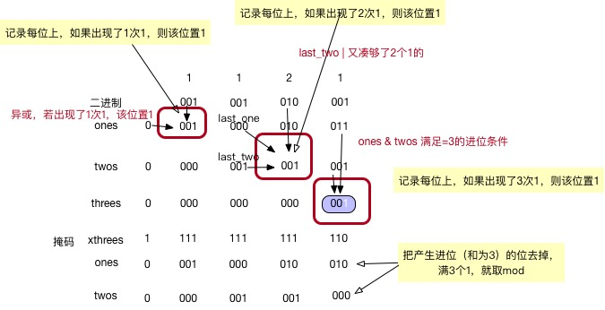

# 137 Single Number II

Given a **non-empty** array of integers, every element appears *three* times except for one, which appears exactly once. Find that single one.

**Note:**

Your algorithm should have a linear runtime complexity. Could you implement it without using extra memory?

**Example 1:**

```
Input: [2,2,3,2]
Output: 3
```

**Example 2:**

```
Input: [0,1,0,1,0,1,99]
Output: 99
```

------


## 解

[参考](https://www.cnblogs.com/higerzhang/p/4159330.html)

1- 用 map 记录一下；

```cpp
class Solution {
public:
    int singleNumber(vector<int>& nums) {
        unordered_map<int, int> umap;
        for( int i = 0; i < nums.size(); i++  ){
            umap[nums[i]]++; 
        }
        
        for( unordered_map<int, int>::iterator it = umap.begin(); it != umap.end(); it++ ){
            if(it -> second % 3)   
                return it -> first;
        }
    }
};
```

2- 法二：还是利用位运算才有办法实现不用额外空间，就是遍历32次每次记录某位的出现的次数，如果不能被三整除，说明那个出现一次的就在该位有值，那么ans 或该位一下就可以了。

```cpp
int singleNumber(int A[], int n)
{
    int ans = 0;
    for (int i = 0; i < 32; i++)
    {
        int cnt = 0, bit = 1 << i;
        for (int j = 0; j < n; j++)
        {
            if (A[j] & bit) cnt++;
        }
        if (cnt % 3 != 0)
            ans |= bit;
    }
    return ans;
}
```


法三：还是位运算，这里利用二进制模拟a进制的方法。对于此题，a为3.

点[这里](http://www.cnblogs.com/daijinqiao/p/3352893.html)分析和拓展的很好：

对于除出现一次之外的所有的整数，其二进制表示中每一位1出现的次数是3的整数倍，将所有这些1清零，剩下的就是最终的数。用ones记录到当前计算的变量为止，二进制1出现“1次”（mod 3 之后的 1）的数位。用twos记录到当前计算的变量为止，二进制1出现“2次”（mod 3 之后的 2）的数位。当ones和twos中的某一位同时为1时表示二进制1出现3次，此时需要清零。即用二进制模拟三进制计算。最终ones记录的是最终结果。

==推荐这种，ones 用来记录，该位“1”累计次数mod 3 后为1次的，则该位置1；==

==twos 记录该位上，累计该位“1” 出现次数mod 3 后为2次的，则该位置值1；==

==threes 记录该位上，累计该位“1” 出现次数为3次的，当前会产生进位（作为临时变量），则该位置值1；==




```cpp
int singleNumber(int A[], int n) {
    int ones = 0, twos = 0, xthrees = 0;
    for(int i = 0; i < n; ++i) {
        twos |= (ones & A[i]);		// 同时进位
        ones ^= A[i];				// 1 出现一次的位
        xthrees = ~(ones & twos);	// 
        ones &= xthrees;			// 去掉进位的
        twos &= xthrees;			// 去掉进位的位
    }

    return ones;
}
```

