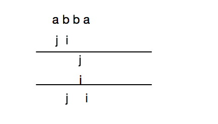

# 002 无重复字符的最长子串

## 链接和考点

| LeetCode | https://leetcode-cn.com/problems/longest-substring-without-repeating-characters/description/ |
| -------- | ------------------------------------------------------------ |
| 考点     | 字符串， unordered_map                                       |
| 难度     | Medium                                                       |

<br>

## 题意

给定一个字符串，找出不含有重复字符的**最长子串**的长度。

**示例：**

给定 `"abcabcbb"` ，没有重复字符的最长子串是 `"abc"` ，那么长度就是3。

给定 `"bbbbb"` ，最长的子串就是 `"b"` ，长度是1。

给定 `"pwwkew"` ，最长子串是 `"wke"` ，长度是3。请注意答案必须是一个**子串**，`"pwke"` 是 *子序列*  而不是子串。

<br>

## 分析

[参考](https://leetcode.com/problems/longest-substring-without-repeating-characters/discuss/1729/11-line-simple-Java-solution-O(n)-with-explanation)

设置两个指针，j 指向不重复子串的左边，i 往右遍历。i 和j 之间的字符串不重复，且存储在 hashmap 中；

当i遇到第一个有重复的子串时, 就将j往右移1， 并将重复的字符更新为最新的；

注意： i 和 j 只能往前移动，**不能往后**。否则，如 “abba” 的例子：

```cpp
a : 0

a : 0
b : 1

a : 0
b : 2

b : 2
a : 3
```

如果j可以往后，



到达最后一步， j 又跳回去了。 最大长度就是 3 了。

<br>

## 参考答案

时间复杂度： O(n)

空间复杂度：O(n)

```cpp
#include <iostream>
#include <unordered_map>
//#include <vector>
using namespace std;

/*
 reference: https://leetcode.com/problems/longest-substring-without-repeating-characters/discuss/1729/11-line-simple-Java-solution-O(n)-with-explanation
 */

template <typename T, typename  U>
void print_hash(unordered_map<T, U> hashmap){
    for( auto it = hashmap.begin(); it != hashmap.end(); it ++){
        std::cout << it->first << " : " << it -> second << std::endl;
    }
}

class Solution {
public:
    int lengthOfLongestSubstring(string s) {
        if(s.size() == 0)
            return 0;
        unordered_map<char, int> hashmap;
        int maxLen = 0;
        for( int i=0, j=0; i<s.size(); i++ ){
            if( hashmap.count(s[i]) > 0 ){
                j = max(j, hashmap[s[i]] + 1);           // 2- 出现第一个重复的字母，就将左指针往右移1
                hashmap.erase(s[i]);                     // 3- 要向插入重复的，必选先删除之前的，否则插不进去
            }

            hashmap.insert(std::make_pair(s[i],i) );     // 1- 将不重复的元素存到hashmap
//            hashmap[s[i]] = i;
            maxLen = max(maxLen, i - j + 1);
//            print_hash(hashmap);
        }
        return maxLen;
    }
};


int main() {
    string s1 = "abcabcbb";
    string s2 = "bbbbb";
    string s3 = "pwwkew";
    string s4 = "abba";

//    cout << Solution().lengthOfLongestSubstring(s1) << std::endl;
//    cout << Solution().lengthOfLongestSubstring(s2) << std::endl;
//    cout << Solution().lengthOfLongestSubstring(s3) << std::endl;
    cout << Solution().lengthOfLongestSubstring(s4) << std::endl;

    std::cout<<"Hello, World!"<<std::endl;
    return 0;
}
/*output:
a : 0

a : 0
b : 1

a : 0
b : 2

b : 2
a : 3

3
*/
```

