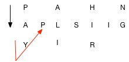

# 006  Z字形变换

## 链接和考点

| LeetCode | https://leetcode-cn.com/problems/zigzag-conversion/description/ |
| -------- | ------------------------------------------------------------ |
| 考点     | String                                                       |
| 难度     | Medium                                                       |

<br>

## 题意

将字符串 `"PAYPALISHIRING"` 以Z字形排列成给定的行数：

```
P   A   H   N
A P L S I I G
Y   I   R
```

之后从左往右，逐行读取字符：`"PAHNAPLSIIGYIR"`

实现一个将字符串进行指定行数变换的函数:

```
string convert(string s, int numRows);
```

**示例 1:**

```
输入: s = "PAYPALISHIRING", numRows = 3
输出: "PAHNAPLSIIGYIR"
```

**示例 2:**

```
输入: s = "PAYPALISHIRING", numRows = 4
输出: "PINALSIGYAHRPI"
解释:

P     I    N
A   L S  I G
Y A   H R
P     I
```

 <br>

## 分析

找规律的题，根据当前所在的行数，计算下一个字符是什么。

首行和末尾行最好找规律，和 nRows 相关，

非首行，分是从下到上和从上到下；



<br>

## 参考答案

时间复杂度：``nRows* O(n)``,  每行都得进行两层循环

空间复杂度：O(n)

C++ 程序如下：

```cpp
class Solution {  
public:  
    string convert(string s, int nRows) {  
        int length = s.size();  
          
       if((nRows==1)||(nRows>=length))  
            return s;  
        string result;  
        for(int i=0;i<nRows;i++)  
        {  
            bool flag=true;  
            int j=i;  
           while(j<length)  
           {  
                 
               result.push_back(s.at(j));  	// string 也可以用 push_back()
               if((i==0)||(i==nRows-1))     // 第一行和最后一行的规律
                   j+=2*(nRows-1);  
               else  
               {  
                   if(flag)  
                   {  
                       j+=2*(nRows-i-1);  
                       flag=false;  
                   }  
                   else  
                   {  
                       j+=2*i;  
                       flag=true;  
                   }  
                     
               }//else  
           }//while  
        }//for  
        return result;  
    }//convert  
};  
```

<br>

