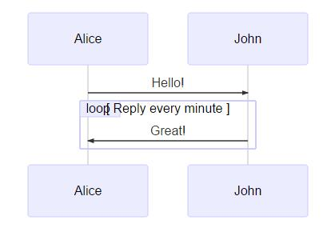

# markdown 绘图插件 mermaid


------

原文：https://blog.csdn.net/wangyaninglm/article/details/52887045

原文： http://www.sysctl.me/2017/11/11/Draw%20Diagrams%20With%20Markdown/

## 流程图(flowchart)

```Sh
graph LR;  %% 从左到右
　　A-->B;    
　　A-->C;  
　　B-->D;  
　　C-->D;
```

效果如下【即时渲染】：

```mermaid
graph LR;  %% 从左到右
　　A-->B;    
　　A-->C;  
　　B-->D;  
　　C-->D;
```

## 时序图(Sequence diagram)

```shell
sequenceDiagram
　　　participant Alice  %% 先给两个参与者
　　　participant Bob
　　　Alice->John:Hello John, how are you?
　　　loop Healthcheck		% 自循环[标题]
　　　　　John->John:Fight against hypochondria % 自循环内容
　　　end
　　　Note right of John:Rational thoughts <br/>prevail...	% 右边注释
　　　John-->Alice:Great!		% -> 实线；  --> 虚线
　　　John->Bob: How about you?
　　　Bob-->John: Jolly good!
```

生成的图表如下所示：


## 甘特图（gantt diagram）

这种图，主要是为了完成任务的

```shell
gantt
　　　dateFormat　YYYY-MM-DD  % 日期格式
　　　title Adding GANTT diagram functionality to mermaid % 标题
　　　section A section	   % 上面的一部分
　　　Completed task　　:done, des1, 2014-01-06,2014-01-08 % 【起始， 终止】
　　　Active task 　　　　:active, des2, 2014-01-09, 3d 	% [起始，之后的时长]
　　　future task 　　　　:　　　  des3, after des2, 5d 	 % [起始des2 的后面, 之后持续5天]
　　　future task2　　　　:　　　  des4, after des3, 5d	 % 
　　　section Critical tasks
　　　Completed task in the critical line　:crit, done, 2014-01-06,24h % crit 会变红
　　　Implement parser and json　　　　　　:crit, done, after des1, 2d	
　　　Create tests for parser　　　　　　　:crit, active, 3d % 默认继上一天之后，持续3天
　　　Future task in critical line　　　　　:crit, 5d		 % 默认继上一天之后，持续5天
　　　Create tests for renderer　　　　　　:crit,2d
　　　Add to ,mermaid　　　　　　　　　　　:1d
```

生成的表如下：


## 下游项目

Mermaid 是由Knut Sveidqbist发起旨在轻便化的文档撰写。所有开发者:[开发者列表](https://github.com/knsv/mermaid/graphs/contributors)

- [Gitbook-plugin](https://github.com/JozoVilcek/gitbook-plugin-mermaid)
- [Light table](http://lighttable.com/)
- [Confluence plugin](https://marketplace.atlassian.com/plugins/org.anvard.atlassian.mermaid-plugin/server/overview)
- [Using mermaid via docpad](http://nauvalatmaja.com/2015/01/13/rendering-mermaid-in-docpad/)
- [Using mermaid in Jekvll](https://rubygems.org/gems/jekyll-mermaid/versions/1.0.0)
- [Using mermaid via Octopress](http://mostlyblather.com/blog/2015/05/23/mermaid-jekyll-octopress/)
- [Mardown editor Haroopad](http://pad.haroopress.com/user.html)
- [Plugin for atom](https://atom.io/packages/atom-mermaid)
- [Markdown Plus](http://mdp.tylingsoft.com/)
- [LightPaper 1.2+](http://lightpaper.42squares.in/)
- [Vim Plugin](https://github.com/kannokanno/previm) 
  以上的这些都有集成mermaid或者开发相关的插件。


## 简单图解析

### Graph

```
graph TD
    A --> B
```

效果：


这是申明一个由左到右，水平向右的图。\ 
可能方向有： 

- TB - top bottom 
- BT - bottom top 
- RL - right left 
- LR - left right 
- TD - same as TB

#### 节点与形状

###### 默认节点

> graph LR 
> id1

效果：


注意：’id’显示在节点内部。

###### 文本节点

```sh
graph LR
id[This is the text in the box];
```

效果：


###### 圆角节点

```
graph LR
id(This is the text in the box);
```

效果：


###### 圆节点(The form of a circle)


```
graph LR
id((This is the text in the circle)); %% 两个圆括号
```

###### 非对称节点(asymetric shape)


```
graph LR
id>This is the text in the box]		%% 注意是id> *** ]
```

###### 菱形节点(rhombus)


```
graph LR
id{This is the text in the box}		%% 菱形节点用的是id{}
```

------

#### 连接线

节点间的连接线有多种形状，而且可以在连接线中加入标签：

###### 箭头形连接


```
graph LR;
  A-->B;			%% 箭头就是 -->
```

###### 开放行连接


```
graph LR
A --- B		%% 无箭头--
```

###### 标签连接


```
graph LR
A -- This is the label text --- B;	%% 中间加标签 -- ** ---
```

###### 箭头标签连接

> A–>|text|B
> 或者
> A– text –>B    %% 这种更直观


```
graph LR
 A-- text -->B12
```

###### 虚线(dotted link,点连线)

> -.->  % 带箭头的


```
graph LR
A-.->B12
```

> -.-.	% 不带箭头的


```
graph LR
A-.-.B12
```

###### 标签虚线

> -.text.->  % 标签用虚线

```
graph LR
A-.text.->B12
```


###### 粗实线

> ==>

```
graph LR
A==>B12
```


> ===

```
graph LR
A===B12
```


###### 标签粗线

> =\=text\==>

```
graph LR
A==text==>B12
```


> =\=text\===

```
graph LR
A==text===B12
```


------

#### 特殊的语法

##### 使用引号可以抑制一些特殊的字符的使用，可以避免一些不必要的麻烦。

> graph LR
> d1[“This is the (text) in the box”]

```
graph LR
d1["This is the (text) in the box"]12
```


##### html字符的转义字符

转义字符的使用语法： 
流程图定义如下：

> graph LR\ 
> A[“A double quote:#quot;”] –> B[“A dec char:#9829;”]

渲染后的图如下： 


```
graph LR
        A["A double quote:#quot;"]-->B["A dec char:#9829;"] %% 特殊的 HTML 符号
```

#### 子图(Subgraphs)

> subgraph title
> 	graph definition 
> end

示例：

```
graph TB
        subgraph one
        a1 --> a2
        end
        subgraph two
        b1 --> b2
        end
        subgraph three
        c1 --> c2
        end
        c1 --> a2
```

```Mermaid

```

结果：


#### 基础fontawesome支持

如果想加入来自frontawesome的图表字体,需要像frontawesome网站上那样引用的那样。\ 
详情请点击：[fontawdsome](http://fontawesome.io/)

引用的语法为：++fa:#icon class name#++

```
graph TD
      B["fa:fa-twitter for peace"]
      B-->C[fa:fa-ban forbidden]
      B-->D(fa:fa-spinner);
      B-->E(A fa:fa-camerra-retro perhaps?);
```

渲染图如下：


以上reference： 
1.[mermaid docs](https://knsv.github.io/mermaid/#initialization)

------

### 第二部分—图表(graph)

------

##### 定义连接线的样式

```
graph LR
     id1(Start)-->id2(Stop)
     style id1 fill:#f9f,stroke:#333,stroke-width:4px;
     style id2 fill:#ccf,stroke:#f66,stroke-width:2px,stroke-dasharray:5,5;
```

渲染结果：


备注：这些样式参考CSS样式。

##### 样式类

为了方便样式的使用，可以定义类来使用样式 
类的定义示例：

```
classDef className fill:#f9f,stroke:#333,stroke-width:4px;
```

对节点使用样式类：

```
class nodeId className;
```

同时对多个节点使用相同的样式类：

```
class nodeId1,nodeId2 className;
```

可以在CSS中提前定义样式类，应用在图表的定义中。

```
graph LR
      A-->B[AAABBB];
      B-->D;
      class A cssClass;
```

默认样式类：\ 
当没有指定样式的时候，默认采用。

```
classDef default fill:#f9f,stroke:#333,stroke-width:4px;
```

示例：

```
graph LR
    classDef default fill:#f90,stroke:#555,stroke-width:4px;
    id1(Start)-->id2(Stop)
```

结果：


## 

### 序列图(sequence diagram)[1](https://blog.csdn.net/wangyaninglm/article/details/52887045#fn:sequence)

[序列图](https://en.wikipedia.org/wiki/Unified_Modeling_Language#Interaction_diagrams)

示例：

```
sequenceDiagram
　　Alice->>John: Hello John, how are you ?
　　John-->>Alice: Great!
　　Alice--->>John: Huang,you are better .
　　John-->>Alice: yeah, Just not bad.
```


 
观察上面的图，如果想让John出现在前面，如何控制，mermaid通过设定参与者(participants)的顺序控制二者的顺序。上面的图可以做如下修改：

```
sequenceDiagram
　　participant John
　　participant Alice
　　Alice-xJohn:Hello John,how are you?
　　John-->>Alice:Great!
```

 
消息的语法： 
　　实线或者虚线的使用： 
[Actor][Arrow][Actor]:Message text\ 

### Arrow的六种样式：

- ->
- –>
- ->>
- –>>
- -x
- –x

示例：

```
sequenceDiagram
    Alice->John: Hello John, how are you ?
    John-->Alice:Great!
    Alice->>John: dont borther me !
    John-->>Alice:Great!
    Alice-xJohn: wait!
    John--xAlice: Ok!
```


##### 便签

给序列图增加便签：\ 
具体规则：\ 
`[right of | left of | over][Actor]:Text`\ 
示例：

```
sequenceDiagram
　　participant John
　　Note left of John: Text in note
```

结果：


跨越两个Actor的便签：

```
sequenceDiagram
　　Alice->John:Hello John, how are you?
　　Note over Alice,John:A typical interaction 
```


##### 循环Loops

在序列图中，也可以使用循环，具体规则如下：

```
loop Loop text
... statements...
end
```

示例：

```
sequenceDiagram
　　Alice->>John: Hello!
　　loop Reply every minute
　　　　John->>Alice:Great!
　　end
```

渲染结果：



##### 选择ALT

在序列图中选择的表达。规则如下：

```
alt Describing text
...statements...
else
...statements...
end
```

或者使用opt(推荐在没有else的情况下使用)

```
opt Describing text
...statements...
end
```

示例：

```
sequenceDiagram
　　Alice->>Bob: Hello Bob, how are you?
　　alt is sick
　　　　Bob->>Alice:not so good :(
　　else is well
　　　　Bob->>Alice:Feeling fresh like a daisy:)
　　end
　　opt Extra response
　　　　Bob->>Alice:Thanks for asking
　　end12345678910
```

渲染结果如下：


------

### 甘特图(gantt)[2](https://blog.csdn.net/wangyaninglm/article/details/52887045#fn:gantt)

甘特图是一类条形图，由Karol Adamiechi在1896年提出, 而在1910年Henry Gantt也独立的提出了此种图形表示。通常用在对项目终端元素和总结元素的开始及完成时间进行的描述。

示例：

```
gantt
dateFormat YYYY-MM-DD

section S1
T1: 2014-01-01, 9d

section S2
T2: 2014-01-11, 9d

section S3
T3: 2014-01-02, 9d
```


先来看一个大的例子：

```
    gantt
    dateFormat  YYYY-MM-DD
    title Adding GANTT diagram functionality to mermaid

    section A section
    Completed task            :done,    des1, 2014-01-06,2014-01-08
    Active task               :active,  des2, 2014-01-09, 3d
    Future task               :         des3, after des2, 5d
    Future task2               :         des4, after des3, 5d

    section Critical tasks
    Completed task in the critical line :crit, done, 2014-01-06,24h
    Implement parser and jison          :crit, done, after des1, 2d
    Create tests for parser             :crit, active, 3d
    Future task in critical line        :crit, 5d
    Create tests for renderer           :2d
    Add to mermaid                      :1d

    section Documentation
    Describe gantt syntax               :active, a1, after des1, 3d
    Add gantt diagram to demo page      :after a1  , 20h
    Add another diagram to demo page    :doc1, after a1  , 48h

    section Last section
    Describe gantt syntax               :after doc1, 3d
    Add gantt diagram to demo page      : 20h
    Add another diagram to demo page    : 48h
```

获得的图渲染后如下： 


| header 1   | header 2           |
| ---------- | ------------------ |
| title      | 标题               |
| dateFormat | 日期格式           |
| section    | 模块               |
| Completed  | 已经完成           |
| Active     | 当前正在进行       |
| Future     | 后续待处理         |
| crit       | 关键阶段           |
| 日期缺失   | 默认从上一项完成后 |

关于日期的格式可以参考： 
- [string-format](http://momentjs.com/docs/#/parsing/string-format/) 
- [Time-Formatting](https://github.com/mbostock/d3/wiki/Time-Formatting)

### Demo

```
graph TB
    sq[Square shape] --> ci((Circle shape))

    subgraph A subgraph
        di{Diamond with  line break} -.-> ro(Rounded)
        di==>ro2(Rounded square shape)
    end

    e --> od3>Really long text with linebreak<br>in an Odd shape]

    cyr[Cyrillic]-->cyr2((Circle shape Начало));

    classDef green fill:#9f6,stroke:#333,stroke-width:2px;
    classDef orange fill:#f96,stroke:#333,stroke-width:4px;
    class sq,e green
    class di orange
```


### **reference**

[mermaid docs](https://knsv.github.io/mermaid/)


