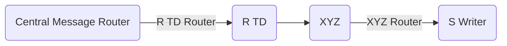
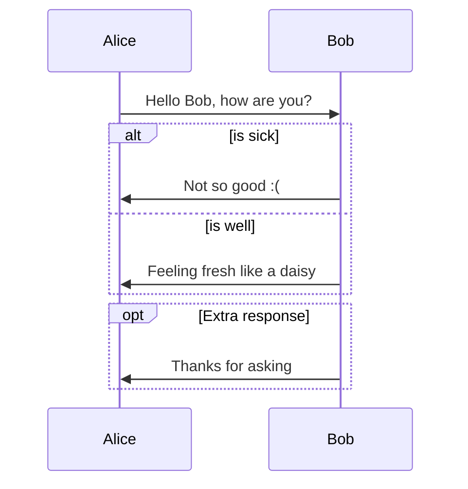
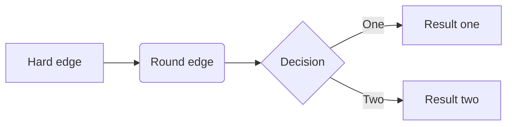
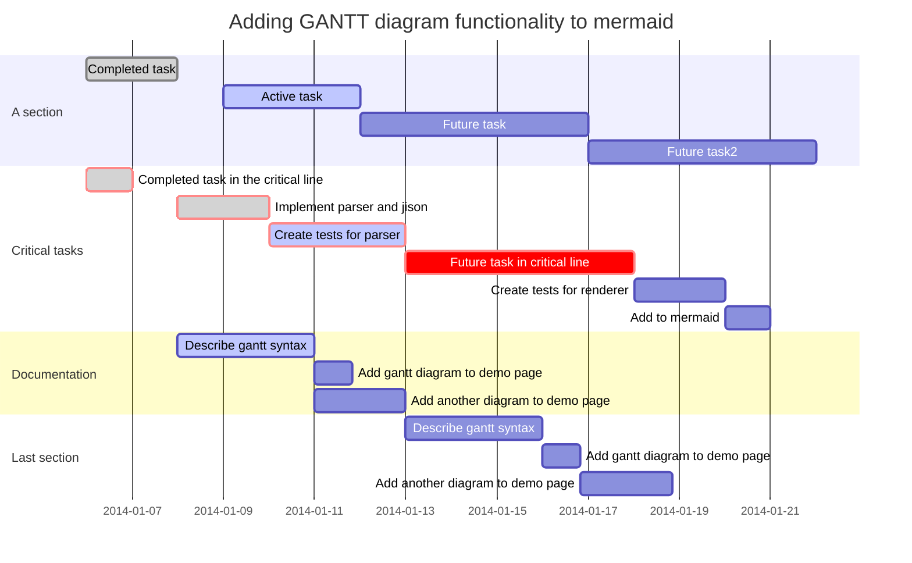

# 20180506mermaid 画图

关于画时间序列图的，在`时间序列图`文件夹，

流程图的在`flowchart未用`文件夹

这两个也可以拿来支持画图。但是第一个渲染速度太慢，而且编译器还得重新改很多地方，暂时不支持它。

这两个怎么用，可以看例子。具体找源文件，可以从这个网址找起：http://www.sysctl.me/2017/11/11/Draw%20Diagrams%20With%20Markdown/


------

画图的原文链接： http://www.sysctl.me/2017/11/11/Draw%20Diagrams%20With%20Markdown/

下载包： https://mermaidjs.github.io/ 下面的`remark.js`

使用方法： https://github.com/gnab/remark/wiki/Adding-graphs-via-Mermaid

## 序列图

### 例子1

```
​```mermaid
%% Example of sequence diagram
  sequenceDiagram
    Alice->>Bob: Hello Bob, how are you?
    alt is sick
    Bob->>Alice: Not so good :(
    else is well
    Bob->>Alice: Feeling fresh like a daisy
    end
    opt Extra response
    Bob->>Alice: Thanks for asking
    end

```







### 转换

html 转成了如下文档：

```
<pre><code class="mermaid">%% Example of sequence diagram
  sequenceDiagram
	Alice-&gt;&gt;Bob: Hello Bob, how are you?
	alt is sick
	Bob-&gt;&gt;Alice: Not so good :(
	else is well
	Bob-&gt;&gt;Alice: Feeling fresh like a daisy
	end
	opt Extra response
	Bob-&gt;&gt;Alice: Thanks for asking
	end
</code></pre>
```

对比发现：

只要兑换一下标签就可以了：

```
 <div class="mermaid">%% Example of sequence diagram
  sequenceDiagram
	Alice->>Bob: Hello Bob, how are you?
	alt is sick
	Bob-&gt;&gt;Alice: Not so good :(
	else is well
	Bob-&gt;&gt;Alice: Feeling fresh like a daisy
	end
	opt Extra response
	Bob-&gt;&gt;Alice: Thanks for asking
	end

</div>
```


## 流程图

```
​```mermaid
graph LR
A[Hard edge] -->B(Round edge)
    B --> C{Decision}
    C -->|One| D[Result one]
    C -->|Two| E[Result two]

```





## 甘特图

```
​```mermaid
%% Example with slection of syntaxes 不要在这里写注释，渲染不出来
        gantt
        dateFormat  YYYY-MM-DD
        title Adding GANTT diagram functionality to mermaid

        section A section
        Completed task            :done,    des1, 2014-01-06,2014-01-08
        Active task               :active,  des2, 2014-01-09, 3d
        Future task               :         des3, after des2, 5d
        Future task2               :         des4, after des3, 5d

        section Critical tasks
        Completed task in the critical line :crit, done, 2014-01-06,24h
        Implement parser and jison          :crit, done, after des1, 2d
        Create tests for parser             :crit, active, 3d
        Future task in critical line        :crit, 5d
        Create tests for renderer           :2d
        Add to mermaid                      :1d

        section Documentation
        Describe gantt syntax               :active, a1, after des1, 3d
        Add gantt diagram to demo page      :after a1  , 20h
        Add another diagram to demo page    :doc1, after a1  , 48h

        section Last section
        Describe gantt syntax               :after doc1, 3d
        Add gantt diagram to demo page      : 20h
        Add another diagram to demo page    : 48h

```


