# 20180506mermaid 画图官方实例


## 例子1

```
graph LR
        
        %% Example diagram
        A[Square Rect] -- Link text --> B((Circle));
        A --> C(Round Rect)
        A --> E(- Elipse -)
        click A coolAction
        B --> D{Rhombus}
        C --> D
        A("test(vcc) a a ") --> B
        snda
```

```mermaid
graph LR
        
        %% Example diagram
        A[Square Rect] -- Link text --> B((Circle));
        A --> C(Round Rect)
        A --> E(- Elipse -)
        click A coolAction
        B --> D{Rhombus}
        C --> D
        A("test(vcc) a a ") --> B
        snda例子2
```

## 例子2

```Shell
graph TB
        subgraph old_sys_2
        a2(new client)-->b2
        oc2(Old client)-->b2
        a3(test)-->b2
        end

        subgraph old_sys_1
        a1(new client)-->b1(sys1 server)
        oc1(Old client)-->b2(test)
        end
```

效果如下所示：

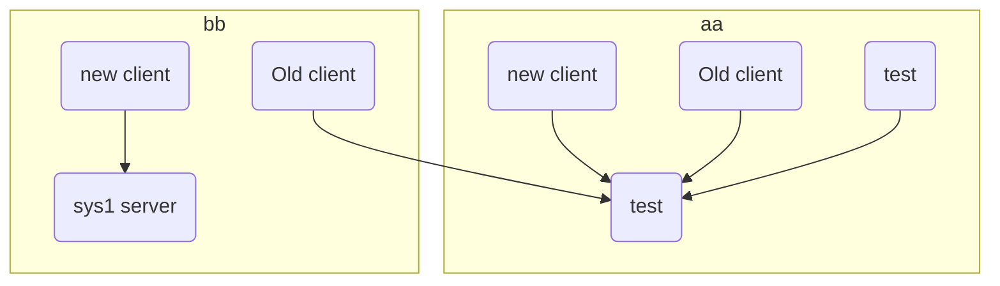


## 例子3

```shell
   graph LR
        A-->B
        B-->C
        C-->A
        D-->C
```

效果：

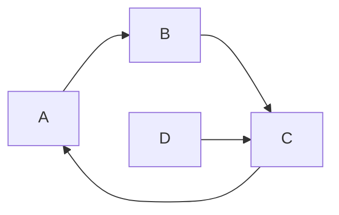


## 例子4

```shell
        graph LR;
        A[Now with default style on links]--v-->B{a = '1,2'}
        B-->|v|C[v]
        B-- ... default style on links -->Z[My default thing this]
        C-->D{condition};

        linkStyle 0 stroke-width:2px,fill:none,stroke:blue;
        linkStyle default stroke-width:2px,fill:none,stroke:red;

```

效果

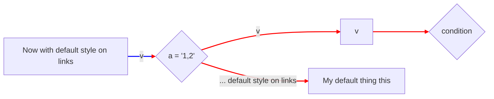

## 例子5

```shell
  graph LR
        A[Square Rect]  --      Link text      -->       B((Circle))
        A[Square Rect]--v-->D((Circle))
        A --> C(Round Rect)
        B    ==  testing ==>     D{Rhombus}
        C-.->D
```

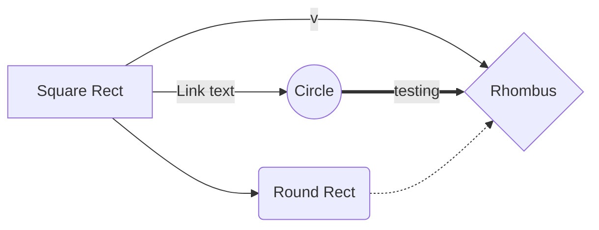

## 例子6

```shell
 graph TD
        question1{Gas tank less than 1/8?}
        action1[Fill tank to 100%]
        question1-- Yes -->action1
```

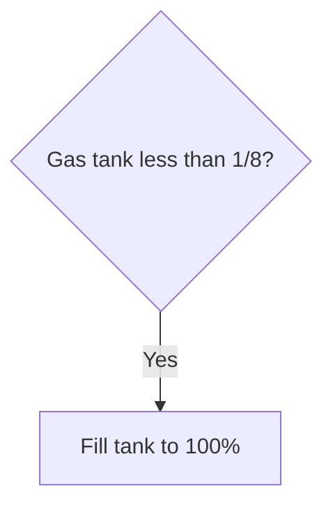

## 例子7

```shell
 graph TD;
        A[Default style on nodes]-->B;
        A-->C;
        A-->D;
        B-->D;
        A-->|Link text|B
        classDef default fill:#f96,stroke:#333,stroke-width:2px;
        classDef green fill:#9f6,stroke:#333,stroke-width:2px;
        class B green;
```

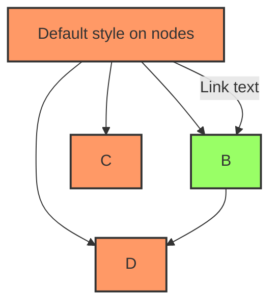

## 例子8

```
graph LR
        subgraph old sys 1
            a1(new client)-->b1(sys1 server)
            oc1(Old client)-->b2
        end

        subgraph old sys 2
            a2(new client)-->b2(sys2 server)
            oc2(Old client)-->b2
        end

        subgraph old sys 3
            a3(new client)-->b3(sys3 server)
        end

        subgraph New sys
            a1
            a2
            a3
        end
```


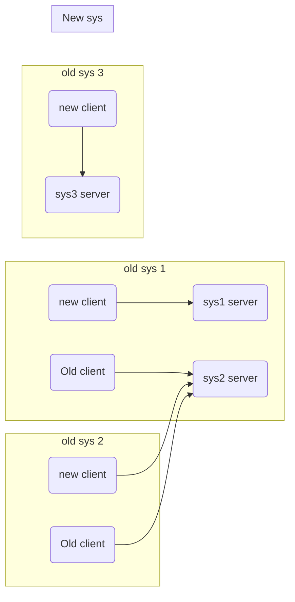

## 例子9

```shell
graph TB
        subgraph one
        a1-->a2
        end
        subgraph two
        b1-->b2
        end
        subgraph three
        c1-->c2
        end
```

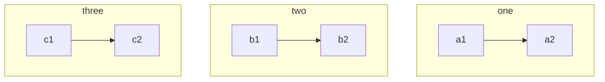

## 例子10

```
graph TB
        subgraph Tjo
            sq[Square shape] -.-> ci((Circle shape))
            od>Odd shape]-. Two line<br>edge comment .-> ro
            di{Diamond with <br/> line break} ==> ro(Rounded<br>square<br>shape)
            di-->ro2(Rounded square shape)
        end

        %% Notice that no text in shape are added here instead that is appended further down
        subgraph Go go
            e --> od3>Really long text with linebreak<br>in an Odd shape]

            e((Inner / circle<br>and some odd <br>special characters)) --> f(,.?!+-*ز)

            cyr[Cyrillic]-->cyr2((Circle shape Начало))
        end
        classDef green fill:#9f6,stroke:#333,stroke-width:2px;
        classDef orange fill:#f96,stroke:#333,stroke-width:4px,font-size:50%,font-style:bold;
        class sq,e green
        class di orange
```


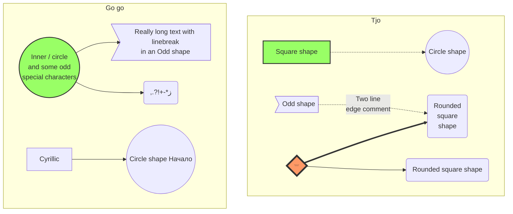

## 例子11

```
graph TB
        subgraph f
            sq[Square shape]-->ci((Circle shape))
            od>Odd shape]---|Two line<br>edge comment|ro
        end
subgraph dfdg
    od2>Really long text in an Odd shape]-->od3>Really long text with linebreak<br>in an Odd shape]
    di{Diamond is broken}-->ro(Rounded squar shape)
    di-->ro2(Rounded square shape)
end
```

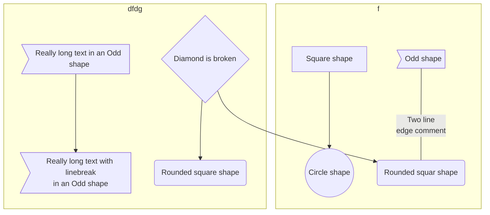


## 例子12

```shell
graph LR;
        A(Central Message Router);
        B(R TD);
        C(XYZ);
        D(S Writer);
        A-->|R TD Router|B;
        B-->C;
        C-->|XYZ Router|D;
```

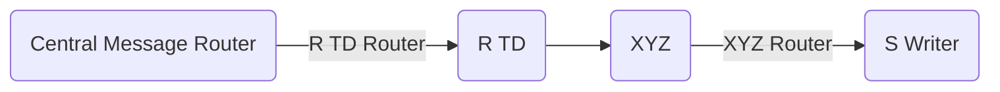

## 例子13

```shell
sequenceDiagram
        participant Alice
        Note left of Alice: Bob thinks about <br/> things <br/> to think about
```


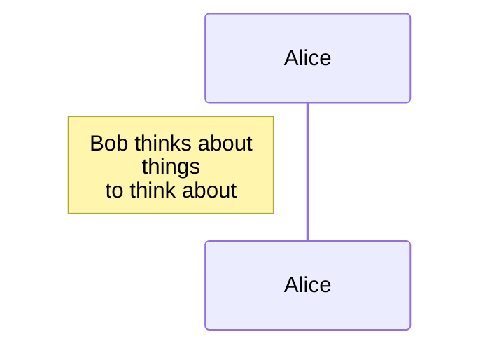

## 例子14

```shell
sequenceDiagram
        participant Alice
        participant Bob
        participant John
        Alice->>Bob: Hello Bob, how are you?
        Note left of Alice: Bob thinks about <br/> things <br/> to think about
        Bob-->>Alice: I am good thanks!
        loop Multiple status checks
        Bob--xJohn: How about you John?
        Note right of John: Bob thinks
        end

        Bob--xAlice: Checking with John...
        Alice->John the Long: Yes... John, how are you?
        John the Long-->Alice: Better then you!!

```

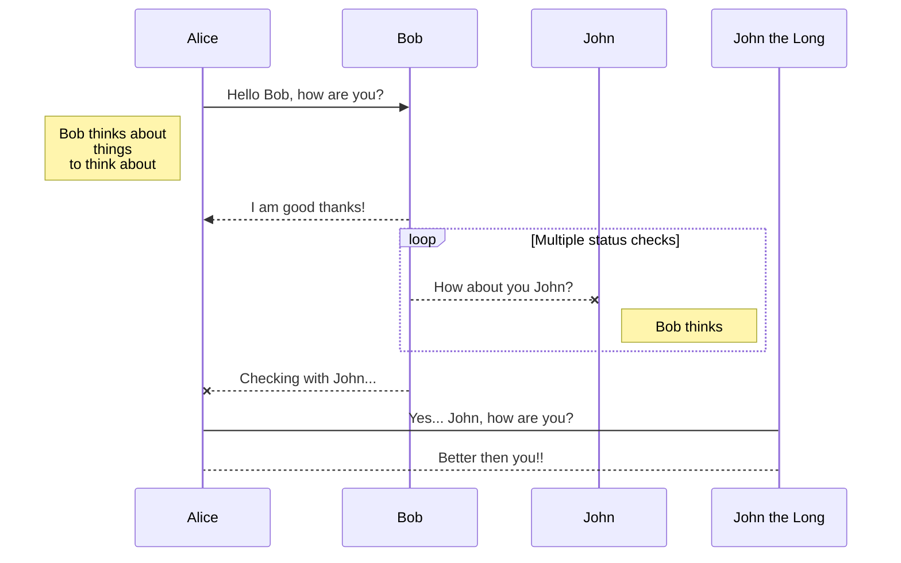


## 例子15

```
graph LR;
                A[Start]-->B{a = '1,2'}
                B-->|True|C[test = 1]
                B-->|False|Z[Store]
                C-->D{condition};
                D-->|True|E[test = 2];
                D-->|False|F[test = 3];
                E-->G{condition2 = ''};
                F-->G;
                G-->|True|H[test = 4];
                G-->|False|I[test = 5];
                H-->J{condition3};
                I-->J;
                J-->|True|K[test = 6];
                J-->|False|L;
                K-->L[Print];
                L-->M[Any Action];
                M-->N[Any Other Action];
                N-->Z;
        linkStyle 11 stroke-width:2px,fill:none,stroke:red;
```

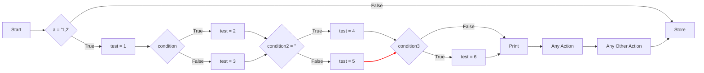


## 例子16

```
 digraph
        {
        a -> b -> c -- d -> e;
        a -- e;
        }
```

```mermaid
 digraph
        {
        a -> b -> c -- d -> e;
        a -- e;
        }
```


