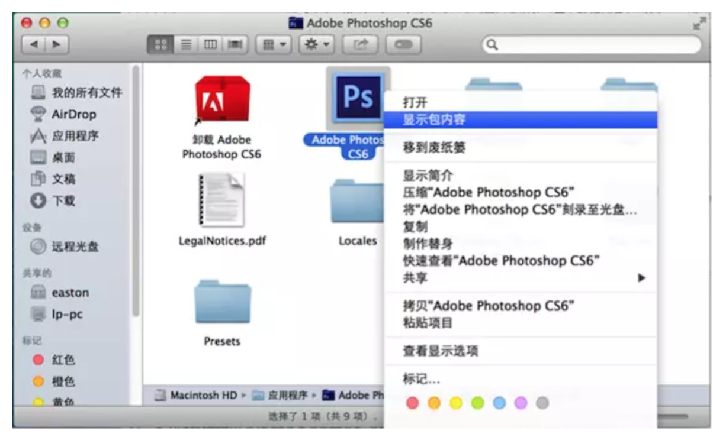

# 安装破解教程

大家在Mac下肯定也少不了对图片进行修改，那也就少不了Photoshop这款软件。今天在这里分享下苹果下的Adobe PhotoshopCS6，这个软件大家应该都很熟悉，主要功能什么我就不多做介绍了。
 软件下载准备
 1.Adobe PhotoshopCS6[https://pan.baidu.com/s/1boZWCzH](https://link.jianshu.com?t=https://pan.baidu.com/s/1boZWCzH)2.破解工具[https://pan.baidu.com/s/1mi4g0D6](https://link.jianshu.com?t=https://pan.baidu.com/s/1mi4g0D6)

自己的百度网盘： [2826112756@qq.com](mailto:2826112756@qq.com)

 

 破解步骤
 1.**首先断开网络连接**，双击下载完成的PhotoShop dmg程序开始安装，如下图：
 

选择**试用**

我们点“试用”开始安装PhotoshopCS6

install

顺利安装完成之后，我们就要开始进行破解了。2.在**应用程序**文件夹，找到**Adobe-Photoshop-CS6**文件夹，在里面找到**Adobe PhotoshopCS6.app**，右键，选择**显示包内容**，如下图所示：
 

Adobe PhotoShop CS6 for Mac（苹果）中文破解版下载及破解方法

然后找到**contents/framework**文件夹，把刚才下载并解压的破解版 **amtlib.framework**拷贝进去，点**全部替换**原文件。**替换前请先备份好你的原始文档amtlib.framework**）
 

OK,PhotoshopCS6 Mac版破解就完成。

参考： https://www.jianshu.com/p/647585fae033