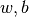
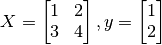

# TensorFlow基础教程

简单测试：

```python
#!/usr/bin/env python3
# -*- coding: utf-8 -*-

'''
filename: main.py
message: notes for examples for gdg
'''

import tensorflow as tf
tf.enable_eager_execution() # 2019 2.0 发布后，tf 默认就会开启

####################################
a = tf.constant(1)
b = tf.constant(1)
c = tf.add(a, b)
print(c)    # 2

A = tf.constant([[1,2], [3, 4]])    # 1.8 版本之前，是一个session里面run 以下，否则还是一个节点值
B = tf.constant([[1,2], [3, 4]])    # 1.8 版本之前，是一个session里面run 以下，否则还是一个节点值
C = tf.matmul(A, B)

# 求导数
# y = x^2, 求x=3 处的导数

x = tf.get_variable('x', shape=[1], initializer=tf.constant_initializer(3.))    # 设置初始化值，一维的
# 开启一个上下文环境， 在这个环境里面的所有表达式， 它会被tf 记录下来，这个里的表达式都是要求表达式
with tf.GradientTape() as tape:     # 在 tf.GradientTape() 的上下文内，所有计算步骤都会被记录以用于求导
    y = tf.square(x)
y_grad = tape.gradient(y, x)        # 计算y关于x的导数
print([y.numpy(), y_grad.numpy()])
```


在机器学习中，更加常见的是对多元函数求偏导数，以及对向量或矩阵的求导。这些对于TensorFlow也不在话下。以下代码展示了如何使用 `tf.GradientTape()` 计算函数  在  时分别对  的偏导数。其中 。

<br>

## 图像识别

1- tf 的简单使用，[线性回归](https://github.com/eubchain/tf-distributed-testcase/blob/master/1_basic_models/1_linear_regression/train.py) 

```python
# -*- coding: utf-8 -*-
"""
Created on Mon Jun  4 14:46:04 2018
@author: eub_hmy
"""

import tensorflow as tf
import numpy as np

x1=np.random.rand(10000) * 10
y1=0.5 * x1 + np.random.randn(10000) + 5

x=tf.placeholder(dtype=tf.float32)
y=tf.placeholder(dtype=tf.float32)

w=tf.Variable(np.random.randn(),name='weights',dtype=tf.float32)
b=tf.Variable(np.random.randn(),name='biases',dtype=tf.float32)

predict=tf.multiply(w,x)+b
loss=tf.reduce_mean(tf.square(predict-y))
train_step=tf.train.AdamOptimizer(0.01).minimize(loss)

init=tf.global_variables_initializer()

sess=tf.Session()
sess.run(init)

for i in range(5000):
    sess.run(train_step,feed_dict={x:x1,y:y1})
    if i%100==0:
        print('Step %d: w=%f ,b=%f ,loss=%f'%(i,sess.run(w),sess.run(b),sess.run(loss,feed_dict={x:x1,y:y1})))


```


tensorflow 情景识别： https://playground.tensorflow.org/#activation=tanh&batchSize=10&dataset=circle&regDataset=reg-plane&learningRate=0.03&regularizationRate=0&noise=0&networkShape=4,2,2&seed=0.84401&showTestData=false&discretize=false&percTrainData=50&x=true&y=true&xTimesY=false&xSquared=false&ySquared=false&cosX=false&sinX=false&cosY=false&sinY=false&collectStats=false&problem=classification&initZero=false&hideText=false

Inception v4 和 inception-resnet，可以参考： https://zhuanlan.zhihu.com/p/32888084

pytorch 深度学习框架：有机会也得学习一下。

tf 基础教程得整理一下： https://tf.wiki/zh/models.html#rnn


## 参考

https://tf.wiki/zh/basic.html

https://snowkylin.github.io/talks


图像识别的两个链接：

数据集的下载地址：https://github.com/chankongching/testcases

tf 基础语法的网址： https://github.com/eubchain/tf-distributed-testcase


