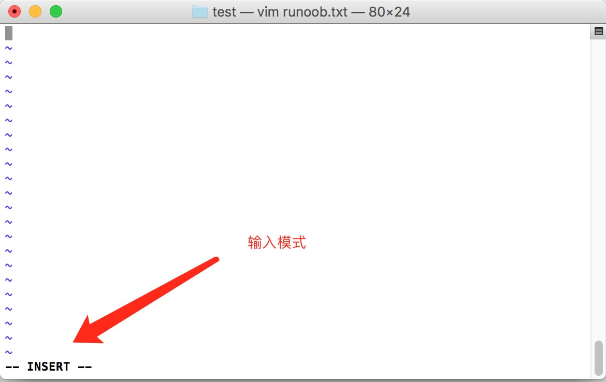

# 20180622 Linux vi vim

所有的 Unix Like 系统都会内建 vi 文书编辑器，其他的文书编辑器则不一定会存在。

但是目前我们使用比较多的是 vim 编辑器。

vim 具有==程序编辑==的能力，可以主动的以字体颜色辨别语法的正确性，方便程序设计。

相关文章：[史上最全Vim快捷键键位图 — 入门到进阶](http://www.runoob.com/w3cnote/all-vim-cheatsheat.html)

------

## 什么是 vim？

Vim是从 vi 发展出来的一个文本编辑器。代码补完、编译及错误跳转等方便编程的功能特别丰富，在程序员中被广泛使用。

简单的来说， vi 是老式的字处理器，不过功能已经很齐全了，但是还是有可以进步的地方。 vim 则可以说是程序开发者的一项很好用的工具。

连 vim 的官方网站 ([http://www.vim.org](http://www.vim.org/)) 自己也说 vim 是一个程序开发==工具==而不是文字处理软件。

vim 键盘图：


------

## vi/vim 的使用

基本上 vi/vim 共分为三种模式，分别是**命令模式（Command mode）**，**输入模式（Insert mode）**和**底线命令模式（Last line mode）**。 这三种模式的作用分别是：

### 命令模式：

用户刚刚启动 vi/vim，便进入了命令模式。

此状态下敲击键盘动作会被Vim识别为命令，而非输入字符。比如我们此时按下i，并不会输入一个字符，i被当作了一个命令。

以下是常用的几个命令：

- ==**i** 切换到输入模式，以输入字符==。
- ==**x** 删除当前光标所在==处的字符。
- **:** 切换到底线命令模式，以在最底一行输入命令。

若想要编辑文本：启动Vim，进入了命令模式，按下i，切换到输入模式。

命令模式只有一些最基本的命令，因此仍要依靠底线命令模式输入更多命令。

### 输入模式

在命令模式下按下i就进入了输入模式。

在输入模式中，可以使用以下按键：

- **字符按键以及Shift组合**，输入字符
- **ENTER**，回车键，换行
- **BACK SPACE**，退格键，删除光标前一个字符
- **DEL**，删除键，删除光标后一个字符
- **方向键**，在文本中移动光标
- **HOME**/**END**，移动光标到行首/行尾
- **Page Up**/**Page Down**，上/下翻页
- **Insert**，切换光标为输入/替换模式，光标将变成竖线/下划线
- **ESC**，退出输入模式，切换到命令模式


### 底线命令模式

在命令模式下按下==:（英文冒号）==就进入了底线命令模式。

底线命令模式可以输入单个或多个字符的命令，可用的命令非常多。

在底线命令模式中，基本的命令有（已经省略了冒号）：

- ==q 退出程序==
- ==w 保存文件==

按ESC键可随时退出底线命令模式。

简单的说，我们可以将这三个模式想成底下的图标来表示：


------

## vi/vim 使用实例

### 使用 vi/vim 进入一般模式

如果你想要使用 ==vi 来建立一个名为 test.txt 的文件==时，你可以这样做：

```
$ vi runoob.txt
```

直接输入 **vi 文件名** 就能够进入 vi 的一般模式了。请注意，记得 vi 后面一定要加文件名，==不管该文件存在与否==！


### 按下 i 进入输入模式(也称为编辑模式)，开始编辑文字

在一般模式之中，只要按下 i, o, a 等字符就可以进入输入模式了！

在编辑模式当中，你可以发现在左下角状态栏中会出现 –INSERT- 的字样，那就是可以输入任意字符的提示。

这个时候，键盘上除了 **Esc** 这个按键之外，其他的按键都可以视作为一般的输入按钮了，所以你可以进行任何的编辑。




### 按下 ESC 按钮回到一般模式

好了，假设我已经按照上面的样式给他编辑完毕了，那么应该要如何退出呢？是的！没错！就是给他按下 **Esc** 这个按钮即可！马上你就会发现画面==左下角的 – INSERT – 不见了==！


### 在一般模式中按下 **:wq** 储存后离开 vi

OK，我们要存档了，存盘并离开的指令很简单，输入 **:wq** 即可保存离开！

OK! 这样我们就成功创建了一个 runoob.txt 的文件。


------


## vi/vim 按键说明

除了上面简易范例的 i, Esc, :wq 之外，其实 vim 还有非常多的按键可以使用。


### 第一部份：一般模式可用的光标移动、复制粘贴、搜索替换等

| 移动光标的方法                                               |                                                              |
| ------------------------------------------------------------ | ------------------------------------------------------------ |
| ==h== 或 向左箭头键(←)                                       | 光标向左移动一个字符                                         |
| j 或 向下箭头键(↓)                                           | 光标向下移动一个字符                                         |
| k 或 向上箭头键(↑)                                           | 光标向上移动一个字符                                         |
| l 或 向右箭头键(→)                                           | 光标向右移动一个字符                                         |
| 如果你将右手放在键盘上的话，你会发现 hjkl 是排列在一起的，因此可以使用这四个按钮来移动光标。 如果想要进行多次移动的话，例如==向下移动 30 行，可以使用 "30j"== 或 "30↓" 的组合按键， 亦即加上想要进行的次数(数字)后，按下动作即可！ |                                                              |
| ==[Ctrl] + [f]==                                             | 屏幕『向下』移动一页，相当于 [Page Down]按键 (常用)          |
| ==[Ctrl] + [b]==                                             | 屏幕『向上』移动一页，相当于 [Page Up] 按键 (常用)           |
| [Ctrl] + [d]                                                 | 屏幕『向下』移动半页                                         |
| [Ctrl] + [u]                                                 | 屏幕『向上』移动半页                                         |
| +                                                            | 光标移动到非空格符的下一行                                   |
| -                                                            | 光标移动到非空格符的上一行                                   |
| n<space>                                                     | 那个 n 表示『数字』，例如 20 。按下数字后再按空格键，光标会向右移动这一行的 n 个字符。例如 ==`20<space>` 则光标会向后面移动 20 个字符距离==。 |
| 0 或功能键[Home]                                             | 这是数==字『 0 』：移动到这一行的最前面字符处 (常用)==       |
| $ 或功能键[End]                                              | ==移动到这一行的最后面字符处==(常用)                         |
| H                                                            | 光标移动到这个屏幕的最上方那一行的第一个字符                 |
| M                                                            | 光标移动到这个屏幕的中央那一行的第一个字符                   |
| L                                                            | 光标移动到这个屏幕的最下方那一行的第一个字符                 |
| G                                                            | ==移动到这个档案的最后一行==(常用)                           |
| nG                                                           | n 为数字。移动到这个档案的第 n 行。例如 ==20G 则会移动到这个档案的第 20 行==(可配合 :set nu) |
| gg                                                           | ==移动到这个档案的第一行==，相当于 1G 啊！ (常用)            |
| n<Enter>                                                     | n 为数字。==光标向下移动 n 行==(常用)                        |
| 搜索替换                                                     |                                                              |
| /word                                                        | 向光标之下寻找一个名称为 word 的字符串。例如要在档案内搜寻 vbird 这个字符串，就输入 ==/vbird 即可==！ (常用) |
| ?word                                                        | 向==光标之上==寻找一个字符串名称为 word 的字符串。           |
| n                                                            | 这个 n 是英文按键。代表重复前一个搜寻的动作。举例来说， 如果刚刚我们执行 /vbird 去向下搜寻 vbird 这个字符串，则按下 n 后，会向下继续搜寻==下一个==名称为 vbird 的字符串。如果是执行 ?vbird 的话，那么按下 n 则会向上继续搜寻名称为 vbird 的字符串！ |
| N                                                            | 这个 N 是英文按键。与 n 刚好相反，==为『反向』进行==前一个搜寻动作。 例如 /vbird 后，按下 N 则表示『向上』搜寻 vbird 。 |
| 使用 /word 配合 n 及 N 是非常有帮助的！可以让你重复的找到一些你搜寻的关键词！ |                                                              |
| :n1,n2s/word1/word2/g                                        | n1 与 n2 为数字。在第 n1 与 n2 行之间寻找 word1 这个字符串，并将该字符串取代为 word2 ！举例来说，在 ==100 到 200 行之间搜寻 vbird 并取代为 VBIRD 则： 『:100,200s/vbird/VBIRD/g』==。(常用)<br>注意：`[100,200]` 是==包含当前==所在行的 |
| :1,$s/word1/word2/g                                          | 从==第一行到最后一行==寻找 word1 字符串，并将该字符串取代为 word2 ！(常用) |
| :1,$s/word1/word2/gc                                         | 从第一行到最后一行寻找 word1 字符串，并将该字符串取代为 word2 ！且在==取代前显示==提示字符给用户确认 (confirm) 是否需要取代！(常用) |
| 删除、复制与贴上                                             |                                                              |
| x, X                                                         | 在一行字当中，==x 为向后删除一个字符== (相当于 [del] 按键)， X 为向前删除一个字符(相当于 [backspace] 亦即是退格键) (常用) |
| nx                                                           | n 为数字，==连续向后删除 n 个字符==。举例来说，我要连续删除 10 个字符， 『10x』。 |
| dd                                                           | ==删除游标所在的那一整行==(常用)                             |
| ndd                                                          | n 为数字。删除==光标所在的向下 n 行==，例如 20dd 则是删除 20 行 (常用) |
| d1G                                                          | 删除==光标所在到第一行==的所有数据                           |
| dG                                                           | 删除==光标所在到最后一行==的所有数据                         |
| d$                                                           | 删除==游标所在处，到该行的最后一个字符==                     |
| d0                                                           | 那个是数字的 0 ，==删除游标所在处，到该行的最前面一个字符==  |
| yy                                                           | ==复制游标所在的那一行==(常用)<br>注意这个是复制到剪切板<br>MacVim 里用的是 ==p==， 然后在下一行将剪切板里的内容黏贴 |
| nyy                                                          | n 为数字。复制光标所在的向下 n 行，例如 20yy 则是复制 20 行(常用)<br>MacVIm 复制20行：20p |
| y1G                                                          | 复制游标所在行到第一行的所有数据                             |
| yG                                                           | 复制游标所在行到最后一行的所有数据                           |
| y0                                                           | 复制光标所在的那个字符到该行行首的所有数据                   |
| y$                                                           | 复制光标所在的那个字符到该行行尾的所有数据                   |
| p, P                                                         | p 为==将已复制的数据在光标下一行贴上，P 则为贴在游标上一行==！ 举例来说，我目前光标在第 20 行，且已经复制了 10 行数据。则按下 p 后， 那 10 行数据会贴在原本的 20 行之后，亦即由 21 行开始贴。但如果是按下 P 呢？ 那么原本的第 20 行会被推到变成 30 行。 (常用) |
| J                                                            | ==将光标所在行与下一行的数据结合成同一行==                   |
| c                                                            | 重复删除多个数据，例如==向下删除 10 行，[ 10cj ]==           |
| u                                                            | 撤回，==复原前一个动作==。(常用)                             |
| [Ctrl]+r                                                     | 重做， ==重做上一个动作==。(常用)                            |
| 这个 u 与 [Ctrl]+r 是很常用的指令！一个是复原，另一个则是重做一次～ 利用这两个功能按键，你的编辑，嘿嘿！很快乐的啦！ |                                                              |
| .                                                            | 不要怀疑！这就是小数点！意思是重复前一个动作的意思。 如果你想要==重复删除、重复贴上等等动作，按下小数点『.』就好了==！ (常用)<br>==重复上一条指令(略微有点强大)== |

<br>

### 第二部份：一般模式切换到编辑模式的可用的按钮说明

| 进入输入或取代的编辑模式                                     |                                                              |
| ------------------------------------------------------------ | ------------------------------------------------------------ |
| i, I                                                         | 进入输入模式(Insert mode)： i 为『从目前光标所在处输入』， I 为『在目前所在行的第一个非空格符处开始输入』。 (常用) |
| a, A                                                         | 进入输入模式(Insert mode)： a 为『从目前光标所在的==下一个字符处开始输入==』， A 为『从光标所在行的最后一个字符处开始输入』。(常用) |
| o, O                                                         | 进入输入模式(Insert mode)： 这是英文字母 o 的大小写。o 为『在目前光标所在的==下一行处输入新的一行==』； O 为在目前光标所在处的上一行输入新的一行！(常用) |
| r, R                                                         | 进入取代模式(Replace mode)： ==r 只会取代光标所在的那一个字符一次；R会一直取代光标所在的文字==，直到按下 ESC 为止；(常用) |
| 上面这些按键中，在 vi 画面的左下角处会出现『--INSERT--』或『--REPLACE--』的字样。 由名称就知道该动作了吧！！特别注意的是，我们上面也提过了，你想要在档案里面输入字符时， 一定要在左下角处看到 INSERT 或 REPLACE 才能输入喔！ |                                                              |
| [Esc]                                                        | 退出编辑模式，回到一般模式中(常用)                           |

<br>

### 第三部份：一般模式切换到指令行模式的可用的按钮说明

| 指令行的储存、离开等指令                                     |                                                              |
| ------------------------------------------------------------ | ------------------------------------------------------------ |
| :w                                                           | 将编辑的数据写入硬盘档案中(常用)                             |
| :w!                                                          | 若文件属性为『只读』时，强制写入该档案。不过，==到底能不能写入， 还是跟你对该档案的档案权限有关==啊！ |
| :q                                                           | 离开 vi (常用)                                               |
| :q!                                                          | 若曾==修改过档案，又不想储存==，使用 ! 为强制离开不储存档案。 |
| 注意一下啊，那个惊叹号 (!) 在 vi 当中，常常具有『强制』的意思～ |                                                              |
| :wq                                                          | 储存后离开，若为 ==:wq! 则为强制储存后离开== (常用)          |
| ZZ                                                           | 这是大写的 Z 喔！若档案没有更动，则不储存离开，若档案已经被更动过，则==储存后离开==！ |
| :w [filename]                                                | 将编辑的数据储存成另一个档案（类似==另存新档==）             |
| :r [filename]                                                | 在编辑的数据中，读入另一个档案的数据。亦即将 『filename』 这个档案内容加到游标所在行后面 |
| :n1,n2 w [filename]                                          | ==将 n1 到 n2 的内容储存成 filename== 这个档案。             |
| :! command                                                   | ==暂时离开 vi 到指令行模式下执行== command 的显示结果！例如 『:! ls /home』即可在 vi 当中察看 /home 底下以 ls 输出的档案信息！ |
| vim 环境的变更                                               |                                                              |
| :set nu                                                      | 显示行号，设定之后，会在每一行的前缀显示该行的行号           |
| :set nonu                                                    | 与 set nu 相反，为取消行号！                                 |

特别注意，在 vi/vim 中，数字是很有意义的！数字通常代表==重复做几次==的意思！ 也有可能是==代表去到第几个==什么什么的意思。

举例来说，要删除 50 行，则是用 『50dd』 对吧！ 数字加在动作之前，如我要向下移动 20 行呢？那就是『20j』或者是『20↓』即可。

<br>

## VIM 常用

1- “打开最近一个文件” 不太好用。

2- 显示缓冲区内打开的文件：

```shell
:ls		# 如果是系统命令，就应该是 :! ls
# 看到编号之后， 可以在指定分屏的窗口打开文件
:e # 1		# 打开编号为 1 的文件
```


<br>

### 打开多个文件

#### 方法一： 在shell 中打开多个文件

vim file1 file2 

打开文件并水平窗口显示

vim -o file1 file2

打开文件并垂直方式显示

vim -O p1.sh p2.sh


在终端里输入   vim file1 file2 ... filen便可以打开所有想要打开的文件 


#### 方法二：在vim中打开新文件

原窗口打开新文件

```sh
:open file
```


```shell
:e ../myFile.pl
```


1. vim 文档名   普通方式打开文档       
2. vim +n 文档名      打开文档后，定位第n行 
3. vim ，进入vim界面之后使用命令 :e 文档名 打开文档，此方式可以在编辑一个文档的同时打开另外一个文档

####  多窗口打开

:split    简写  :sp 
:vsplit  简写  :vsp 【==垂直复制本文件的内容==】

\# 显示缓存   :ls


:vs  文件路径/文件名      在新的垂直分屏中打开文件

:sv  文件路径/文件名      在新的水平分屏中打开文件

文件间切换（一个窗口，但是打开了多个文件）

Ctrl+6—下一个文件【不管用】

==:bn—下一个文件==

==:bp—上一个文件==


#### 同时打开了多个窗口切换

对于用(v)split在多个窗格中打开的文件，这种方法只会在当前窗格中切换不同的文件。

Ctrl+w+方向键——切换到前／下／上／后一个窗格

Ctrl+w+h/j/k/l ——同上

==Ctrl+ww——依次向后切换到下一个窗格中==


### 在多个个文件之间复制

1.在第一个文件中使用可视模式，就是VISUAL，然后选中要复制的文本，执行命令 =="+y,或者“*y这就把内容复制到剪贴板==。这里可以三个字符，而且一定要在==可视化模式==中，并存选中你要复制的代码以后，输入上面的命令，这时在VIM中的下面并不显示你输入的这条命令。

2.在另一个文件中，执行命令=="+p,或者"*p。就能复制过来==，＋指的是寄存器的意思,似乎也是操作系统的剪贴板，复制了之后，在别的地方，例如文本文件里就可以用==ctrl＋v==了。这里也是在可视模式下，不需要输入冒号：，这里输入的命令也是看不到的。


### 关闭文件

单个文件 ：:q 就可以了

关闭所有： :qa 

<br>

### 多文档编辑的命令

:n          编辑下一个文档。 
:2n        编辑下两个文档。 
:N          编辑上一个文档。注意，该方法只能用于同时打开多个文档。 
:e 文档名        这是在进入vim后，不离开 vim 的情形下打开其他文档。 
==:e#== 或 Ctrl+ˆ      编辑上一个文档,用于两个文档相互交换编辑时使用。?# 代表的是编辑前一次编辑的文档 
:files 或 :buffers 或 ==:ls==     可以列出目前 缓冲区 中的所有文档。==加号 + 表示 缓冲区已经被修改过了==。==＃代表上一次==编辑的文档，==%是目前==正在编辑中的文档 
==:b 文档名或编号==    移至该文档。 
==:f==  或 Ctrl+g     显示当前正在编辑的文档名称。 
==:f 新文件名==         改变编辑中的文档名。(file)

 <br>


### **多文件切换**

1. 通过vim打开多个文件（可以通过ctags或者cscope）
2. ":ls"查看当前打开的buffer（文件）
3. ":b num"切换文件（其中num为buffer list中的编号）