# 20180801 modelsim 新建工程实现功能仿真

## 操作过程

下文通过单独在modelsim中新建工程的方式来进行功能仿真。 
打开altera-modelsim软件，界面如下图所示。红框里是各种仿真用到的库，这里由于用的是altera-modelsim，所以altera的器件库等已经**自动关联**了，如果没有的库则需要手动去添加。同时，注意现在下面library里是没有work 库的。 

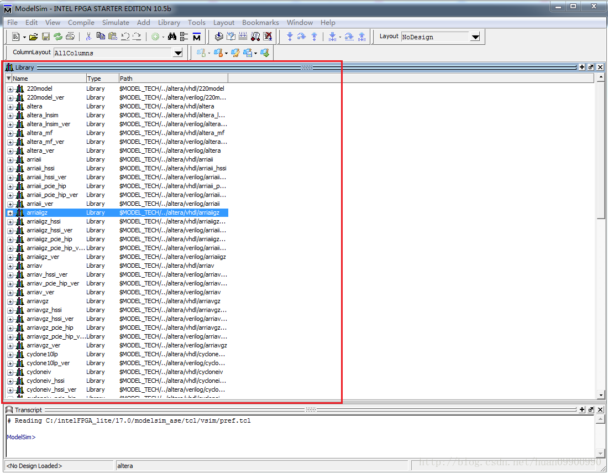

(1)点击菜单栏的 File->New->Project进入新建工程界面（新建完工程后在library里出现空的work库） 
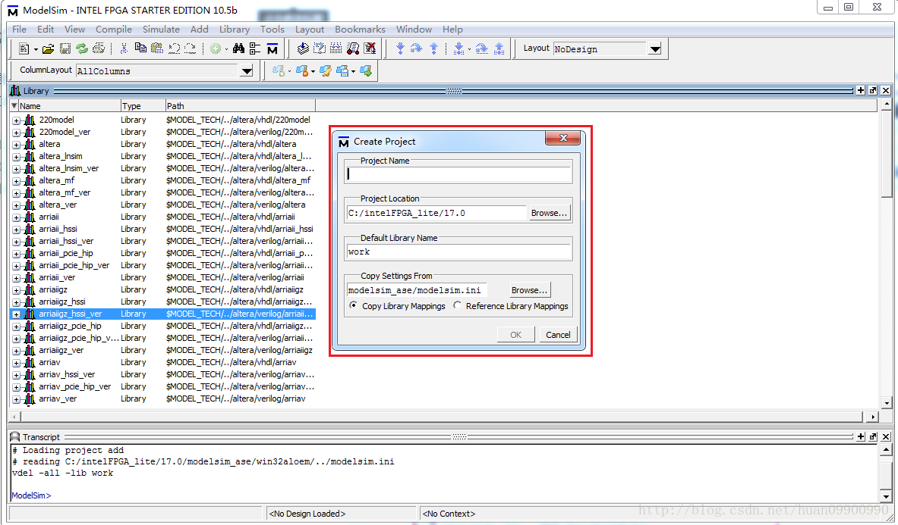

Project Name : 工程名字 add 
Project Location :指要把工程放到哪个位置。默认 
Default Library Name:Work (默认，不用修改) 
设置好后的界面如下图所示，点击OK 按钮： 
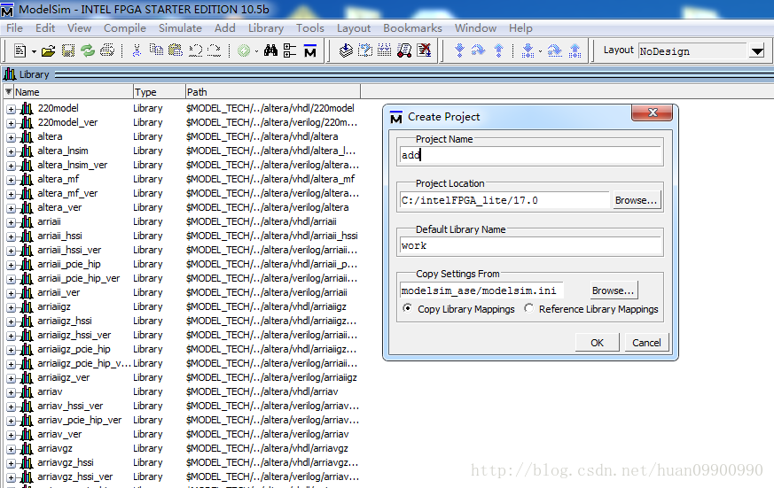
(2)进入添加文件界面 
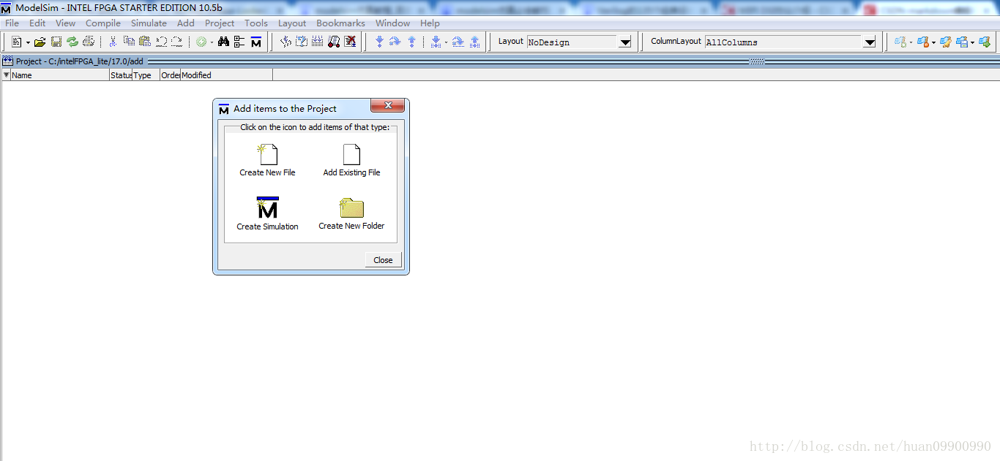
这里可以通过Creating New File新建文件，也可以通过Add Existing File添加之前编辑好的文件。这里由于我已经将工程文件和仿真文件编辑好，所以通过Add Existing File将这两个文件添加进来。 
(3)点击Add Existing File按钮，出现Add file to Project 窗口，即下图的红框 
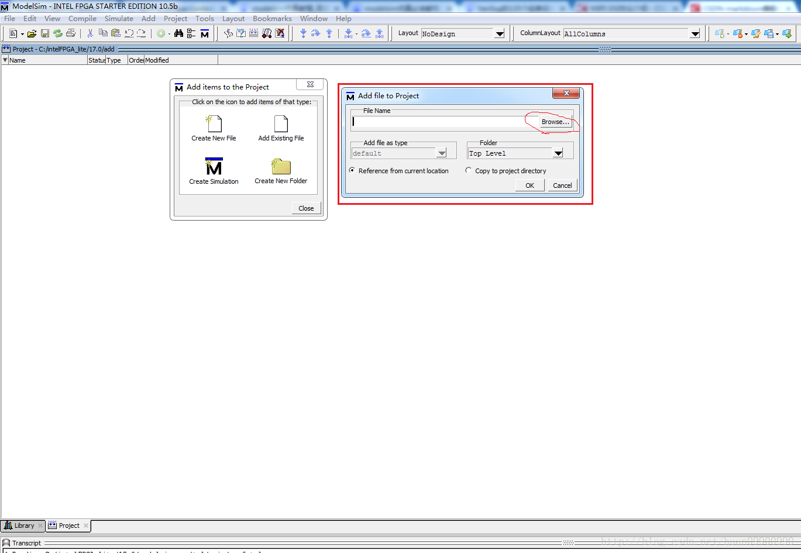
(4)点击Browse 按钮，选择你文件的存放路径，添加文件add.v ，其它设置默认如下图所示，点击OK按钮 
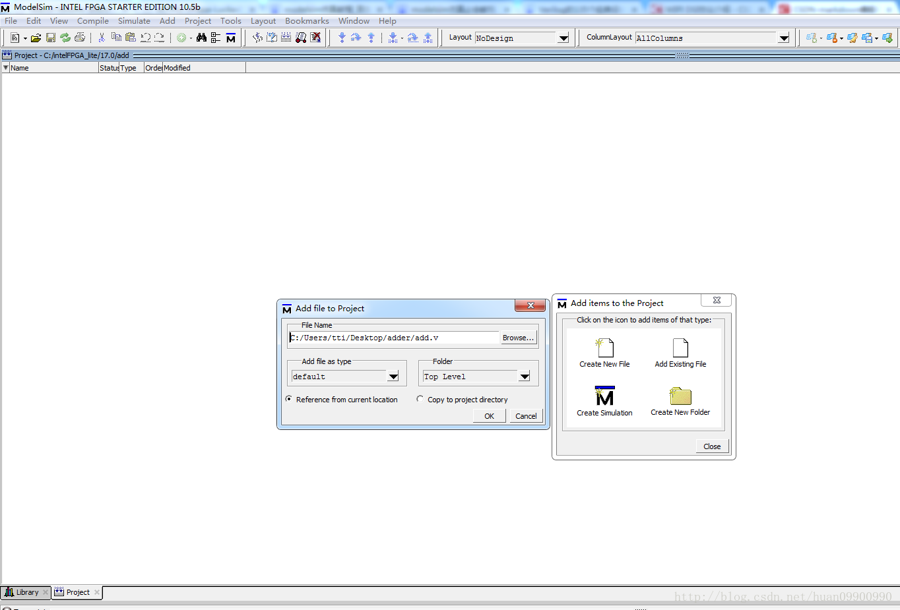

(5)添加仿真文件，继续点击Add Existing File添加仿真文件。添加完后，在Project栏应该有两个刚才添加的文件。Status 列是？ 状态，如下图所示。 
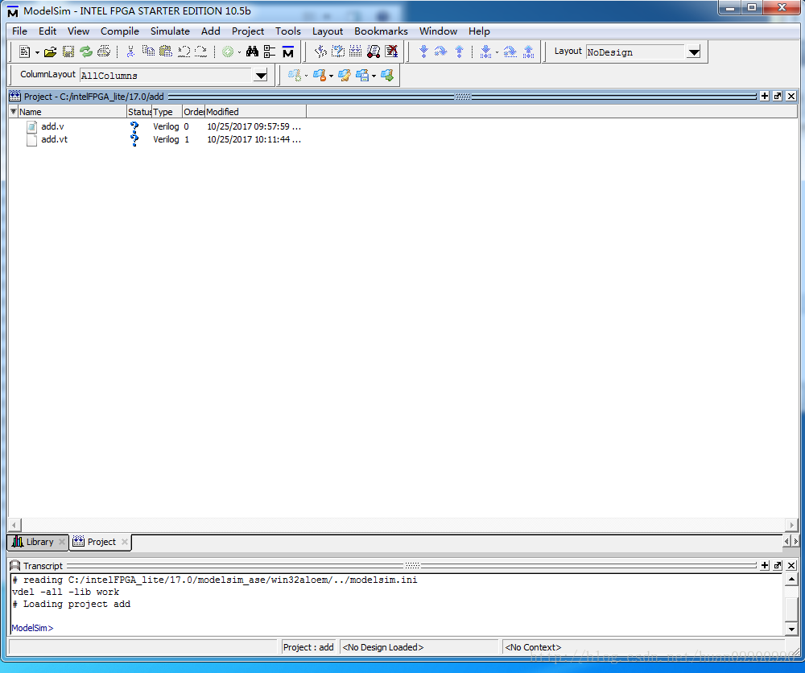
(6)编译,把添加进去的两个文件，选中任意一个文件，右键 Compile->左键Compile All。进行编译。 
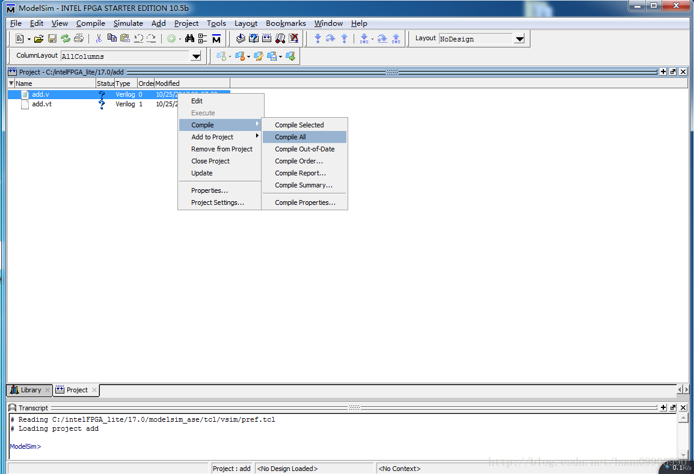
编译后，Status 列 状态为 √ 表示编译通过。如果报错，需根据对应报错修改代码，直到编译通过。 
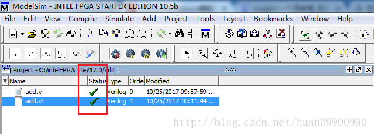
同时在Work目录下有这两个文件。 
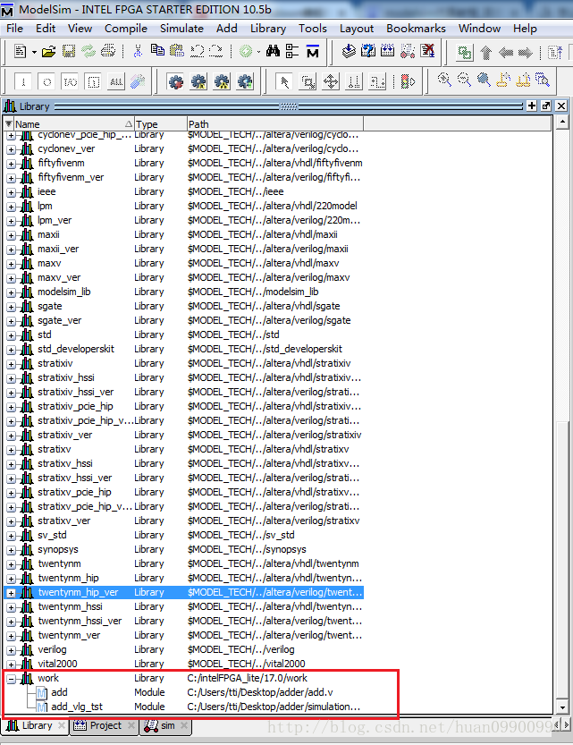

(7)仿真， 右键仿真文件add_vlg_tst->左键simulate 
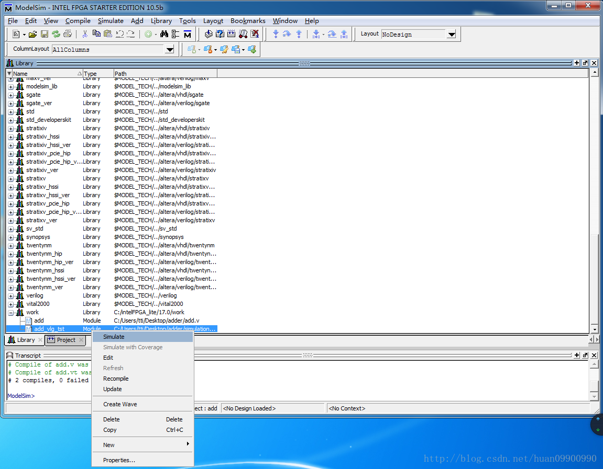

新增simulate窗口 
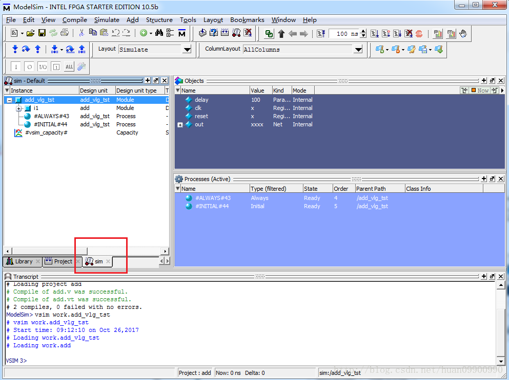
(8)添加仿真信号到波形窗口 
右键add_vlg_tst->Add to->Wave->左键All items in region 
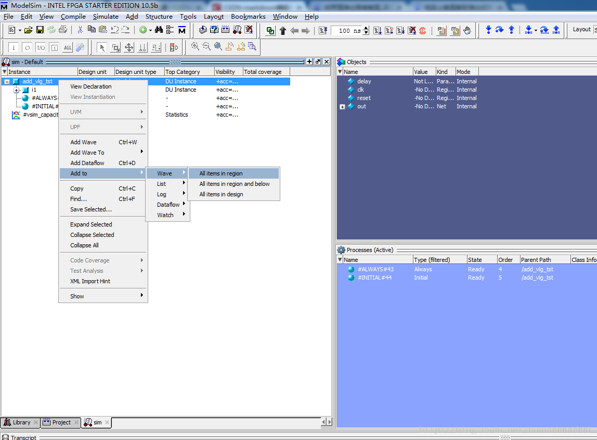
(9)运行仿真 
按(8)操作后，出现Wave 波形窗口，左键下图红框里的Run All 按钮，开始运行仿真 
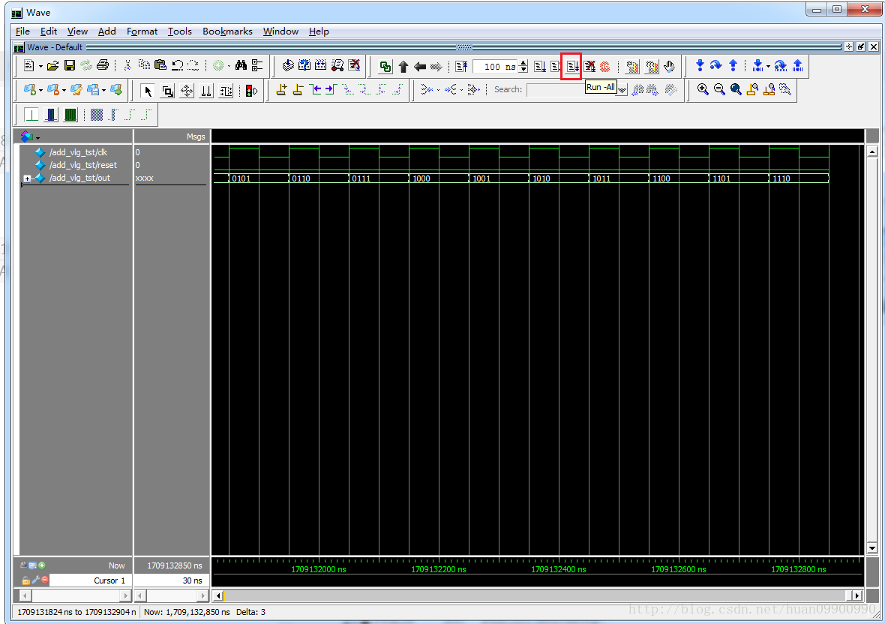
(10)停止仿真 
仿真的波形图如上图所示，如果要停止仿真，左键红框里的Stop 按钮，即可停止仿真。 
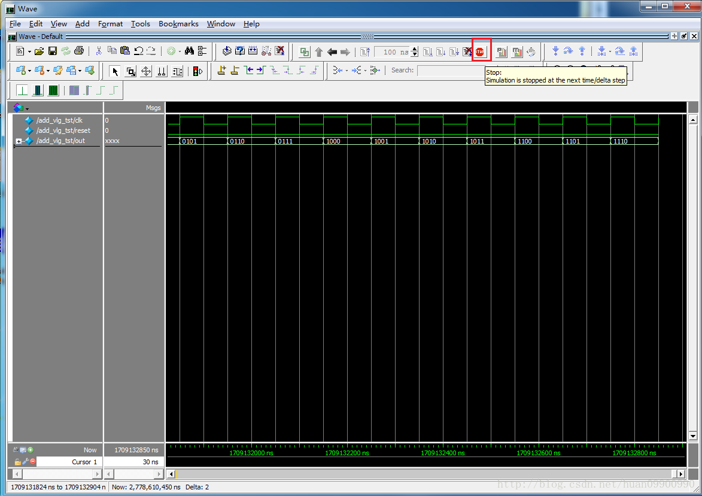

## 参考

[1]https://blog.csdn.net/huan09900990/article/details/78340856