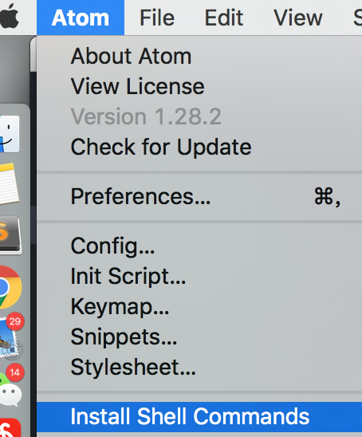
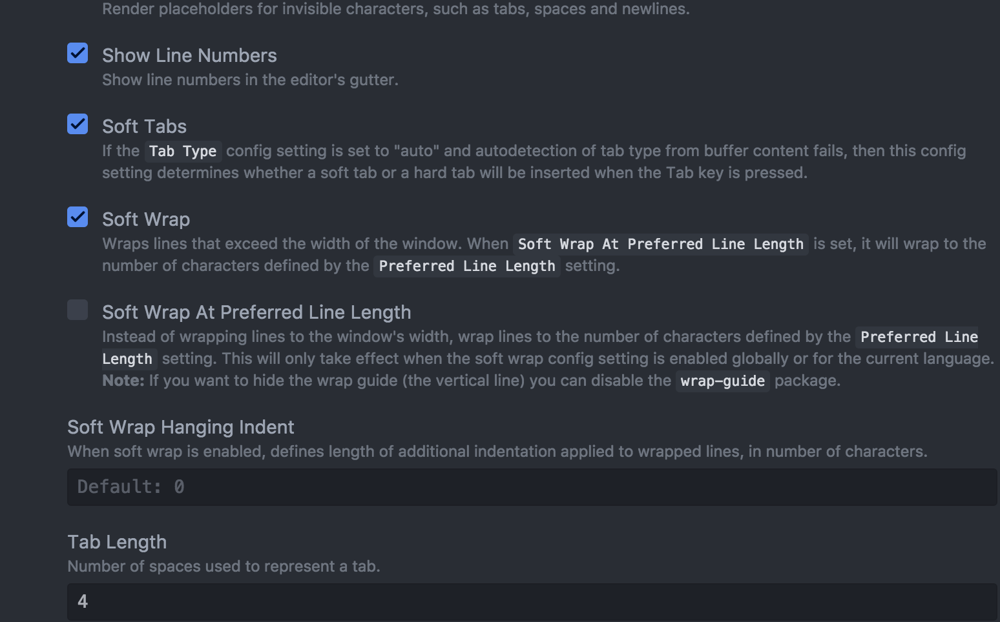

# atom 的使用手册

<br>

## 安装包

这个安装比sublime还简单：cmd+, ; 然后在install选项卡搜索插件即可， 还能看说明文档；

<br>

## 命令面板
1- command+p: 快速搜索
2- command+,: 打开设置

3- command + O: 打开文件



安装命令行后， `atom file.txt` 就能打开文件；

`atom 目录` 打开文档树；

Ctrl + P: 光标上一行；

Ctrl + N: 光标下一行；

Ctrl + B: 光标向左；

Ctrl + F: 光标向右；

Alt + F: 移到下一个单词的开头；

Alt+ H：删除光标前一个单词

command + —>: 移到一行的末尾 ；

Ctrl + A: 移到行头；

Ctrl + G： 跳到指定行；

cmd+\: 显示/隐藏目录树

<br>

## 打开终端

像你说的使用快捷键打开终端的package我用的是[atom-terminal 1.0K](https://atom.io/packages/atom-terminal)，
默认的快捷键：
于==当前目录打开终端是`ctrl-shift-t`;== 
于project目录打开终端是`alt-shift-t`。

<br>

## 查看函数声明的文件

不同语言可选用的插件不一样
有的语言有支持较好的插件，比如go可以考虑[go-plus 80](https://atom.io/packages/go-plus),这个会安装相关的一些插件,跳转也是语义级别支持

有的语言==没有语义支持的插件==，可以考虑[atom-ctags 233](https://atom.io/packages/atom-ctags)
熟悉vim的就知道了，这个也是==基于ctags来做跳转==的

ctags 用命令就是： `ctags -R .` ， 末尾的 `.` 表示当前目录

<br>

### 方案一

1- 先安装 symbol-gen

然后用 cmd + alt + g: 在当前目录下生成 `.tags` 文件；

Cmd + shift + r: 跳转；

2-  安装 symbol-view

If your project has a `tags`/`.tags`/`TAGS`/`.TAGS` file at the root then following are supported:

| Command                                | Description                         | Keybinding (Linux) | Keybinding (macOS) | Keybinding (Windows) |
| -------------------------------------- | ----------------------------------- | ------------------ | ------------------ | -------------------- |
| `symbols-view:toggle-file-symbols`     | Show all symbols in current file    | ctrl-r             | cmd-r              | ctrl-r               |
| `symbols-view:toggle-project-symbols`  | Show all symbols in the project     | ctrl-shift-r       | **cmd-shift-r**    | ctrl-shift-r         |
| `symbols-view:go-to-declaration`       | Jump to the symbol under the cursor | ctrl-alt-down      | cmd-alt-down       |                      |
| `symbols-view:return-from-declaration` | Return from the jump                | ctrl-alt-up        | cmd-alt-up         |                      |

<br>

3- go-definition： 不太好用啊 

右键：goto definition 或者  `cmd + alt + enter` 

[参考](https://blog.csdn.net/wowotuo/article/details/78447704) 

<br>

跳转快捷键的参考：

```json
'atom-text-editor[data-grammar~="php"]:not([mini])':
  'ctrl-]': 'atom-ctags:go-to-declaration'
  'ctrl-t': 'atom-ctags:return-from-declaration'

'atom-text-editor[data-grammar~="go"]:not([mini])':
  'ctrl-]': 'golang:godef'
  'ctrl-t': 'golang:godef-return'

'atom-text-editor[data-grammar~="python"]:not([mini])':
  'ctrl-]': 'autocomplete-python:go-to-definition'

'atom-text-editor[data-grammar~="perl"]:not([mini])':
  'ctrl-]': 'atom-ctags:go-to-declaration'
  'ctrl-t': 'atom-ctags:return-from-declaration'
```

其它参考： https://www.zhihu.com/question/32242183

<br>

## 插件

1- atom-shell-commands


<br>

## 设置

确认下 打勾的， Tab Length 即可；



<br>

## 参考

1- https://mba811.gitbooks.io/mac-dev/content/Atom/

2- 这是一个比较全的参考： https://www.jeffjade.com/2016/03/03/2016-03-02-how-to-use-atom/

和 sublime 有对比；

