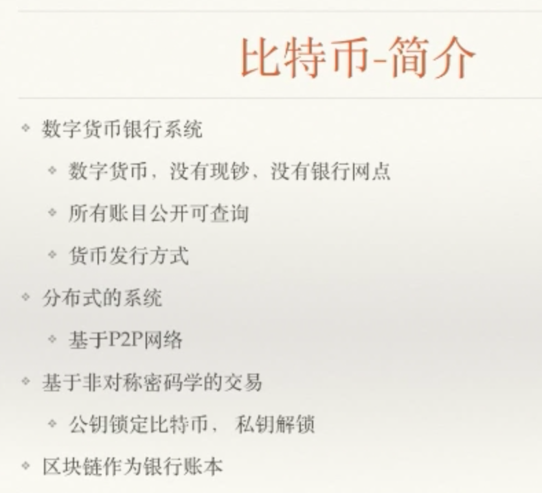
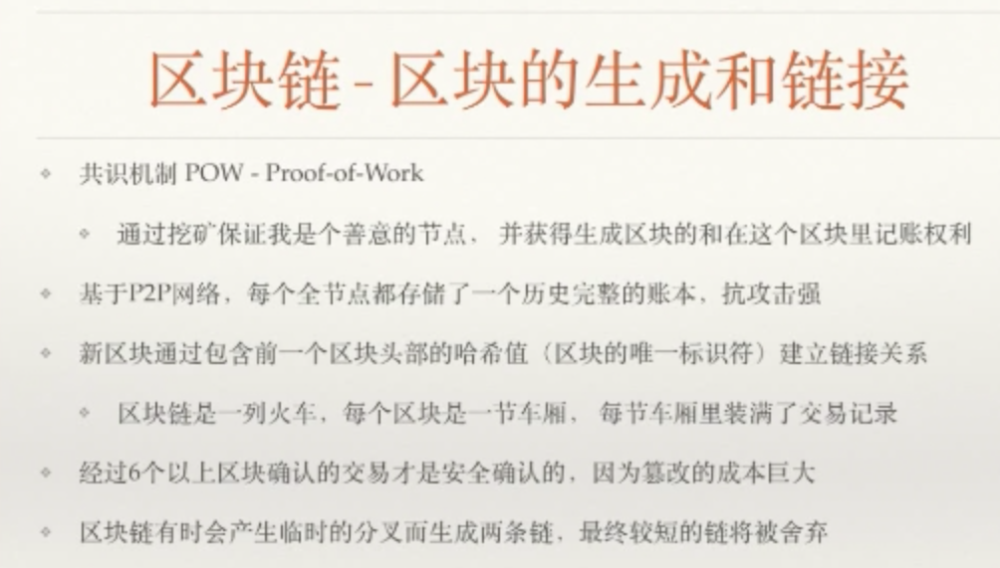
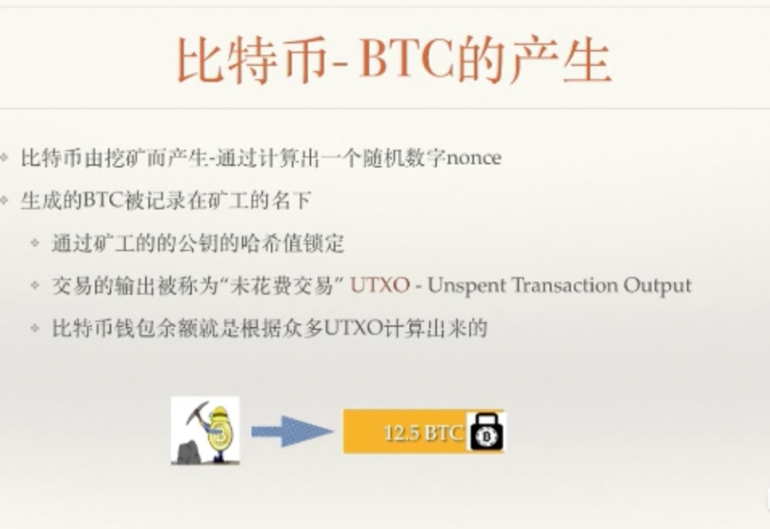

#20180416_bitbi 简介





Bitbi  钱包地址就是银行账户。【太长】分批存储

这个账本是公共的，想知道谁有多少钱，很难的。

所有账户可查

区块链进行交易用的公钥的Hash 【比较短】


货币发行：

CoinBase: 挖出来的 最基础的东西，发源地

2100w 枚，每4年减半

x + 头部哈希 < 条件 就得到12.5 个币的奖励

挖矿：解决节点间的信任问题。


分布式系统：以前得下载整个账本（100多G，盗旷），现在只需要下载10几M就能移动交易

P2P：点对点的，没中间的概念，节点之间是对等的。

非常安全的系统


非对称密码的交易： 公钥和私钥，每个钱+锁，匹配锁的钥匙，就是私钥。


一个字符改变，整个链都是非法，除非有50% 的算力，证明其它非法，自己是合法。



不说时间戳，说链的高度。

挖矿太难，证明合法性。

```cpp
         3  - 4 -5 -6
        /
0 -1 -2
        \3 - 4 - 5     
```

没有实力50%超算力来超过长链，只能认怂，废掉【白做了】。一般有连续两个同时在算力概率就很小了。




交易UTXO(比特币 未花费输出) + 区块链（打包相关） = 比特币系统


区块链硬分叉：BCC/BCH

软分叉： 都认同


扩容、分叉（都不好）

