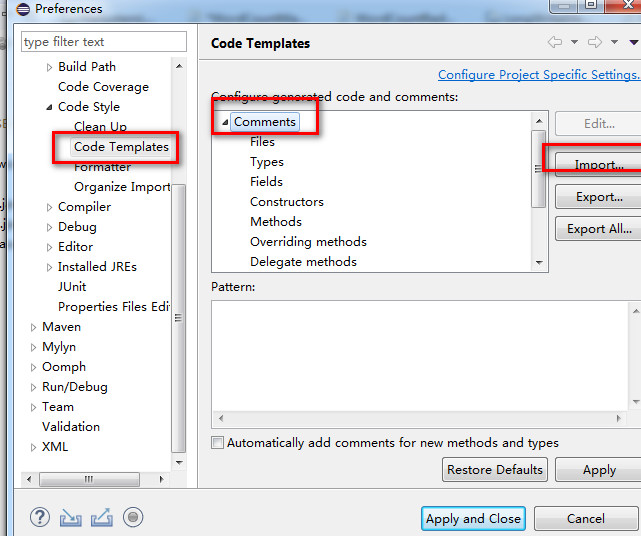
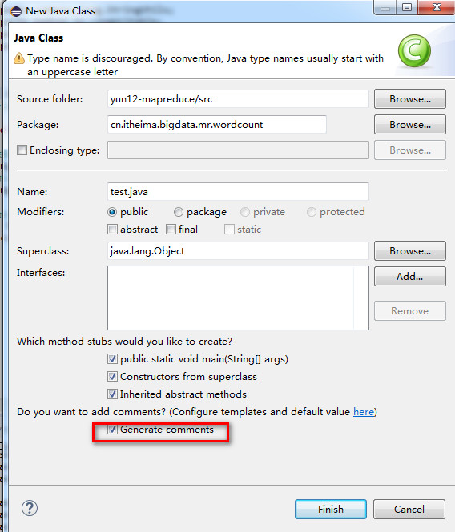
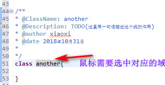

# Eclipse 注释末班设置

## 文档注释快捷键

可通过如下三种方法自动添加注释：

（1）输入“/**”并回车。

（2）用快捷键 Alt＋Shift+J（先选中某个方法、类名或变量名）。

（3）在右键菜单中选择“Source > Generate ElementComment”。

<br>

## 自定义文档注释

设置注释模板的入口：

Window-<Preference-<Java-<CodeStyle-<Code Template 然后展开Comments节点就是所有需设置注释的元素。现就每一个元素逐一介绍：

文件(Files)注释标签：

```sh
/**
* @Title: ${file_name}
* @Package ${package_name}
* @Description: ${todo}(用一句话描述该文件做什么)
* @author ${user}
* @date ${date}
* @version V1.0
*/
```

类型(Types)注释标签（类的注释）：

```sh
/**
* @ClassName: ${type_name}
* @Description: ${todo}(这里用一句话描述这个类的作用)
* @author ${user}
* @date ${date}
*
* ${tags}
*/
```

字段(Fields)注释标签：

```sh
/**
* @Fields field:field:{todo}(用一句话描述这个变量表示什么)
*/
```

构造函数标签

```sh
/**
* 创建一个新的实例 ${enclosing_type}.
*
* ${tags}
*/
```


* @Fields field:field:{todo}(用一句话描述这个变量表示什么)
  */
  构造函数(Constructor)标签：

/**
* 创建一个新的实例 ${enclosing_type}.
  *
* ${tags}
  */

方法(Methods)标签：

```sh
/**
* @Title: ${enclosing_method}
* @Description: ${todo}(这里用一句话描述这个方法的作用)
* @param ${tags}    参数
* @return ${return_type}    返回类型
* @throws
*/
```


覆盖方法(Overriding Methods)标签：

```sh
/* (非 Javadoc)
* <p>Title: ${enclosing_method}</p>
* <p>Description: </p>
* ${tags}
* ${see_to_overridden}
*/
```

代理方法(Delegate Methods)标签：

```sh
/**
* ${tags}
* ${see_to_target}
*/
```


getter方法标签：

```sh
/**
* @return ${bare_field_name}
*/
```

setter方法标签：

```sh
/**
* @param paramtheparamthe{bare_field_name} to set
*/
```

<br>

要实现上面的注释模板，这需要将下面的配置文件导入就可以了：



配置文件在 [unmd](unmd) 目录下

```xml
<?xml version="1.0" encoding="UTF-8"?>
<templates>
<template
            autoinsert="false"
            context="filecomment_context"
            deleted="false"
            description="Comment for created Java files"
            enabled="true"
            id="org.eclipse.jdt.ui.text.codetemplates.filecomment"
            name="filecomment">
/**  
* 嘟嘟oο哇靠！快让开，女友等我呢...
*　　　　 ╭══╮ 
*　　　 ╭╯ΘΘ║ 
*　　　 ╰⊙═⊙╯。oо○  压死了不管 
* There is no way to happiness ,happiness is the way.  
* ---------------------------------------------------- 
* @Title: ${file_name}
* @Package ${package_name}
* @Description: ${todo}(用一句话描述该文件做什么)
* @author ${user}
* @date ${date}
* @version V1.0  
*/
</template>
<template
            autoinsert="false"
            context="typecomment_context"
            deleted="false"
            description="Comment for created types"
            enabled="true"
            id="org.eclipse.jdt.ui.text.codetemplates.typecomment"
            name="typecomment">
/**
* @ClassName: ${type_name}
* @Description: ${todo}(这里用一句话描述这个类的作用)
* @author ${user}
* @date ${date}
*
* ${tags}
*/
</template>
<template
            autoinsert="false"
            context="fieldcomment_context"
            deleted="false"
            description="Comment for fields"
            enabled="true"
            id="org.eclipse.jdt.ui.text.codetemplates.fieldcomment"
            name="fieldcomment">
/**
* @Fields field:field:{todo}(用一句话描述这个变量表示什么)
*/
</template>
<template
            autoinsert="false"
              context="constructorcomment_context"
            deleted="false"
            description="Comment for created constructors"
            enabled="true"
            id="org.eclipse.jdt.ui.text.codetemplates.constructorcomment"
            name="constructorcomment">
/**
 * 创建一个新的实例 ${enclosing_type}.
 *
 * ${tags}
 */
</template>
    <template
            autoinsert="false"
            context="methodcomment_context"
            deleted="false"
            description="Comment for non-overriding methods"
            enabled="true"
            id="org.eclipse.jdt.ui.text.codetemplates.methodcomment"
            name="methodcomment">
/**
* @Title: ${enclosing_method}
* @Description: ${todo}(这里用一句话描述这个方法的作用)
* @param ${tags}    参数
* @return ${return_type}    返回类型
* @throws
*/
</template>
<template
            autoinsert="true"
            context="overridecomment_context"
            deleted="false"
            description="Comment for overriding methods"
            enabled="true"
            id="org.eclipse.jdt.ui.text.codetemplates.overridecomment"
            name="overridecomment">
/* (非 Javadoc)
* <p>Title: ${enclosing_method}</p>
* <p>Description: </p>
* ${tags}
* ${see_to_overridden}
*/
</template>
    <template
            autoinsert="true"
            context="delegatecomment_context"
            deleted="false"
            description="Comment for delegate methods"
            enabled="true"
            id="org.eclipse.jdt.ui.text.codetemplates.delegatecomment"
            name="delegatecomment">
/**
 * ${tags}
 * ${see_to_target}
 */
</template>
<template
            autoinsert="false"
            context="gettercomment_context"
            deleted="false"
            description="Comment for getter method"
            enabled="true"
            id="org.eclipse.jdt.ui.text.codetemplates.gettercomment"
            name="gettercomment">
/**
* @return ${bare_field_name}
*/
</template>
<template
            autoinsert="true"
            context="settercomment_context"
            deleted="false"
            description="Comment for setter method"
            enabled="true"
            id="org.eclipse.jdt.ui.text.codetemplates.settercomment"
            name="settercomment">
/**
 * @param paramtheparamthe{bare_field_name} to set
 */
</template>
</templates>
```
或者可以从网上下载配置好的.xml文件导入也可以。[下载请点击我！](http://download.csdn.net/detail/dobirds/5252232)

 PS:在按照上面的方法设置后，一定要到 ==windows->Preferences->general->Content Types== ，右侧Context Types树，点开Text，选择Java Source File，在下面的Default encoding输入框中**输入UTF-8**，点Update，则设置Java文件编码为UTF-8，否则会出现字符编码的问题。

经过如上的设置后，就可以使用快捷键Alt+Shift+J来快速生成文档的注释了。使用方法如下：

## 文件头注释：

使用New->Class方法生成的文件会在创建类的对话框选项中提示是否生成注释，**默认是选中的**。这样生成的.java文件就有在文件头**带有上面设置的版权信息**。若是使用**New->File方法建立的java文件则不会自动生成文件头的版权信息，必须手动输入。**

New -> class 的时候，这个地方需要勾选



新建一个类，生成的模板如下：

```java

/**  
* 嘟嘟oο哇靠！快让开，女友等我呢...
*　　　　 ╭══╮ 
*　　　 ╭╯ΘΘ║ 
*　　　 ╰⊙═⊙╯。oо○  压死了不管 
* There is no way to happiness ,happiness is the way.  
* ---------------------------------------------------- 
* @Title: test.java
* @Package cn.itheima.bigdata.mr.wordcount
* @Description: TODO(用一句话描述该文件做什么)
* @author xiaoxi
* @date 2018年10月31日
* @version V1.0  
*/

package cn.itheima.bigdata.mr.wordcount;


/**
* @ClassName: test
* @Description: TODO(这里用一句话描述这个类的作用)
* @author xiaoxi
* @date 2018年10月31日
*
*/

public class test {

	/**
	 * 创建一个新的实例 test.
	 *
	 */

	public test() {
		// TODO Auto-generated constructor stub
	}

}

/**
* @ClassName: another
* @Description: TODO(这里用一句话描述这个类的作用)
* @author xiaoxi
* @date 2018年10月31日
*
*/
class another{
	
}
```


<br>

## 方法、类、字段等注释：

这一类的注释只需要选中方法名、类名、或字段名，然后使用Alt+Shift+J来自动生成注释，然后补全信息即可。

==插入前， 鼠标需要选中对应的域==




## 参考

1- https://www.cnblogs.com/duboway/archive/2013/04/11/Eclipse.html

2- https://blog.csdn.net/paul342/article/details/52982585

