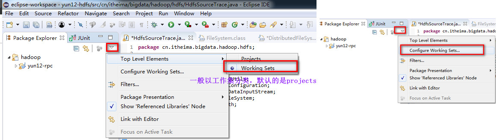
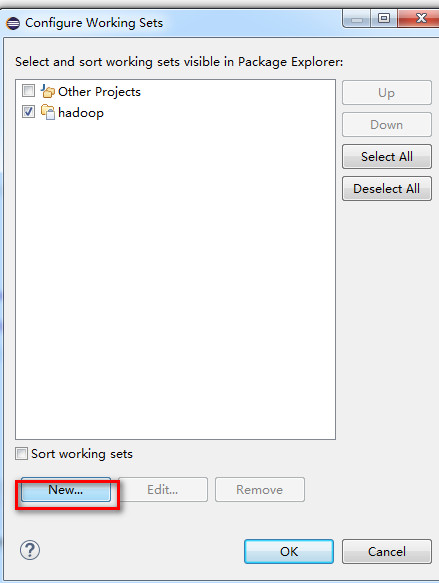
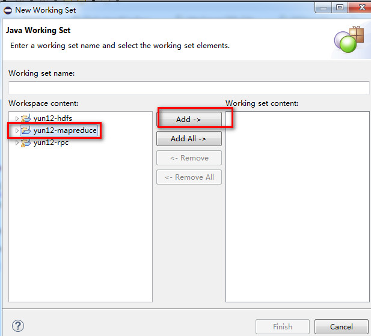
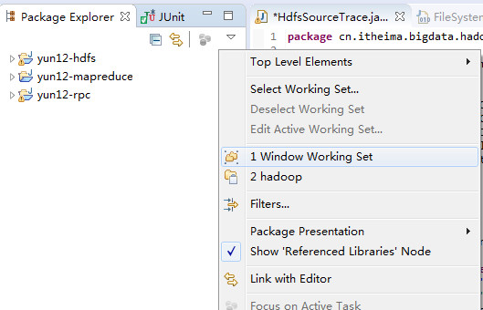
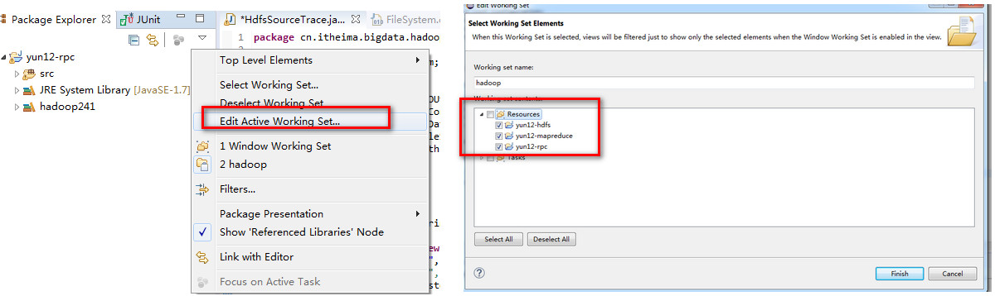

# eclipse workingset 的管理

1- 一个界面可以打开多个 project， 多个project 用 working set 进行分类管理；

一旦选择 New， 相当于新建 working set:

新建一个working set， 并选择相应的 Project

 

2- 假如新建工程时，没有指定working set， 默认是在  Window working set 下面：

怎么把他们添加到hadoop工作集中呢, 一定是通过右上角，倒三角下的 Edit Active Working Set 来设置的；

