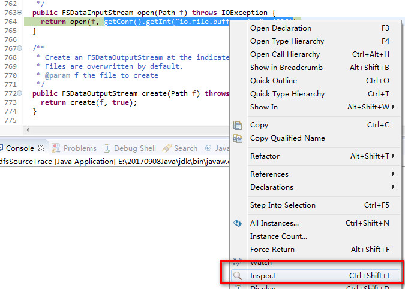
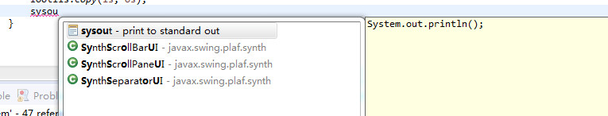

# eclipse 调试和相关快捷键

## 窗口

1- ctrl + M: 窗口最大化

2- 窗口视图的切换


<br>

## 错误

ctrl+.及ctrl+1：下一个错误及快速修改**

​    ctrl+.将光标移动至当前文件中的下一个报错处或警告处。这组快捷键我一般与ctrl+1一并使用，即修改建议的快捷键。新版Eclipse的修改建 议做的很不错，可以帮你解决很多问题，如方法中的缺失参数，throw/catch exception，未执行的方法等等。

[]()

更多快捷键组合可在Eclipse按下==ctrl+shift+L==查看。 

<br>

## 打开文件

| 序号   | 快捷键          | 说明                               |
| ---- | ------------ | -------------------------------- |
| 1    | ctrl+shift+r | 打开你工作区中任何一个文件                    |
| 2    | ctrl+o       | outline<br>列出当前类所有的方法和属性； 不用拉上拉下 |
| 3    | ctrl + e     | 在打开的编辑器之间快速浏览                    |

<br>

## 查看一个方法被谁使用

在idea 里就是右键查 usage

在eclipse里有4种方法：

| 序号   | 快捷键                        | 说明                                       |
| ---- | -------------------------- | ---------------------------------------- |
| 1    | Ctrl+Alt+H                 | 双击选中该方法<br> 如果你想知道一个类的方法到底被那些其他的类调用，那么请选中这个方法名，然后按“Ctrl+Alt+H”， Eclipse就会显示出这个方法被哪些方法调用，最终产生一个调用关系树。 |
| 2    | Ctrl+Shift+G <br>现在是Ctrl+G | 查询在整个工作区中被谁引用了                           |
| 3    | Ctrl + H（全局搜索）             | 选中该方法                                    |
| 4    | 右键reference                | 选中该方法                                    |

<br>

## 搜索

1-

| 序号   | 快捷键    | 说明                               |
| ---- | ------ | -------------------------------- |
| 1    | ctrl+H | 自定义全局搜索                          |
| 2    | ctrl+3 | 右上角快速搜索，这个更多的是eclipse本身菜单相关的一些搜索 |

对于第一种搜索方式，需要配置：

FileSearch 也用一点，但是更多的用JavaSearch；

下面选择搜索的 是类还是方法；

还要选择搜索的区域；

 

<br>

2- **Control-Shift-T: 打开类型（Open type）。**如果你不是有意磨洋工，还是忘记通过源码树（source tree）打开的方式吧。用eclipse很容易打开接口的实现类的，按ctrl+t会列出接口的实现类列表


打开当前光标所在接口的所有实现类：


<br>

## 跳转

这个很简单了。

| 序号   | 快捷键          | 说明           |
| ---- | ------------ | ------------ |
| 1    | alt + <-     | 跳转到上一个位置     |
| 2    | alt + ->     | 跳转到下一个位置     |
| 3    | Ctrl + 单击/F3 | 跳转到函数或者方法定义处 |

<br>

## 调试

1- 查看变量的结果：

鼠标放在上面，或者右边的侧边栏；


2- 流程控制：


| 序号   | 快捷键                          | 说明              |
| ---- | ---------------------------- | --------------- |
| 1    | F5                           | 跳进函数里面执行        |
| 2    | F6                           | 不进入函数， 当成单条语句执行 |
| 3    | Ctrl + R<br>或者右键 Run to Line | 运行到光标所在行        |

<br>

3- Debug 的时候希望能看到表达式返回的值：

选中表达式 ctrl+shift+I



4- Debug 的时候看，函数下一步走哪里：

ctrl + 鼠标点击， "Open Implementation" 说明在这个类里是抽象方法， 肯定走的是子类中 的方法


<br>

5- 删除所有断点


<br>


## 编辑

1- 编辑有一个好用的特性是： 鼠标在哪里，左侧蓝色的条形框显示的是方法的区域； 这个就不用费力的去找两个花括号的位置了；


2- 输入时候希望有提示下拉框：

alt + ‘/’



3- 如果想聚焦一下，看看该方法是哪个类的， 按F2


4- ctrl + 2 ( 被自定义成了 alt +2 )： 打完new 后面的，前面自动补全；

```java
FileOutputStream os = new FileOutputStream("d:/jdk.tgz.download");
```


