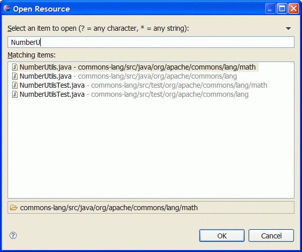
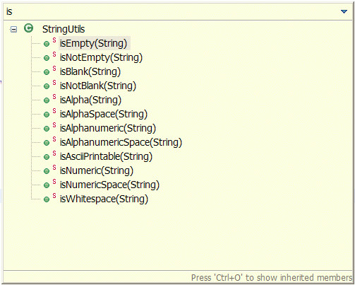
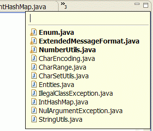
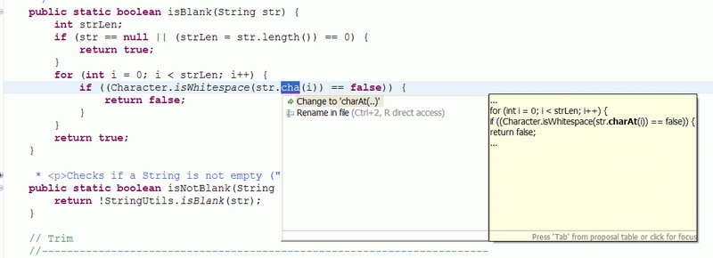

 # eclipse10 个最有用的快捷键

可以自定义的，使之符合自己的习惯（Window->Preferences->General->Keys）。

Eclipse中10个最有用的快捷键组合 

**1. ctrl+shift+r：打开资源**

​    这可能是所有快捷键组合中最省时间的了。这组快捷键可以让你打开你的工作区中任何一个文件，而你只需要按下文件名或mask名中的前几个字母，比如applic*.xml。美中不足的是这组快捷键并非在所有视图下都能用。

**2. ctrl+o：快速outline**

​    如果想要查看当前类的方法或某个特定方法，但又不想把代码拉上拉下，也不想使用查找功能的话，就用ctrl+o吧。它可以列出当前类中的所有方法及属性，你只需输入你想要查询的方法名，点击enter就能够直接跳转至你想去的位置。

**3. ctrl+e：快速转换编辑器**

​    这组快捷键将帮助你在打开的编辑器之间浏览。使用ctrl+page down或ctrl+page up可以浏览前后的选项卡，但是在很多文件打开的状态下，ctrl+e会更加有效率。

**4. ctrl+2，L：为本地变量赋值**

​    开发过程中，我常常先编写方法，如Calendar.getInstance()，然后通过ctrl+2快捷键将方法的计算结果赋值于一个本地变量之上。 这样我节省了输入类名，变量名以及导入声明的时间。Ctrl+F的效果类似，不过效果是把方法的计算结果赋值于类中的域。

**5. alt+shift+r：重命名**

​    重命名属性及方法在几年前还是个很麻烦的事，需要大量使用搜索及替换，以至于代码变得零零散散的。今天的Java IDE提供源码处理功能，Eclipse也是一样。现在，变量和方法的重命名变得十分简单，你会习惯于在每次出现更好替代名称的时候都做一次重命名。要使 用这个功能，将[鼠标]()移动至属性名或方法名上，按下alt+shift+r，输入新名称并点击回车。就此完成。如果你重命名的是类中的一个属性，你可以点击alt+shift+r两次，这会呼叫出源码处理对话框，可以实现get及set方法的自动重命名。

**6. alt+shift+l以及alt+shift+m：提取本地变量及方法**

​    源码处理还包括从大块的代码中提取变量和方法的功能。比如，要从一个string创建一个常量，那么就选定文本并按下alt+shift+l即可。如果同 一个string在同一类中的别处出现，它会被自动替换。方法提取也是个非常方便的功能。将大方法分解成较小的、充分定义的方法会极大的减少复杂度，并提 升代码的可测试性。

**7. shift+enter及ctrl+shift+enter**

​    Shift+enter在当前行之下创建一个空白行，与光标是否在行末无关。Ctrl+shift+enter则在当前行之前插入空白行。

**8. Alt+方向键**

​    这也是个节省时间的法宝。这个组合将当前行的内容往上或下移动。在try/catch部分，这个快捷方式尤其好使。

**9. ctrl+m**

​    大显示屏幕能够提高工作效率是大家都知道的。Ctrl+m是编辑器窗口最大化的快捷键。

**10. ctrl+.及ctrl+1：下一个错误及快速修改**

​    ctrl+.将光标移动至当前文件中的下一个报错处或警告处。这组快捷键我一般与ctrl+1一并使用，即修改建议的快捷键。新版Eclipse的修改建 议做的很不错，可以帮你解决很多问题，如方法中的缺失参数，throw/catch exception，未执行的方法等等。

更多快捷键组合可在Eclipse按下ctrl+shift+L查看。

让我们按照使用频率来看看我最爱用的一些热键组合。（注：以下内容在Eclipse3.02及一上版本通过测试）

1. **Control-Shift-T: 打开类型（Open type）。**如果你不是有意磨洋工，还是忘记通过源码树（source tree）打开的方式吧。用eclipse很容易打开接口的实现类的，按ctrl+t会列出接口的实现类列表

2. **Control-Shift-R: 打开资源（不只是用来寻找Java文件）。**小提示：利用Navigator视图的黄色双向箭头按钮让你的编辑窗口和导航器相关联。这会让你打开的文件对应显示在导航器的层级结构中，这样便于组织信息。如果这影响了速度，就关掉它。

3. **F3: 打开申明（Open declaration）。**或者，利用Declaration Tab（在Java视图模式下，选择Windows --> Show View -- > Declaration）。当你选中代码中的一个方法，然后按这个按键，它会把整个方法在申明方框里显示出来。

4. **Alt-left arrow: 在导航历史记录（Navigation History）中后退。**就像Web浏览器的后退按钮一样，在利用F3跳转之后，特别有用。（用来返回原先编译的地方）

5. **Alt-right arrow: 导航历史记录中向前。**

6. **Control-Q: 回到最后一次编辑的地方。**这个快捷键也是当你在代码中跳转后用的。特别是当你钻的过深，忘记你最初在做什么的时候。

7. **Control-Shift-G: 在workspace中搜索引用（reference）。**这 是重构的前提。对于方法，这个热键的作用和F3恰好相反。它使你在方法的栈中，向上找出一个方法的所有调用者。一个与此相关的功能是开启“标记”功能 （occurrence marking） 。选择Windows->Preferences->Java-> Editor-> Mark Occurrences，勾选选项。这时，当你单击一个元素的时候，代码中所有该元素存在的地方都会被高亮显示。我个人只使用“标记本地变量”（Mark Local Variables）。注意：太多的高亮显示会拖慢Eclipse。

8. **Control-Shift-F: CodeàJavaàPreferencesà根据代码风格设定重新格式化代码。**我 们的团队有统一的代码格式，我们把它放在我们的wiki上。要这么做，我们打开Eclipse，选择Window Style，然后设置Code Formatter，Code Style和Organize Imports。利用导出（Export）功能来生成配置文件。我们把这些配置文件放在wiki上，然后团队里的每个人都导入到自己的Eclipse中。

9. **Control-O: 快速概要(quick outline)。**通过这个快捷键，你可以迅速的跳到一个方法或者属性，只需要输入名字的头几个字母。

10. **Control-/: 对一行注释或取消注释。对于多行也同样适用。**

11. **Control-Alt-down arrow: 复制高亮显示的一行或多行。**

12. **Alt-down arrow: 将一行或多行向下移动。Alt-up arrow会向上移动。**

其他的热键在菜单里有。你可以通过按下Control-Shift-L（从3.1版本开始）， 看到所有快捷键的列表。按下Control-Shift-L两次，会显示热键对话框（Keys Preferences dialog），你可以在这里自己设置热键。我欢迎你在Talkback部分发表你的Eclipse提示。

**其他的Eclipse窍门**

我总结了几个相关的小窍门：

**锁定命令行窗口**：在命令行视图中（Window ->Show View ->Other ->Basic ->Console），试试看用滚动锁定按钮来锁定控制台输出不要滚屏。

**使用Ant视图**： 在我的Java或Debug模式下，我喜欢显示出Ant视图，这样我就可以迅速的运行Ant任务。通过Window Ant可以找到该视图。把Ant视图放在屏幕的一角， 通过“添加编译文件（Addà Other à Show View à Buildfiles）”按钮来添加build.xml文件。在3.1版本中，甚至支持Ant调试脚本语言。

**自动遍历一个集合**：for + Control-Space: 如果你还不知道，那么你应该记住Control-Space是自动完成功能。在Eclipse中，你还可以自动完成结构。在一个数组或集合范围内，试试看 输入“for”然后按下Control-Space键。Eclipse会问你你想要遍历哪一个集合然后自动完成循环代码。

**使用分级布局**： 在包浏览视图（Package Explorer view）中默认的布局（扁平式）方式让我困惑，它把包的全名显示在导航树（navigation tree）中。我更喜欢我源码的包和文件系统视图，在Eclipse中叫做分级布局（Hierarchical Layout）。要切换到这种模式，点击包浏览视图中向下的按钮，选择布局（Layout），然后选择分级（Hierarchial）。

**一次显示多个文件**：你可以一次浏览多个文件。把不在激活状态的编辑窗口拖到激活窗口的底部或侧边的滚动条上，就可以打开该编辑窗口。这是我能描述该窍门的最好方式了。

**同时打开两个Eclipse**： 要将改动从一个CVS分支上合并到另外一个上，我喜欢通过同时打开两个工作目录（Workspace）不同Eclipse来实现。这样我可以通过比较 CVS上的最新版本看到所有的变化（右键单击工程，然后选择Compare Lastest from HEAD）然后把每一个变化都合并到另外一个CVS分支上。启动多个Eclipse的最简单的方法是利用Eclipseàwith Launcher。

**Implementors插件**：安装一个能够跳到一个接口的实现的插件。如果你是个dependency injection 粉丝，或者正在基于编写优良的接口工作，那么你需要一个这样的插件来加速代码导航。 你可以在SourceForge找到这个插件。

Ctrl+Alt+H

如果你想知道一个类的方法到底被那些其他的类调用，那么请选中这个方法名，然后按“Ctrl+Alt+H”，

Eclipse就会显示出这个方法被哪些方法调用，最终产生一个调用关系树。 
\1. Ctrl+左键

这个是大多数人经常用到的，用来查看变量、方法、类的定义

\2. Ctrl+O

查看一个类的纲要，列出其方法和成员变量。提示：再多按一次Ctrl+O，可以列出该类继承的方法和变量。

助记："O"--->"Outline"--->"纲要"

\3. Ctrl+T

查看一个类的继承关系树，是自顶向下的，再多按一次Ctrl+T, 会换成自底向上的显示结构。

提示：选中一个方法名，按Ctrl+T，可以查看到有这个同名方法的父类、子类、接口。

助记："T"------->"Tree"----->"层次树"

4.Alt+左右方向键

我们经常会遇到看代码时Ctrl+左键，层层跟踪，然后迷失在代码中的情况，这时只需要按“Alt+左方向键

”就可以退回到上次阅读的位置，同理，按“Alt+右方向键”会前进到刚才退回的阅读位置，就像浏览器的

前进和后退按钮一样。

导入包：Ctrl+Shift+O 
编辑 
作用域 功能 快捷键 
全局 查找并替换 Ctrl+F 
文本编辑器 查找上一个 Ctrl+Shift+K 
文本编辑器 查找下一个 Ctrl+K 
全局 撤销 Ctrl+Z 
全局 复制 Ctrl+C 
全局 恢复上一个选择 Alt+Shift+↓ 
全局 剪切 Ctrl+X 
全局 快速修正 Ctrl1+1 
全局 内容辅助 Alt+/ 
全局 全部选中 Ctrl+A 
全局 删除 Delete 
全局 上下文信息 Alt+？ 
Alt+Shift+? 
Ctrl+Shift+Space 
Java编辑器 显示工具提示描述 F2 
Java编辑器 选择封装元素 Alt+Shift+↑ 
Java编辑器 选择上一个元素 Alt+Shift+← 
Java编辑器 选择下一个元素 Alt+Shift+→ 
文本编辑器 增量查找 Ctrl+J 
文本编辑器 增量逆向查找 Ctrl+Shift+J 
全局 粘贴 Ctrl+V 
全局 重做 Ctrl+Y 
查看 
作用域 功能 快捷键 
全局 放大 Ctrl+= 
全局 缩小 Ctrl+- 
窗口 
作用域 功能 快捷键 
全局 激活编辑器 F12 
全局 切换编辑器 Ctrl+Shift+W 
全局 上一个编辑器 Ctrl+Shift+F6 
全局 上一个视图 Ctrl+Shift+F7 
全局 上一个透视图 Ctrl+Shift+F8 
全局 下一个编辑器 Ctrl+F6 
全局 下一个视图 Ctrl+F7 
全局 下一个透视图 Ctrl+F8 
文本编辑器 显示标尺上下文菜单 Ctrl+W 
全局 显示视图菜单 Ctrl+F10 
全局 显示系统菜单 Alt+- 
导航 
作用域 功能 快捷键 
Java编辑器 打开结构 Ctrl+F3 
全局 打开类型 Ctrl+Shift+T 
全局 打开类型层次结构 F4 
全局 打开声明 F3 
全局 打开外部javadoc Shift+F2 
全局 打开资源 Ctrl+Shift+R 
全局 后退历史记录 Alt+← 
全局 前进历史记录 Alt+→ 
全局 上一个 Ctrl+, 
全局 下一个 Ctrl+. 
Java编辑器 显示大纲 Ctrl+O 
全局 在层次结构中打开类型 Ctrl+Shift+H 
全局 转至匹配的括号 Ctrl+Shift+P 
全局 转至上一个编辑位置 Ctrl+Q 
Java编辑器 转至上一个成员 Ctrl+Shift+↑ 
Java编辑器 转至下一个成员 Ctrl+Shift+↓ 
文本编辑器 转至行 Ctrl+L 
搜索 
作用域 功能 快捷键 
全局 出现在文件中 Ctrl+Shift+U 
全局 打开搜索对话框 Ctrl+H 
全局 工作区中的声明 Ctrl+G 
全局 工作区中的引用 Ctrl+Shift+G 
文本编辑 
作用域 功能 快捷键 
文本编辑器 改写切换 Insert 
文本编辑器 上滚行 Ctrl+↑ 
文本编辑器 下滚行 Ctrl+↓ 
文件 
作用域 功能 快捷键 
全局 保存 Ctrl+X 
Ctrl+S 
全局 打印 Ctrl+P 
全局 关闭 Ctrl+F4 
全局 全部保存 Ctrl+Shift+S 
全局 全部关闭 Ctrl+Shift+F4 
全局 属性 Alt+Enter 
全局 新建 Ctrl+N 
项目 
作用域 功能 快捷键 
全局 全部构建 Ctrl+B 
源代码 
作用域 功能 快捷键 
Java编辑器 格式化 Ctrl+Shift+F 
Java编辑器 取消注释 Ctrl+/ 
Java编辑器 注释 Ctrl+/ 
Java编辑器 添加单个import Ctrl+Shift+M 
Java编辑器 组织多个import Ctrl+Shift+O 
Java编辑器 使用try/catch块来包围 未设置，太常用了，所以在这里列出,建议自己设置。 
也可以使用Ctrl+1自动修正。 
调试/运行 
作用域 功能 快捷键 
全局 单步返回 F7 
全局 单步跳过 F6 
全局 单步跳入 F5 
全局 单步跳入选择 Ctrl+F5 
全局 调试上次启动 F11 
全局 继续 F8 
全局 使用过滤器单步执行 Shift+F5 
全局 添加/去除断点 Ctrl+Shift+B 
全局 显示 Ctrl+D 
全局 运行上次启动 Ctrl+F11 
全局 运行至行 Ctrl+R 
全局 执行 Ctrl+U 
重构 
作用域 功能 快捷键 
全局 撤销重构 Alt+Shift+Z 
全局 抽取方法 Alt+Shift+M 
全局 抽取局部变量 Alt+Shift+L 
全局 内联 Alt+Shift+I 
全局 移动 Alt+Shift+V 
全局 重命名 Alt+Shift+R 
全局 重做 Alt+Shift+Y

（1）Ctrl+M切换窗口的大小 
（2）Ctrl+Q跳到最后一次的编辑处 
（3）F2当鼠标放在一个标记处出现Tooltip时候按F2则把鼠标移开时Tooltip还会显示即Show Tooltip

Description。 
F3跳到声明或定义的地方。 
F5单步调试进入函数内部。 
F6单步调试不进入函数内部，如果装了金山词霸2006则要把“取词开关”的快捷键改成其他的。 
F7由函数内部返回到调用处。 
F8一直执行到下一个断点。 
（4）Ctrl+Pg~对于XML文件是切换代码和图示窗口 
（5）Ctrl+Alt+I看Java文件中变量的相关信息 
（6）Ctrl+PgUp对于代码窗口是打开“Show List”下拉框，在此下拉框里显示有最近曾打开的文件 
（7）Ctrl+/ 在代码窗口中是这种//~注释。 
Ctrl+Shift+/ 在代码窗口中是这种/*~*/注释，在JSP文件窗口中是〈!--~--〉。 
（8）Alt+Shift+O(或点击工具栏中的Toggle Mark Occurrences按钮) 当点击某个标记时可使本页面中其他

地方的此标记黄色凸显，并且窗口的右边框会出现白色的方块，点击此方块会跳到此标记处。 
（9）右击窗口的左边框即加断点的地方选Show Line Numbers可以加行号。 
（10）Ctrl+I格式化激活的元素Format Active Elements。 
Ctrl+Shift+F格式化文件Format Document。 
（11）Ctrl+S保存当前文件。 
Ctrl+Shift+S保存所有未保存的文件。 
（12）Ctrl+Shift+M(先把光标放在需导入包的类名上) 作用是加Import语句。 
Ctrl+Shift+O作用是缺少的Import语句被加入，多余的Import语句被删除。 
（13）Ctrl+Space提示键入内容即Content Assist，此时要将输入法中Chinese(Simplified)IME-

Ime/Nonlme Toggle的快捷键（用于切换英文和其他文字）改成其他的。 
Ctrl+Shift+Space提示信息即Context Information。 
（14）双击窗口的左边框可以加断点。 
（15）Ctrl+D删除当前行。

Eclipse快捷键大全 
Ctrl+1 快速修复(最经典的快捷键,就不用多说了) 
Ctrl+D: 删除当前行 
Ctrl+Alt+↓ 复制当前行到下一行(复制增加) 
Ctrl+Alt+↑ 复制当前行到上一行(复制增加)

Alt+↓ 当前行和下面一行交互位置(特别实用,可以省去先剪切,再粘贴了) 
Alt+↑ 当前行和上面一行交互位置(同上) 
Alt+← 前一个编辑的页面 
Alt+→ 下一个编辑的页面(当然是针对上面那条来说了)

Alt+Enter 显示当前选择资源(工程,or 文件 or文件)的属性

Shift+Enter 在当前行的下一行插入空行(这时鼠标可以在当前行的任一位置,不一定是最后) 
Shift+Ctrl+Enter 在当前行插入空行(原理同上条)

Ctrl+Q 定位到最后编辑的地方 
Ctrl+L 定位在某行 (对于程序超过100的人就有福音了) 
Ctrl+M 最大化当前的Edit或View (再按则反之) 
Ctrl+/ 注释当前行,再按则取消注释 
Ctrl+O 快速显示 OutLine 
Ctrl+T 快速显示当前类的继承结构 
Ctrl+W 关闭当前Editer 
Ctrl+K 参照选中的Word快速定位到下一个 
Ctrl+E 快速显示当前Editer的下拉列表(如果当前页面没有显示的用黑体表示)

Ctrl+/(小键盘) 折叠当前类中的所有代码

Ctrl+×(小键盘) 展开当前类中的所有代码

Ctrl+Space 代码助手完成一些代码的插入(但一般和输入法有冲突,可以修改输入法的热键,也可以暂用

Alt+/来代替)

Ctrl+Shift+E 显示管理当前打开的所有的View的管理器(可以选择关闭,激活等操作)

Ctrl+J 正向增量查找(按下Ctrl+J后,你所输入的每个字母编辑器都提供快速匹配定位到某个单词,如果没有

,则在stutes line中显示没有找到了,查一个单词时,特别实用,这个功能Idea两年前就有了)

Ctrl+Shift+J 反向增量查找(和上条相同,只不过是从后往前查)

Ctrl+Shift+F4 关闭所有打开的Editer

Ctrl+Shift+X 把当前选中的文本全部变味小写

Ctrl+Shift+Y 把当前选中的文本全部变为小写

Ctrl+Shift+F 格式化当前代码

Ctrl+Shift+P 定位到对于的匹配符(譬如{}) (从前面定位后面时,光标要在匹配符里面,后面到前面,则反之

)

下面的快捷键是重构里面常用的,本人就自己喜欢且常用的整理一下(注:一般重构的快捷键都是Alt+Shift开

头的了)

Alt+Shift+R 重命名 (是我自己最爱用的一个了,尤其是变量和类的Rename,比手工方法能节省很多劳动力)

Alt+Shift+M 抽取方法 (这是重构里面最常用的方法之一了,尤其是对一大堆泥团代码有用)

Alt+Shift+C 修改函数结构(比较实用,有N个函数调用了这个方法,修改一次搞定)

Alt+Shift+L 抽取本地变量( 可以直接把一些魔法数字和字符串抽取成一个变量,尤其是多处调用的时候)

Alt+Shift+F 把Class中的local变量变为field变量 (比较实用的功能)

Alt+Shift+I 合并变量(可能这样说有点不妥Inline) 
Alt+Shift+V 移动函数和变量(不怎么常用) 
Alt+Shift+Z 重构的后悔药(Undo)

链接<http://hi.baidu.com/lzycsd/blog/item/dcce5989a3f559bb0f2444cb.html>

## 参考

1- http://www.open-open.com/solution/view/1320934157953/