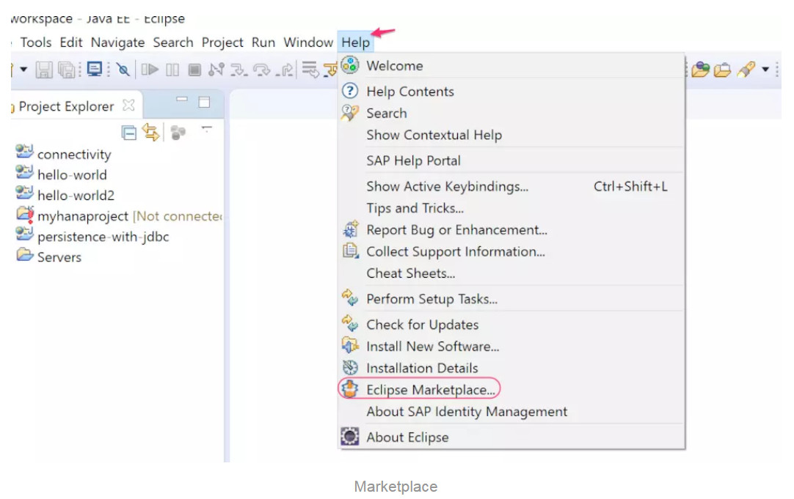
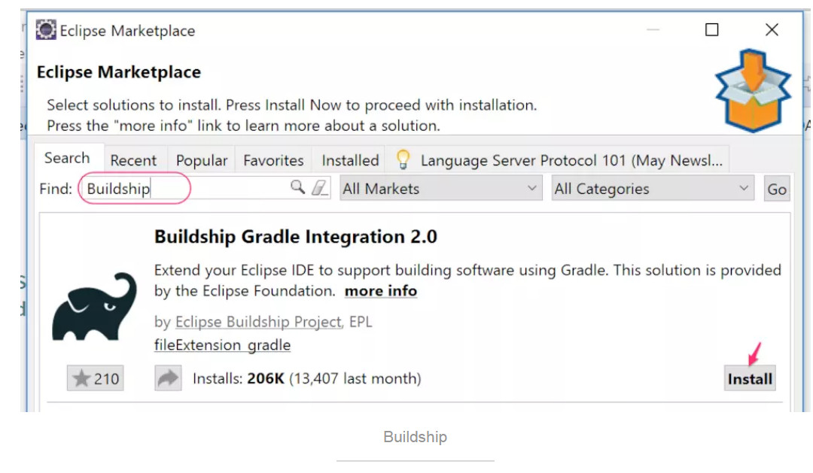
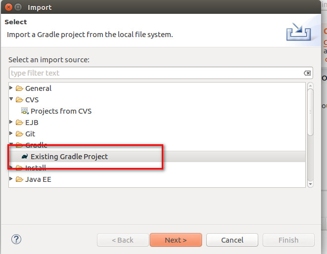

# eclipse中安装gradle插件

## 简介

管理java项目有两种工具，分别是maven和gradle。

gradle用的稍微多一点。

## 安装gradle

**在 Eclipse 的Marketplace中安装**

安装Eclipse Gradle工具的最简单的方法是使用Eclipse 中的Marketplace。我机器上的 Eclipse 的版本为： Neon.3 Release (4.6.3)，具体操作步骤为：

在弹出的窗口中，输入“Buildship”并回车进行搜索，

然后点击安装，并同意协议，安装完成以后，需要重启 Eclipse，

## 使用gradle管理项目

如果已经有工程了，可以先关掉工程。

然后手动建一个`build.gradle` 文件。

然后在import导入项目的时候， 选择导入gradle项目即可。

## 参考

https://www.jianshu.com/p/b5a02e360ec4

