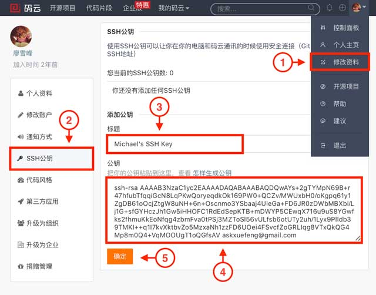

# 20180411 GitHub 和 码云一起用

```sh
第一次push 码云时，要注意，会提醒你填写用户名和密码。
```

使用码云和使用GitHub类似，我们在码云上注册账号并登录后，需要先上传自己的SSH公钥。选择右上角用户头像 -> 菜单“修改资料”，然后选择“SSH公钥”，填写一个便于识别的标题，然后把用户主目录下的`.ssh/id_rsa.pub`文件的内容粘贴进去：

【需要注意的是，如果之前用的247700529@qq.com 注册的GitHub，生成了相应的公钥，那么直接添加这个即可，即使码云用的账号是xiaoxiyouran@163.com 也没有关系】



点击“确定”即可完成并看到刚才添加的Key：


如果我们已经有了一个本地的git仓库（例如，一个名为learngit的本地库），如何把它关联到码云的远程库上呢？

首先，我们在码云上创建一个新的项目，选择右上角用户头像 -> 菜单“控制面板”，然后点击“创建项目”：


项目名称最好与本地库保持一致：

然后，我们在本地库上使用命令`git remote add`把它和码云的远程库关联：

```git
git remote add origin git@gitee.com:liaoxuefeng/learngit.git
```

之后，就可以正常地用`git push`和`git pull`推送了！

如果在使用命令`git remote add`时报错：

```
git remote add origin git@gitee.com:liaoxuefeng/learngit.git
fatal: remote origin already exists.
```

这说明本地库已经关联了一个名叫`origin`的远程库，此时，可以先用`git remote -v`查看远程库信息：

```
git remote -v
origin    git@github.com:michaelliao/learngit.git (fetch)
origin    git@github.com:michaelliao/learngit.git (push)
```

可以看到，本地库已经关联了`origin`的远程库，并且，该远程库指向GitHub。

我们可以删除已有的GitHub远程库：

```
git remote rm origin
```

再关联码云的远程库（注意路径中需要填写正确的用户名）：

```
git remote add origin git@gitee.com:liaoxuefeng/learngit.git
```

此时，我们再查看远程库信息：

```
git remote -v
origin    git@gitee.com:liaoxuefeng/learngit.git (fetch)
origin    git@gitee.com:liaoxuefeng/learngit.git (push)
```

现在可以看到，origin已经被关联到码云的远程库了。通过`git push`命令就可以把本地库推送到Gitee上。

------


有的小伙伴又要问了，一个本地库能不能既关联GitHub，又关联码云呢？

答案是肯定的，因为git本身是分布式版本控制系统，可以同步到另外一个远程库，当然也可以同步到另外两个远程库。

使用多个远程库时，我们要注意，git给远程库起的默认名称是`origin`，如果有多个远程库，我们需要用不同的名称来标识不同的远程库。

仍然以`learngit`本地库为例，我们先删除已关联的名为`origin`的远程库：

```
git remote rm origin
```


------

【**把 origin 替换掉即可**】

后，先关联GitHub的远程库：

```shell
git remote add github git@github.com:michaelliao/learngit.git
```

注意，**远程库的名称叫`github`，不叫`origin`了。**

接着，再关联码云的远程库：

```shell
git remote add gitee git@gitee.com:liaoxuefeng/learngit.git
```

**同样注意，远程库的名称叫`gitee`，不叫`origin`。**

现在，我们用`git remote -v`查看远程库信息，可以看到两个远程库：

```shell
git remote -v
gitee    git@gitee.com:liaoxuefeng/learngit.git (fetch)
gitee    git@gitee.com:liaoxuefeng/learngit.git (push)
github    git@github.com:michaelliao/learngit.git (fetch)
github    git@github.com:michaelliao/learngit.git (push)
```

**如果要推送到GitHub，使用命令：**

```
git push github master
```

**如果要推送到码云，使用命令：**

```
git push gitee master
```

这样一来，我们的本地库就可以同时与多个远程库互相同步：

```
┌─────────┐ ┌─────────┐
│ GitHub  │ │  Gitee  │
└─────────┘ └─────────┘
     ▲           ▲
     └─────┬─────┘
           │
    ┌─────────────┐
    │ Local Repo  │
    └─────────────┘

```

码云也同样提供了Pull request功能，可以让其他小伙伴参与到开源项目中来。你可以通过Fork我的仓库：<https://gitee.com/liaoxuefeng/learngit>，创建一个`your-gitee-id.txt`的文本文件，写点自己学习Git的心得，然后推送一个pull request给我，这个仓库会在码云和GitHub做双向同步。


