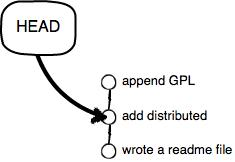

# 20180411 git 综合笔记

原文： https://www.liaoxuefeng.com/wiki/0013739516305929606dd18361248578c67b8067c8c017b000/001374831943254ee90db11b13d4ba9a73b9047f4fb968d000


## 1- Git 的安装

在Linux上一条命令解决

```git
sudo apt-get install git
```

安装完成后，还需要最后一步设置，在命令行输入：

```
$ git config --global user.name "Your Name"
$ git config --global user.email "email@example.com"
```

因为Git是分布式版本控制系统，所以，每个机器都必须自报家门：你的名字和Email地址。你也许会担心，如果有人故意冒充别人怎么办？这个不必担心，首先我们相信大家都是善良无知的群众，其次，真的有冒充的也是有办法可查的。

注意`git config`命令的`--global`参数，用了这个参数，表示你这台机器上**所有的Git仓库都会使用这个配置**(**所以慎重使用， 特别是想同时在码云和 GitHub上同时推的时候，貌似直接设置了GitHub还是没设置， 只要添加了SSH公约，push 的时候会提醒咱们输入码云的： 用户名 和 密码，输入进入，重新 git add . 即可，后序正常提交)**，当然也可以对某个仓库指定不同的用户名和Email地址。


## 2- 创建本地版本库

创建一个版本库非常简单，首先，选择一个合适的地方，创建一个空目录：

```
$ mkdir learngit
$ cd learngit
$ pwd
/Users/michael/learngit
```

`pwd`命令用于显示当前目录。在我的Mac上，这个仓库位于`/Users/michael/learngit`。

如果你使用**Windows系统，为了避免遇到各种莫名其妙的问题，请确保目录名（包括父目录）不包含中文。**

第二步，通过`git init`命令把这个目录变成Git可以管理的仓库：

```git
$ git init
Initialized empty Git repository in /Users/michael/learngit/.git/
```

当前目录下多了一个`.git`的目录，这个目录是Git来跟踪管理版本库的，没事千万不要手动修改这个目录里面的文件，不然改乱了，就把Git仓库给破坏了。

如果你没有看到`.git`目录，那是因为这个目录默认是隐藏的，用`ls -ah`命令就可以看见。

### 把文件添加到版本库

首先这里再明确一下，所有的版本控制系统，其实只能跟踪文本文件的改动，比如TXT文件，网页，所有的程序代码等等，Git也不例外。版本控制系统可以告诉你每次的改动，比如在第5行加了一个单词“Linux”，在第8行删了一个单词“Windows”。而图片、视频这些二进制文件，虽然也能由版本控制系统管理，但没法跟踪文件的变化，只能把二进制文件每次改动串起来，也就是只知道图片从100KB改成了120KB，但到底改了啥，版本控制系统不知道，也没法知道。

不幸的是，Microsoft的Word格式是二进制格式，因此，版本控制系统是没法跟踪Word文件的改动的，前面我们举的例子只是为了演示，如果要真正使用版本控制系统，就要以纯文本方式编写文件。

因为文本是有编码的，比如中文有常用的GBK编码，日文有Shift_JIS编码，如果没有历史遗留问题，强烈建议使用标准的UTF-8编码，所有语言使用同一种编码，既没有冲突，又被所有平台所支持。

使用Windows的童鞋要特别注意：

千万不要使用Windows自带的**记事本**编辑任何文本文件。原因是Microsoft开发记事本的团队使用了一个非常弱智的行为来保存UTF-8编码的文件，他们自作聪明地在每个文件开头添加了0xefbbbf（十六进制）的字符，你会遇到很多不可思议的问题，比如，网页第一行可能会显示一个“?”，明明正确的程序一编译就报语法错误，等等，都是由记事本的弱智行为带来的。建议你下载[Notepad++](http://notepad-plus-plus.org/)代替记事本，不但功能强大，而且免费！记得把Notepad++的默认编码设置为UTF-8 without BOM即可：


言归正传，现在我们编写一个`readme.txt`文件，内容如下：

```git
Git is a version control system.
Git is free software.
```

一定要放到`learngit`目录下（子目录也行），因为这是一个Git仓库，放到其他地方Git再厉害也找不到这个文件。

第一步，用命令`git add`告诉Git，把文件添加到仓库：

```
$ git add readme.txt
$ git add file2.txt # 可以连续添加
$ git add . 	    # 一次添加所有文件
```

执行上面的命令，没有任何显示，这就对了，Unix的哲学是“没有消息就是好消息”，说明添加成功。

第二步，用命令`git commit`告诉Git，把文件提交到仓库：

```
$ git commit -m "wrote a readme file"
[master (root-commit) cb926e7] wrote a readme file
 1 file changed, 2 insertions(+)
 create mode 100644 readme.txt
```


## 3- 时光机穿梭

我们已经成功地添加并提交了一个readme.txt文件，现在，是时候继续工作了，于是，我们继续修改readme.txt文件，改成如下内容：

```shell
Git is a distributed version control system.
Git is free software.
```

现在，运行`git status`命令看看结果：

```shell
$ git status
# On branch master
# Changes not staged for commit:
#   (use "git add <file>..." to update what will be committed)
#   (use "git checkout -- <file>..." to discard changes in working directory)
#
#    modified:   readme.txt
#
no changes added to commit (use "git add" and/or "git commit -a")

```

`git status`命令可以让我们时刻掌握仓库当前的状态，上面的命令告诉我们，readme.txt被修改过了，但还没有准备提交的修改。

虽然Git告诉我们readme.txt被修改了，但如果能看看具体修改了什么内容，自然是很好的。比如你休假两周从国外回来，第一天上班时，已经记不清上次怎么修改的readme.txt，所以，需要用`git diff`这个命令看看：

```shell
$ git diff readme.txt 
diff --git a/readme.txt b/readme.txt
index 46d49bf..9247db6 100644
--- a/readme.txt
+++ b/readme.txt
@@ -1,2 +1,2 @@
-Git is a version control system.
+Git is a distributed version control system.
 Git is free software.

```

`git diff`顾名思义就是查看difference，显示的格式正是Unix通用的diff格式，可以从上面的命令输出看到，我们在第一行添加了一个“distributed”单词。

知道了对readme.txt作了什么修改后，再把它提交到仓库就放心多了，提交修改和提交新文件是一样的两步，第一步是`git add`：

```shell
$ git add readme.txt
```

同样没有任何输出。在执行第二步`git commit`之前，我们再运行`git status`看看当前仓库的状态：

```shell
$ git status
# On branch master
# Changes to be committed:
#   (use "git reset HEAD <file>..." to unstage)
#
#       modified:   readme.txt
#
```

`git status`告诉我们，将要被提交的修改包括readme.txt，下一步，就可以放心地提交了：

```shell
$ git commit -m "add distributed"
[master ea34578] add distributed
 1 file changed, 1 insertion(+), 1 deletion(-)

```

提交后，我们再用`git status`命令看看仓库的当前状态：

```shell
$ git status
# On branch master
nothing to commit (working directory clean)
```

Git告诉我们当前没有需要提交的修改，而且，工作目录是干净（working directory clean）的。

### 3.1- 版本回退

现在，你已经学会了修改文件，然后把修改提交到Git版本库，现在，再练习一次，修改readme.txt文件如下：

```
Git is a distributed version control system.
Git is free software distributed under the GPL.
```

然后尝试提交：

```shell
$ git add readme.txt
$ git commit -m "append GPL"      # 提示内容还是很重要的，在版本回退中
[master 3628164] append GPL
 1 file changed, 1 insertion(+), 1 deletion(-)
```

像这样，你不断对文件进行修改，然后不断提交修改到版本库里，就好比玩RPG游戏时，每通过一关就会自动把游戏状态存盘，如果某一关没过去，你还可以选择读取前一关的状态。有些时候，在打Boss之前，你会手动存盘，以便万一打Boss失败了，可以从最近的地方重新开始。Git也是一样，每当你觉得文件修改到一定程度的时候，就可以“保存一个快照”，这个快照在Git中被称为`commit`。一旦你把文件改乱了，或者误删了文件，还可以从最近的一个`commit`恢复，然后继续工作，而不是把几个月的工作成果全部丢失。

现在，我们回顾一下readme.txt文件一共有几个版本被提交到Git仓库里了：

版本1：wrote a readme file

```shell
Git is a version control system.
Git is free software.
```

版本2：add distributed

```shell
Git is a distributed version control system.
Git is free software.
```

版本3：append GPL

```shell
Git is a distributed version control system.
Git is free software distributed under the GPL.
```

当然了，在实际工作中，我们脑子里怎么可能记得一个几千行的文件每次都改了什么内容，不然要版本控制系统干什么。版本控制系统肯定有某个命令可以告诉我们历史记录，在Git中，我们用`git log`命令查看：

```shell
$ git log
commit 3628164fb26d48395383f8f31179f24e0882e1e0
Author: Michael Liao <askxuefeng@gmail.com>
Date:   Tue Aug 20 15:11:49 2013 +0800

    append GPL

commit ea34578d5496d7dd233c827ed32a8cd576c5ee85
Author: Michael Liao <askxuefeng@gmail.com>
Date:   Tue Aug 20 14:53:12 2013 +0800

    add distributed

commit cb926e7ea50ad11b8f9e909c05226233bf755030
Author: Michael Liao <askxuefeng@gmail.com>
Date:   Mon Aug 19 17:51:55 2013 +0800

    wrote a readme file
```

`git log`命令显示从最近到最远的提交日志，我们可以看到3次提交，最近的一次是`append GPL`，上一次是`add distributed`，最早的一次是`wrote a readme file`。如果嫌输出信息太多，看得眼花缭乱的，可以试试加上`--pretty=oneline`参数：

```shell
$ git log --pretty=oneline
3628164fb26d48395383f8f31179f24e0882e1e0 append GPL
ea34578d5496d7dd233c827ed32a8cd576c5ee85 add distributed
cb926e7ea50ad11b8f9e909c05226233bf755030 wrote a readme file
```

需要友情提示的是，你看到的一大串类似`3628164...882e1e0`的是`commit id`（版本号），和SVN不一样，Git的`commit id`不是1，2，3……递增的数字，而是一个SHA1计算出来的一个非常大的数字，用十六进制表示，而且你看到的`commit id`和我的肯定不一样，以你自己的为准。为什么`commit id`需要用这么一大串数字表示呢？因为Git是分布式的版本控制系统，后面我们还要研究多人在同一个版本库里工作，如果大家都用1，2，3……作为版本号，那肯定就冲突了。

每提交一个新版本，实际上Git就会把它们自动串成一条时间线。如果使用可视化工具查看Git历史，就可以更清楚地看到提交历史的时间线：


好了，现在我们启动时光穿梭机，准备把readme.txt回退到上一个版本，也就是“add distributed”的那个版本，怎么做呢？

首先，Git必须知道当前版本是哪个版本，在Git中，用`HEAD`表示当前版本，也就是最新的提交`3628164...882e1e0`（注意我的提交ID和你的肯定不一样），上一个版本就是`HEAD^`，上上一个版本就是`HEAD^^`，当然往上100个版本写100个`^`比较容易数不过来，所以写成`HEAD~100`。

现在，我们要把当前版本“append GPL”回退到上一个版本“add distributed”，就可以使用`git reset`命令：

```
$ git reset --hard HEAD^
HEAD is now at ea34578 add distributed
```

`--hard`参数有啥意义？这个后面再讲，现在你先放心使用。

看看readme.txt的内容是不是版本`add distributed`：

```
$ cat readme.txt
Git is a distributed version control system.
Git is free software.
```

果然。

还可以继续回退到上一个版本`wrote a readme file`，不过且慢，然我们用`git log`再看看现在版本库的状态：

```shell
$ git log
commit ea34578d5496d7dd233c827ed32a8cd576c5ee85
Author: Michael Liao <askxuefeng@gmail.com>
Date:   Tue Aug 20 14:53:12 2013 +0800

    add distributed

commit cb926e7ea50ad11b8f9e909c05226233bf755030
Author: Michael Liao <askxuefeng@gmail.com>
Date:   Mon Aug 19 17:51:55 2013 +0800

    wrote a readme file

```

最新的那个版本`append GPL`已经看不到了！好比你从21世纪坐时光穿梭机来到了19世纪，想再回去已经回不去了，肿么办？

办法其实还是有的，**只要上面的命令行窗口还没有被关掉，你就可以顺着往上找啊找啊**，找到那个`append GPL`的`commit id`是`3628164...`，于是就可以指定回到未来的某个版本：

```
$ git reset --hard 3628164
HEAD is now at 3628164 append GPL
```

版本号没必要写全，**前几位就可以了**，Git会自动去找。当然也不能只写前一两位，因为Git可能会找到多个版本号，就无法确定是哪一个了。

再小心翼翼地看看readme.txt的内容：

```
$ cat readme.txt
Git is a distributed version control system.
Git is free software distributed under the GPL.
```

果然，我胡汉三又回来了。

Git的版本回退速度非常快，因为Git在内部有个指向当前版本的`HEAD`指针，当你回退版本的时候，Git仅仅是把HEAD从指向`append GPL`：


改为指向`add distributed`：



然后顺便把工作区的文件更新了。所以你让`HEAD`指向哪个版本号，你就把当前版本定位在哪。

就是一个快速移动Head 指针的过程，实际版本号还是未删除的。【美妙的时光穿梭机】


### 3.2 工作区和暂存区

Git和其他版本控制系统如SVN的一个不同之处就是**有暂存区**的概念。

先来看名词解释。

#### 工作区（Working Directory）

就是你在电脑里能看到的目录，比如我的`learngit`文件夹就是一个工作区：


#### 版本库（Repository）

工作区有一个隐藏目录`.git`，这个不算工作区，而是Git的版本库。

Git的版本库里存了很多东西，其中最重要的就是称为stage（或者叫index）的暂存区，还有Git为我们自动创建的第一个分支`master`，以及指向`master`的一个指针叫`HEAD`。


分支和`HEAD`的概念我们以后再讲。

前面讲了我们把文件往Git版本库里添加的时候，是分两步执行的：

第一步是用`git add`把文件添加进去，实际上就是把文件修改添加到暂存区；

第二步是用`git commit`提交更改，实际上就是把暂存区的所有内容提交到当前分支。

因为我们创建Git版本库时，Git自动为我们创建了唯一一个`master`分支，所以，现在，`git commit`就是往`master`分支上提交更改。

你可以简单理解为，需要提交的文件修改通通放到暂存区，然后，一次性提交暂存区的所有修改。

俗话说，实践出真知。现在，我们再练习一遍，先对`readme.txt`做个修改，比如加上一行内容：

```shell
Git is a distributed version control system.
Git is free software distributed under the GPL.
Git has a mutable index called stage.
```

然后，在工作区新增一个`LICENSE`文本文件（内容随便写）。

先用`git status`查看一下状态：

```shell
$ git status
# On branch master
# Changes not staged for commit:
#   (use "git add <file>..." to update what will be committed)
#   (use "git checkout -- <file>..." to discard changes in working directory)
#
#       modified:   readme.txt
#
# Untracked files:
#   (use "git add <file>..." to include in what will be committed)
#
#       LICENSE
no changes added to commit (use "git add" and/or "git commit -a")

```

Git非常清楚地告诉我们，`readme.txt`被修改了，而`LICENSE`还从来没有被添加过，所以它的状态是`Untracked`。

现在，使用两次命令`git add`，把`readme.txt`和`LICENSE`都添加后，用`git status`再查看一下：

```shell
$ git status
# On branch master
# Changes to be committed:
#   (use "git reset HEAD <file>..." to unstage)
#
#       new file:   LICENSE
#       modified:   readme.txt
#
```

现在，暂存区的状态就变成这样了：


所以，`git add`命令实际上就是把要提交的所有修改放到暂存区（Stage），然后，执行`git commit`就可以一次性把暂存区的所有修改提交到分支。

```shell
$ git commit -m "understand how stage works"
[master 27c9860] understand how stage works
 2 files changed, 675 insertions(+)
 create mode 100644 LICENSE

```

一旦提交后，如果你又没有对工作区做任何修改，那么工作区就是“干净”的：

```shell
$ git status
# On branch master
nothing to commit (working directory clean)
```

现在版本库变成了这样，暂存区就没有任何内容了：


### 3.3 管理修改

现在，假定你已经完全掌握了暂存区的概念。下面，我们要讨论的就是，为什么Git比其他版本控制系统设计得优秀，因为Git跟踪并管理的是修改，而非文件。

你会问，什么是修改？比如你新增了一行，这就是一个修改，删除了一行，也是一个修改，更改了某些字符，也是一个修改，删了一些又加了一些，也是一个修改，甚至创建一个新文件，也算一个修改。

为什么说Git管理的是修改，而不是文件呢？我们还是做实验。第一步，对readme.txt做一个修改，比如加一行内容：

```shell
$ cat readme.txt
Git is a distributed version control system.
Git is free software distributed under the GPL.
Git has a mutable index called stage.
Git tracks changes.
```

然后，添加：

```shell
$ git add readme.txt
$ git status
# On branch master
# Changes to be committed:
#   (use "git reset HEAD <file>..." to unstage)
#
#       modified:   readme.txt
#
```

然后，再修改readme.txt：

```shell
$ cat readme.txt 
Git is a distributed version control system.
Git is free software distributed under the GPL.
Git has a mutable index called stage.
Git tracks changes of files.
```

提交：

```shell
$ git commit -m "git tracks changes"
[master d4f25b6] git tracks changes
 1 file changed, 1 insertion(+)
```

提交后，再看看状态：

```shell
$ git status
# On branch master
# Changes not staged for commit:
#   (use "git add <file>..." to update what will be committed)
#   (use "git checkout -- <file>..." to discard changes in working directory)
#
#       modified:   readme.txt
#
no changes added to commit (use "git add" and/or "git commit -a")

```

咦，怎么第二次的修改没有被提交？

别激动，我们回顾一下操作过程：

第一次修改 -> `git add` -> 第二次修改 -> `git commit`

你看，我们前面讲了，Git管理的是修改，当你用`git add`命令后，在工作区的第一次修改被放入暂存区，准备提交，但是，在工作区的第二次修改并没有放入暂存区，所以，`git commit`**只负责把暂存区的修改提交**了，也就是第一次的修改被提交了，第二次的修改不会被提交。

多次git add ., 一次 commit， 如下图： 


提交后，用`git diff HEAD -- readme.txt`命令可以查看工**作区和版本库里面最新版本的区别**：

```shell
$ git diff HEAD -- readme.txt 
diff --git a/readme.txt b/readme.txt
index 76d770f..a9c5755 100644
--- a/readme.txt
+++ b/readme.txt
@@ -1,4 +1,4 @@
 Git is a distributed version control system.
 Git is free software distributed under the GPL.
 Git has a mutable index called stage.
-Git tracks changes.
+Git tracks changes of files.

```

可见，第二次修改确实没有被提交。


那怎么提交第二次修改呢？你可以继续`git add`再`git commit`，也可以别着急提交第一次修改，先`git add`第二次修改，再`git commit`，就相当于**把两次修改合并后一块提交了**：

第一次修改 -> `git add` -> 第二次修改 -> `git add` -> `git commit`

好，现在，把第二次修改提交了，然后开始小结。


### 3.4 撤销修改

自然，你是不会犯错的。不过现在是凌晨两点，你正在赶一份工作报告，你在`readme.txt`中添加了一行：

```shell
$ cat readme.txt
Git is a distributed version control system.
Git is free software distributed under the GPL.
Git has a mutable index called stage.
Git tracks changes of files.
My stupid boss still prefers SVN.

```

在你准备提交前，一杯咖啡起了作用，你猛然发现了“stupid boss”可能会让你丢掉这个月的奖金！

既然错误发现得很及时，就可以很容易地纠正它。你**可以删掉最后一行，手动把文件恢复到上一个版本的状态**。如果用`git status`查看一下：

```shell
$ git status
# On branch master
# Changes not staged for commit:
#   (use "git add <file>..." to update what will be committed)
#   (use "git checkout -- <file>..." to discard changes in working directory)
#
#       modified:   readme.txt
#
no changes added to commit (use "git add" and/or "git commit -a")
```

你可以发现，Git会告诉你，`git checkout -- file`可以丢弃工作区的修改：

```
$ git checkout -- readme.txt
```

命令`git checkout -- readme.txt`意思就是，把`readme.txt`文件在工作区的修改全部撤销，这里有两种情况：

一种是`readme.txt`  **自修改后还没有被放到暂存区，现在，撤销修改就回到和版本库一模一样的状态**；

一种是`readme.txt` **已经添加到暂存区后，又作了修改，现在，撤销修改就回到添加到暂存区后的状态**。


总之，就是让这个文件回到最近一次`git commit`或`git add`时的状态。

现在，看看`readme.txt`的文件内容：

```
$ cat readme.txt
Git is a distributed version control system.
Git is free software distributed under the GPL.
Git has a mutable index called stage.
Git tracks changes of files.

```

文件内容果然复原了。

`git checkout -- file`命令中的`--`很重要，没有`--`，就变成了“**切换到另一个分支”的命令**，我们在后面的分支管理中会再次遇到`git checkout`命令。


例如，当你添加文件到工作区时：

```shell
xiaoxi@xiaoxi-PC MINGW64 ~/Desktop/gittmp (master)
$ git add .
warning: LF will be replaced by CRLF in readme.txt.  # windows 下创建的记事本有会自动在头加点东西，用notepad创建
The file will have its original line endings in your working directory.

xiaoxi@xiaoxi-PC MINGW64 ~/Desktop/gittmp (master)
$ git status
On branch master

Initial commit

Changes to be committed:
  (use "git rm --cached <file>..." to unstage)

        new file:   readme.txt


xiaoxi@xiaoxi-PC MINGW64 ~/Desktop/gittmp (master)
$ git rm --cached readme.txt  # 撤销工作区的内容。
rm 'readme.txt'
```

一张图来解释上面所有的撤销。工作区内的文件还是两次修改后的。（不会改变）


未完待续。。。

到删除文件这一节。