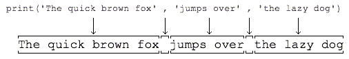

# 第一个python程序

python 脚本的执行是解释执行。

## python 程序的运行

有如下python 文件

```python
# calc.py
print(100 + 200 + 300)
```

在终端的运行：

```shell
C:\work>python calc.py
600
```

<br>

## 使用文本编辑器

使用sublime 或者 notepad， ==但是绝对不能用Word和Windows自带的记事本。Word保存的不是纯文本文件，而记事本会自作聪明地在文件开始的地方加上几个特殊字符（UTF-8 BOM）==

<br>

## 直接运行程序

常加的头缀，可以直接运行 `.py`	 文件。在Windows上是不行的，但是，在 ==Mac和Linux上是可以的==，

```python
#!/usr/bin/env python3

print('hello, world')
```

命令给`hello.py`以执行权限：

```shell
$ chmod a+x hello.py
```

就可以直接运行`hello.py`了，比如在Mac下运行:


<br>

## 输出

1- `print()`函数也可以接受多个字符串，用逗号“,”隔开，就可以连成一串输出：

```python
>>> print('The quick brown fox', 'jumps over', 'the lazy dog')
The quick brown fox jumps over the lazy dog
```

==遇到逗号“,”会输出一个空格==，因此，输出的字符串是这样拼起来的：




遇到逗号“,”会输出一个空格，因此，输出的字符串是这样拼起来的：

2- `print()`也可以打印整数，或者计算结果：

```python
>>> print('100 + 200 =', 100 + 200)
100 + 200 = 300
```

<br>

## 输入

1- 现在，你已经可以用`print()`输出你想要的结果了。但是，如果要让用户从电脑输入一些字符怎么办？Python提供了一个`input()`，可以让用户输入字符串，并存放到一个变量里。比如输入用户的名字：

```
>>> name = input()
Michael

```

当你输入`name = input()`并按下回车后，Python交互式命令行就在等待你的输入了。这时，你可以输入任意字符，然后 ==按回车后完成输入==。

1- `input()` 可以给出输入的提示信息：

```python
name = input('please enter your name: ')
print('hello,', name)
```

<br>

## 练习

请利用`print()`输出`1024 * 768 = xxx`

```python
#!/usr/bin/env python3
# -*- coding: utf-8 -*-


'''
filename: 01.py
message: notes for liaoxuefeng in learning pyhon 3.7
'''

name1=input('pleas enter first num:')
name2=input('please enter  second num:')
print(int(name1))
print(int(name2))
print('%s * %s=' % (name1,name2), int(name1) * int(name2))

# pleas enter first num:1
# please enter  second num:2
# 1
# 2
# 1 * 2= 2
```

