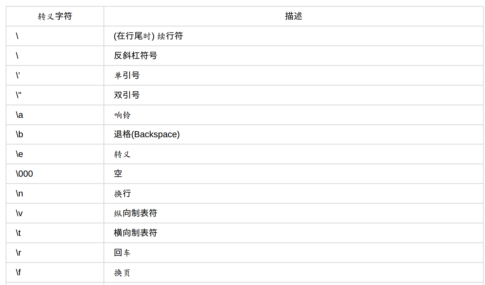
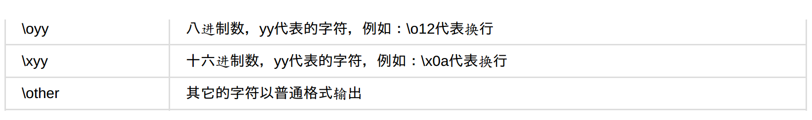

# 02 开始编程

python属于脚本语言，它==不需要编译==。

## 第一段程序

毫无疑问，第一段程序都是 “Hello world”.

```python
#coding:utf-8
'''
filename: hello.py
'''

print "Hello World."
```

除了在IDE中，也可以在终端输入以下命令运行：

```shell
python hello.py
```


## 编程模板

```python
#coding:utf-8
'''
filename: cal.py
'''

a = 19+2*4 - 8/2
print a
```

<br>

## 变量

变量就是占位符


## 函数

- 变量名： 小写
- 文件名： 小写
- 函数名： 小写 + 下划线

```python
#coding:utf-8
'''
filename:02_01.py
'''

def add_function(a, b):
    c = a + b
    print c

if __name__== "__main__":
    add_function(2,3)

'''
output: 5
'''
    
```

<br>

## 字符串

1- 对于单引号和双引号混合的，两种方式：

- 用转义；
- 单 和 双引号混合；

```python
>>> print "what \" they \" "
what " they " 
>>> print 'what\'s your name?'
what's your name?
>>> print "what's your name?"
what's your name?
>>> print 'what "is your" name'
what "is your" name
```

<br>

2- 字符串相连：

```python
>>> "py" + "thon"
'python'
```

以上是字符串相连最简单的方式，但是，如果字符串和数字相连：

```python
>>> a =  10000
>>> b = "free"
>>> print b+a
Traceback (most recent call last):
  File "<stdin>", line 1, in <module>
TypeError: cannot concatenate 'str' and 'int' objects
```

可用以下三种方法之一解决：

第一种和第三种方式相同。

`repr()` 是函数；

`str` 和 int 一样，是对象类型；

```python
>>> print b + `a`	 # 1
free10000
>>> print b + str(a) #2
free10000
>>> print b + repr(a) #
free10000
```

<br>

###  转义字符





注意，两个斜杠表示一个斜杠：

```python
>>> print "you can connect me by qq\\weibo\\gmail"
you can connect me by qq\weibo\gmail
```


<b>

### 占位符

常用的占位符如下：

```python
%d: 整数
%s: 字符串
```

示例如下：

```python
>>> print "value is %d" % a
value is 10000
```

如果有两个以上的占位符，就用 `()` 括起来：

使用占位符来连接两个字符串：

```python
>>> print "%s%s" % (a, b)
python
```

<br>1che

### 字符串的复制

“ = ”这个是深拷贝

```python
a = "hello"
b = a
```

<br>

### 字符串的长度

剑客是以剑为武器的侠客；而键客是以键盘为武器的侠客。 

```python
a = "hello"
print len(a)
_len = len(a)
```

