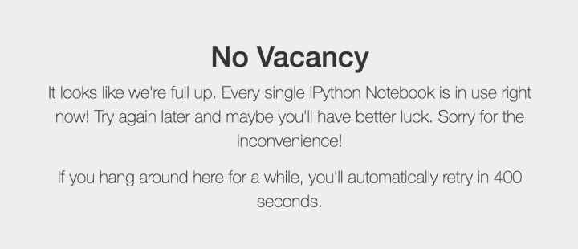
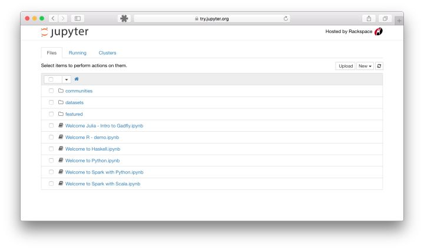
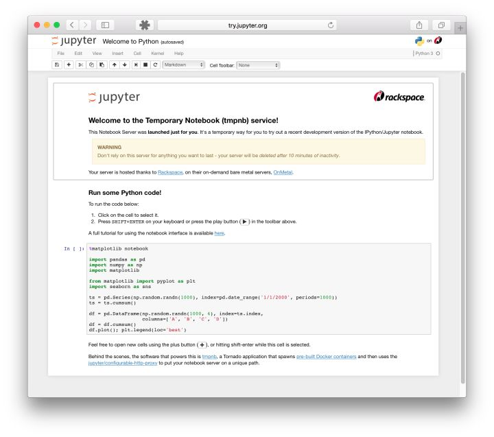

# jupyter 简介和安装

本教程来自[网址](https://zhuanlan.zhihu.com/p/33105153)


## **一、什么是Jupyter Notebook？**

边编程，边写文档

### **1. 简介**

> Jupyter Notebook是基于网页的用于交互计算的应用程序。其可被应用于全过程计算：开发、**文档编写**、运行代码和展示结果。——[Jupyter Notebook官方介绍](https://link.zhihu.com/?target=https%3A//jupyter-notebook.readthedocs.io/en/stable/notebook.html)

简而言之，Jupyter Notebook是以网页的形式打开，可以在网页页面中**直接编写代码**和**运行代码**，代码的**运行结果**也会直接在代码块下显示的程序。如**在编程过程中需要编写说明文档**，可在同一个页面中直接编写，便于作及时的说明和解释。

<br>

### **2. 组成部分**

 **① 网页应用**

网页应用即基于网页形式的、结合了编写==说明文档、数学公式、交互计算和其他富媒体==形式的工具。**简言之，网页应用是可以实现各种功能的==工具==。**

 **② 文档**

即 Jupyter Notebook 中所有交互计算、编写说明文档、数学公式、图片以及其他富媒体形式的输入和输出，都是以文档的形式体现的。

这些文档是保存为后缀名为`.ipynb`的`JSON`格式文件，不仅便于==版本控制==，也方便与他人==共享==。

此外，文档还可以导出为：HTML、LaTeX、PDF等格式。

<br>

### **3. Jupyter Notebook的主要特点**

① 编程时具有**语法高亮**、缩进、tab补全 的功能。

② 可直接通过浏览器运行代码，同时在代码块下方展示运行结果。

③ 以富媒体格式展示计算结果。富媒体格式包括：HTML，LaTeX，PNG，SVG等。

④ 对代码编写说明文档或语句时，**支持Markdown**语法。

⑤ 支持使用**LaTeX编写**数学性说明。

<br>

## **二、安装Jupyter Notebook**

### **0. 先试用，再决定**

如果看了以上对Jupyter Notebook的介绍你还是拿不定主意究竟是否适合你，那么不要担心，你可以先**免安装试用体验**一下，[戳这里](https://link.zhihu.com/?target=https%3A//try.jupyter.org/)，然后再做决定。

值得注意的是，官方提供的同时**试用是有限的**，如果你点击链接之后进入的页面如下图所示，那么不要着急，过会儿再试试看吧。



<center>试用满线.</center>

如果你足够幸运，那么你将看到如下界面，就可以**开始体验**啦。



<center>主界面</center>



<center>编辑页面</center>

### **1. 安装**

 **① 安装前提**

安装Jupyter Notebook的前提是需要安装了Python（3.3版本及以上，或2.7版本）。

**② 使用Anaconda安装**

如果你是小白，那么建议你通过**安装Anaconda**来解决Jupyter Notebook的安装问题，因为Anaconda已经**自动**为你安装了Jupter Notebook及其他工具，还有python中**超过180个科学包及其依赖项**。

你可以通过进入Anaconda的[官方下载页面](https://link.zhihu.com/?target=https%3A//www.anaconda.com/download/%23macos)自行选择下载；如果你对阅读**英文文档**感到头痛，或者对**安装步骤**一无所知，甚至也想快速了解一下**什么是Anaconda**，那么可以前往我的另一篇[文章](https://zhuanlan.zhihu.com/p/32925500), 你想要的，都在里面！

常规来说，安装了Anaconda发行版时已经自动为你安装了Jupyter Notebook的，但如果**没有自动安装**，那么就在终端（Linux或macOS的“终端”，Windows的“Anaconda Prompt”，以下均简称“终端”）中输入以下命令安装：

```shell
conda install jupyter notebook
```

**③ 使用pip命令安装**

如果你是有经验的Python玩家，想要尝试用pip命令来安装Jupyter
Notebook，那么请看以下步骤吧！接下来的命令都输入在终端当中的噢！

**1. 把pip升级到最新版本**

- Python 3.x

```shell
pip3 install --upgrade pip
```

- Python 2.x

```shell
pip install --upgrade pip
```

- 注意：老版本的pip在安装Jupyter Notebook过程中或**面临依赖项无法同步安装**的问题。因此**强烈建议**先把**pip升级到最新**版本。

**2. 安装Jupyter Notebook**

- Python 3.x

```shell
pip3 install jupyter
```

- Python 2.x

```shell
pip install jupyter
```


