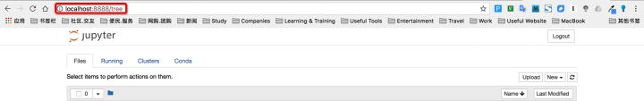
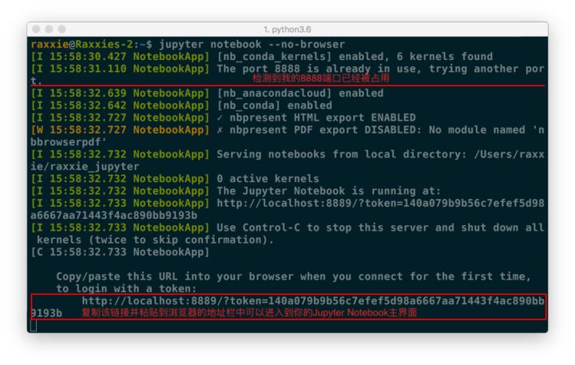
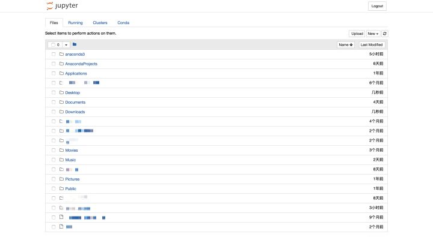
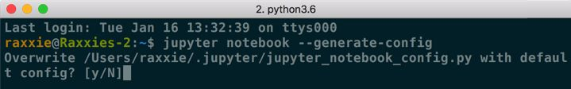
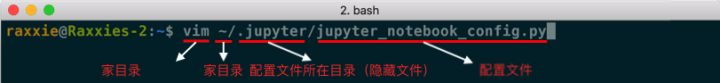
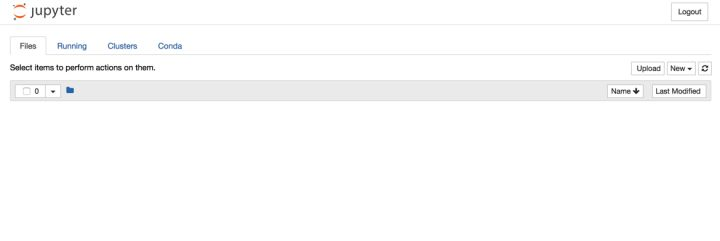

# 运行和配置

## **0. 帮助**

如果你有任何jupyter notebook命令的疑问，可以考虑查看官方帮助文档，命令如下：

```shell
jupyter notebook --help
```

或

```shell
jupyter notebook -h
```

<br>

## **1. 启动**

**① 默认端口启动**

在终端中输入以下命令：

```bash
jupyter notebook
```

执行命令之后，在终端中将会显示一系列notebook的服务器信息，同时浏览器将会自动启动Jupyter Notebook。

启动过程中终端显示内容如下：

```shell
$ jupyter notebook
[I 08:58:24.417 NotebookApp] Serving notebooks from local directory: /Users/catherine
[I 08:58:24.417 NotebookApp] 0 active kernels
[I 08:58:24.417 NotebookApp] The Jupyter Notebook is running at: http://localhost:8888/
[I 08:58:24.417 NotebookApp] Use Control-C to stop this server and shut down all kernels (twice to skip confirmation).
```

- 注意：之后在Jupyter Notebook的所有操作，都请保持终端**不要关闭**，因为一旦关闭终端，就会断开与本地服务器的链接，你将无法在Jupyter Notebook中进行其他操作啦。

浏览器地址栏中默认地将会显示：`http://localhost:8888`。其中，“localhost”指的是本机，“8888”则是端口号。

URL

如果你==**同时**==启动了多个Jupyter Notebook，由于默认端口“8888”被占用，因此地址栏中的数字将从“8888”起，每多启动一个Jupyter Notebook数字就加1，如“8889”、“8890”……

<br>

 **② 指定端口启动**

如果你想自定义端口号来启动Jupyter Notebook，可以在终端中输入以下命令：

```shell
jupyter notebook --port <port_number>
```

其中，“<port_number>”是自定义端口号，直接以数字的形式写在命令当中，数字两边不加尖括号“<>”。如：`jupyter notebook --port 9999`，即在端口号为“9999”的服务器启动Jupyter Notebook。

<br>

 **③ 启动服务器但不打开浏览器**

如果你只是想启动Jupyter Notebook的服务器但不打算立刻进入到主页面，那么就无需立刻启动浏览器。在终端中输入：

```shell
jupyter notebook --no-browser
```

此时，将会在终端显示启动的服务器信息，并在服务器启动之后，显示出打开浏览器页面的链接。当你需要启动浏览器页面时，只需要==复制链接==，并粘贴在浏览器的地址栏中，轻按回车变转到了你的Jupyter Notebook页面。



例图中由于在完成上面内容时我同时启动了多个Jupyter Notebook，因此显示我的“8888”端口号被占用，最终分配给我的是“8889”。

<br>

## **2. 主页面**

###  **① 主页面内容**

当执行完启动命令之后，浏览器将会进入到Notebook的主页面，如下图所示。



<center>默认主页面</center>

如果你的主页面里边的文件夹跟我的不同，或者你在疑惑为什么首次启动里边就已经有这么多文件夹，不要担心，这里边的文件夹全都是你的==家目录==里的目录文件。你可以在终端中执行以下2步来查看：

① `cd` 或 `cd -` 或 `cd ~` 或`cd /Users/<user_name>`

- 这个命令将会进入你的家目录。
- “<user_name>” 是用户名。用户名两边不加尖括号“<>”。

② `ls`

- 这个命令将会展示你家目录下的文件。

<br>

###  **② 设置Jupyter Notebook文件存放位置**

如果你不想把今后在Jupyter Notebook中编写的所有文档都直接保存在家目录下，那你需要==修改==Jupyter Notebook的==文件存放路径==。

 **⑴ 创建文件夹/目录**

- Windows用户在想要存放Jupyter Notebook文件的**磁盘**中**新建文件夹**并为该文件夹命名；双击进入该文件夹，然后复制地址栏中的路径。
- Linux/macOS用户在想要存放Jupyter Notebook文件的位置**创建目录**并为目录命名，命令为：`mkdir <directory_name>`；进入目录，命令为：`cd <directory_name>`；查看目录的路径，命令为：`pwd`；复制该路径。
- 注意：“<directory_name>”是自定义的目录名。目录名两边不加尖括号“<>”。

<br>

 **⑵ 配置文件路径**

- 一个便捷获取配置文件所在路径的命令：

```shell
jupyter notebook --generate-config
```

- 注意： 这条命令虽然可以用于==查看配置文件所在的路径==，但主要用途是是否将这个路径下的配置文件**替换**为**默认配置文件**。 如果你是第一次查询，那么**或许**不会出现下图的提示；若文件已经存在或被修改，使用这个命令之后会出现询问“Overwrite /Users/raxxie/.jupyter/jupyter_notebook_config.py with default config? [y/N]”，即“用默认配置文件覆盖此路径下的文件吗？”，如果按“y”，则完成覆盖，那么之前所做的修改都将失效；如果只是**为了查询路径，那么一定要输入“N”**。



<center>配置文件所在路径</center>

常规的情况下，Windows和Linux/macOS的配置文件所在路径和配置文件名如下所述：

- Windows系统的配置文件路径：`C:\Users\<user_name>\.jupyter\`
- Linux/macOS系统的配置文件路径：`/Users/<user_name>/.jupyter/` 或 `~/.jupyter/`
- 配置文件名：`jupyter_notebook_config.py`

注意：

① “<user_name>”为你的用户名。用户名两边不加尖括号“<>”。

② Windows和Linux/macOS系统的配置文件存放路径其实是相同的，只是系统不同，表现形式有所不同而已。

③ Windows和Linux/macOS系统的配置文件也是相同的。文件名以“.py”结尾，是Python的可执行文件。

④ 如果你不是通过一步到位的方式前往配置文件所在位置，而是一层一层进入文件夹/目录的，那么当你进入==家目录==后，用`ls`命令会发现找不到“.jupyter”文件夹/目录。这是因为凡是以“.”开头的目录都是隐藏文件，你可以通过`ls -a`命令查看当前位置下所有的隐藏文件。

<br>

 **⑶ 修改配置文件**

- Windows系统的用户可以使用文档编辑工具或IDE打开“jupyter_notebook_config.py”文件并进行编辑。常用的文档编辑工具和IDE有记事本、Notepad++、vim、Sublime
  Text、PyCharm等。其中，vim是没有图形界面的，是一款学习曲线==较为陡峭的编辑器==，其他工具在此不做使用说明，因为上手相对简单。通过vim修改配置文件的方法请继续往下阅读。
- Linux/macOS系统的用户建议直接通过终端调用vim来对配置文件进行修改。具体操作步骤如下：

<br>

 **⒜ 打开配置文件**

打开终端，输入命令：

```shell
vim ~/.jupyter/jupyter_notebook_config.py
```



<center>命令详解</center>

执行上述命令后便进入到配置文件当中了。

<br>

 **⒝ 查找关键词**

进入配置文件后==查找关键词“c.NotebookApp.notebook_dir”==。查找方法如下：

进入配置文件后不要按其他键，用**英文半角**直接输入`/c.NotebookApp.notebook_dir`，这时搜索的关键词已在文档中高亮显示了，按回车，光标从底部切换到文档正文中被查找关键词的首字母。

<br>

 **⒞ 编辑配置文件**

按**小写i**进入编辑模式，底部出现“--INSERT--”说明成功进入编辑模式。使用方向键把光标定位在**第二个单引号**上（光标定位在哪个字符，就在这个字符前开始输入），把“⑴ 创建文件夹/目录”步骤中复制的路径粘贴在此处。

<br>

 **⒟ 取消注释**

把该行行首的**井号（#）**删除。因为配置文件是Python的可执行文件，在Python中，井号（#）表示注释，即在编译过程中不会执行该行命令，所以为了使修改生效，需要删除井号（#）。

如，**我的配置**：【相当于设置了jupyter 打开的**主界面**】

```shell
## The directory to use for notebooks and kernels.
c.NotebookApp.notebook_dir = u'/Users/cookie/Desktop/python_machine_learning'
```

<br>

 **⒠ 保存配置文件**

先按`esc`键，从编辑模式退出，回到命令模式。

再用**英文半角**直接输入`:wq`，回车即成功保存且退出了配置文件。

注意：

- **冒号（:）** 一定要有，且也是**英文半角**。
- w：保存。
- q：退出。

<br>

 **⒡ 验证**

在终端中输入命令`jupyter notebook`打开Jupyter Notebook，此时你会看到一个清爽的界面，恭喜！



<center>配置后主页面</center>

<br>

 **⒢ 注意**

- 以上所有命令均以**英文半角**格式输入，若有报错，请严格检查这两个条件，**英文**且**半角**。
- 这里仅介绍了vim编辑器修改配置文件的方法，没有对vim编辑器的详细使用进行讲解，所以无需了解vim编辑器的具体使用方法，只需要按照上述步骤一定可以顺利完成修改！
- 推荐有时间和经历时学习一下**==vim编辑器的使用==**。这款强大的编辑器将会成为你未来工作中的利器。

