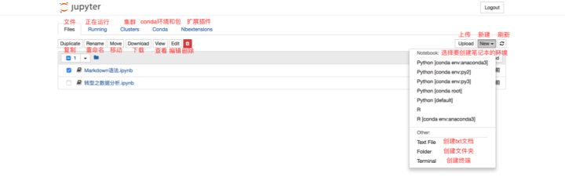
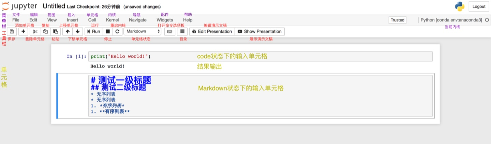
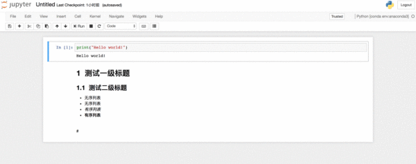
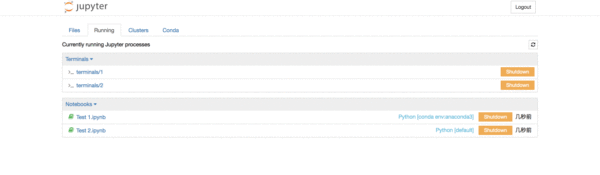
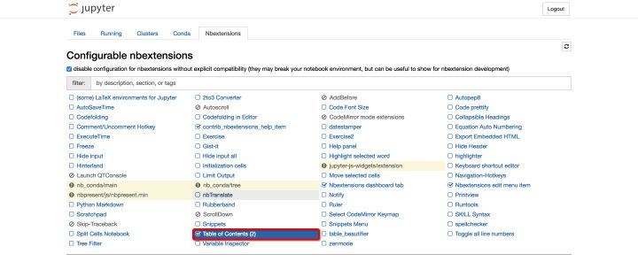

# Jupyter 的基本使用

## **Jupyter Notebook的基本使用**

## **1. Files页面**

Files页面

此时你的界面当中应该还没有“Conda”和“Nbextensions”类目。不要着急，这两个类目将分别在“五、拓展功能”中的“[1.关联Jupyter Notebook和conda的环境和包——‘nb_conda’](https://zhuanlan.zhihu.com/p/33105153/edit#conda)”和“[2.Markdown生成目录](https://zhuanlan.zhihu.com/p/33105153/edit#nbextensions)”中安装。

Files页面是用于**管理和创建文件**相关的类目。

对于现有的文件，可以通过勾选文件的方式，对选中文件进行复制、重命名、移动、下载、查看、编辑和删除的操作。

同时，也可以根据需要，在“New”下拉列表中选择想要创建文件的环境，进行创建“ipynb”格式的笔记本、“txt”格式的文档、终端或文件夹。如果你创建的环境没有在下拉列表中显示，那么你需要依次前往“五、拓展功能”中的“[1.关联Jupyter Notebook和conda的环境和包——‘nb_conda’](https://zhuanlan.zhihu.com/p/33105153/edit#conda)”和“[六、增加内核——‘ipykernel’](https://zhuanlan.zhihu.com/p/33105153/edit#ipykernel)”中解决该问题。

### **① 笔记本的基本操作**

笔记本页面注解图

上图展示的是笔记本的基本结构和功能。根据图中的注解已经可以解决绝大多数的使用问题了！

工具栏的使用如图中的注解一样直观，在此不过多解释。需要特别说明的是“单元格的状态”，有**==Code，Markdown==**，Heading，Raw NBconvert。其中，最常用的是前两个，分别是代码状态，Markdown编写状态。Jupyter Notebook已经取消了Heading状态，即标题单元格。取而代之的是==Markdown的一级至六级标题==。而Raw NBconvert目前极少用到，此处也不做过多讲解。

菜单栏涵盖了笔记本的所有功能，即便是工具栏的功能，也都可以在菜单栏的类目里找到。然而，并不是所有功能都是常用的，比如Widgets，Navigate。Kernel类目的使用，主要是对内核的操作，比如中断、重启、连接、关闭、切换内核等，由于我们在==创建笔记本时已经选择了内核==，因此切换内核的操作便于我们在使用笔记本时切换到我们想要的内核环境中去。由于其他的功能相对比较常规，根据图中的注解来尝试使用笔记本的功能已经非常便捷，因此不再做详细讲解。

 

### **② 笔记本重命名的两种方式**

 **⑴ 笔记本内部重命名**

在使用笔记本时，可以直接在其内部进行重命名。在左上方“Jupyter”的图标旁有程序默认的标题“Untitled”，==点击“Untitled”==然后在弹出的对话框中输入自拟的标题，点击“Rename”即完成了重命名。

 **⑵ 笔记本外部重命名**

若在使用笔记本时忘记了重命名，且已经保存并退出至“Files”界面，则在==“Files”界面勾选需要重命名==的文件，点击“Rename”然后直接输入自拟的标题即可。

 **⑶ 演示**

笔记本重命名演示图

 

## **2. Running页面**

Running页面主要展示的是当前正在运行当中的终端和“ipynb”格式的笔记本。若想要**关闭**已经打开的==终端和“ipynb”==格式的笔记本，仅仅关闭其页面是无法彻底退出程序的，需要在**==Running页面点击其对应的“Shutdown”==**。更多关闭方法可以查阅“八、关闭和退出”中的“[1.关闭笔记本和终端](https://zhuanlan.zhihu.com/p/33105153/edit#quit)”。

Running页面功能演示图

 

## **3. Clusters页面**

> Clusters tab is now provided by IPython parallel. See '[IPython parallel](https://link.zhihu.com/?target=https%3A//github.com/ipython/ipyparallel)' for
> installation details.

Clusters类目现在已由IPython parallel对接，且由于现阶段==使用频率较低==，因此在此不做详细说明，想要了解更多可以访问[IPython parallel的官方网站](https://link.zhihu.com/?target=https%3A//github.com/ipython/ipyparallel)。

 

## **4. Conda页面**

Conda页面主要是Jupyter Notebook与Conda关联之后对Conda环境和包进行直接操作和管理的页面工具。详细信息请直接查阅“五、拓展功能”中的“[1.关联Jupyter Notebook和conda的环境和包——‘nb_conda’](https://zhuanlan.zhihu.com/p/33105153/edit#conda)”。这是目前使用Jupyter Notebook的**必备环节**，因此请务必查阅。

 

## **5. Nbextensions页面**

Nbextensions页面提供了多个Jupyter Notebook的插件，使其功能更加强大。该页面中主要使用的插件有nb_conda，nb_present，Table of Contents(2)。这些功能我们无需完全掌握，也无需安装所有的扩展功能，根据本文档提供的学习思路，我们只需要安装Talbe of Contents(2)即可，该功能可**==为Markdown文档提供目录导航==**，便于我们编写文档。该安装指导请查阅“五、拓展功能”中的“[2.Markdown生成目录](https://zhuanlan.zhihu.com/p/33105153/edit#nbextensions)”。

Nbextensions页面

