# 拓展功能

## **关联Jupyter Notebook和conda的环境和包——“nb_conda”☆**

### **① 安装**

```shell
conda install nb_conda
```

执行上述命令能够将你conda创建的环境与Jupyter Notebook相关联，便于你在Jupyter Notebook的使用中，在不同的环境下创建笔记本进行工作。

### **② 使用**

如果安装后，出现“error jupyter An error occurred while retrieving package information” 错误，可以参考error 文件夹下的相关文档。

- 可以在Conda类目下==对conda环境和包==进行一系列操作。

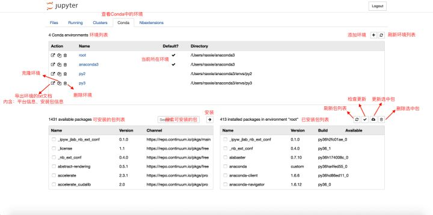

<center>Conda页面注解图</center>


- 可以在笔记本内的“Kernel”类目里的“Change
  kernel”切换内核。

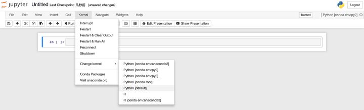切换内核

### **③ 卸载**

```shell
conda remove nb_conda
```

执行上述命令即可卸载nb_conda包。

### 问题

如果出现“EnvironmentLocationNotFound: Not a conda environment: /Users/cookie/anaconda2/envs/anaconda2” 的问题， [参考](https://github.com/Anaconda-Platform/nb_conda/issues/66)， 

查看已安装环境 “*conda* info -e ” 

```shell
subl /Users/cookie/anaconda2/pkgs/nb_conda-2.2.1-py27_0/lib/python2.7/site-packages/nb_conda/envmanager.py 
```

有的是在这个文件夹下：

```
anaconda_dir/pkgs/nb_conda-2.2.1-py36h8118bb2_0/lib/python3.6/site-packages/nb_conda/envmanager.py
```

<br>

Replace `for env in info['envs']]` with `for env in info['envs'] if env != info['root_prefix']]` in `nb_conda/envmanager.py`.

好像没什么用。

跟环境有关，第一个环境没问题， 第二个环境有问题。

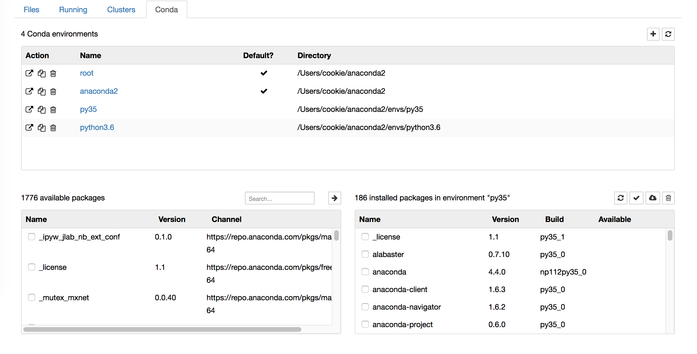

<br>

## **Markdown生成目录**

- 不同于有道云笔记的Markdown编译器，Jupyter Notebook无法为Markdown文档通过特定语法添加目录，因此需要通过**安装扩展**来实现目录的添加。

```shell
conda install -c conda-forge jupyter_contrib_nbextensions
```

- 执行上述命令后，启动Jupyter Notebook，你会发现导航栏多了“Nbextensions”的类目，点击“Nbextensions”，勾选“Tableof Contents ⑵”


<center>Nbextensions页面</center>

- 之后再在Jupyter Notebook中使用Markdown，点击下图的图标即可使用啦。

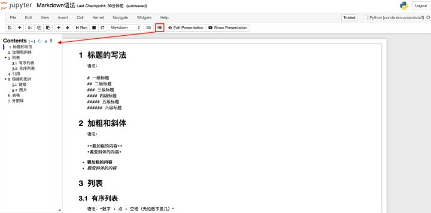

<center>目录</center>

<br>

## **Markdown在文中设置链接并定位**

在使用Markdown编辑文档时，难免会遇到需要在文中设定链接，**定位在文档中的其他位置**便于查看。因为Markdown可以完美的兼容html语法，因此这种功能可以通过html语法当中“a标签”的索引用法来实现。

语法格式如下：

```text
[添加链接的正文](#自定义索引词)
<a id=自定义索引词>跳转提示</a>
```

注意：

1. 1. 语法格式当中所有的符号均是**英文半角**。
   2. “自定义索引词”最好是英文，较长的词可以用下划线连接。
   3. “a标签”出现在想要被跳转到的文章位置，html标签除了单标签外均要符合“有头（`<a>`）必有尾（`</a>`）”的原则。头尾之间的“跳转提示”是可有可无的。
   4. “a标签”中的“id”值即是为正文中添加链接时设定的“自定义索引值”，这里通过“id”的值实现从正文的链接跳转至指定位置的功能。

例：

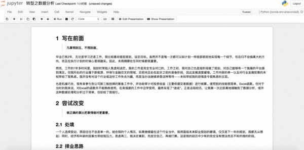

<center>有跳转提示语</center>


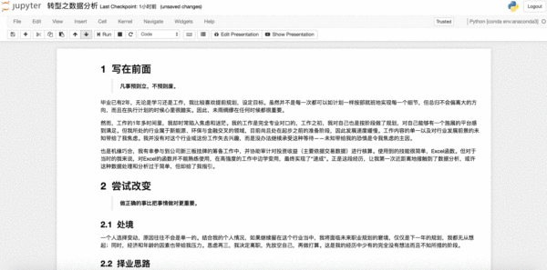

<center>无跳转提示语</center>

<br>

## **加载指定网页源代码**

### **① 使用场景**

想要在Jupyter Notebook中直接**加载指定网站**的源代码到笔记本中。

### **② 方法**

执行以下命令:

```markdown
%load URL
```

其中，URL为指定网站的地址。

### **③ 例**

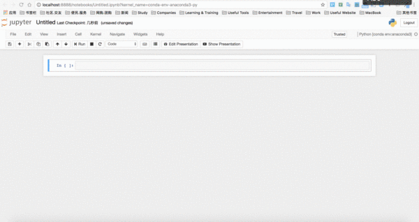


<center>加载网络代码</center>

<br>

## **加载本地Python文件**

### **① 使用场景**

想在Jupyter Notebook中**加载本地的Python文件**并执行文件代码。

<br>

### **② 方法**

执行以下命令：

```shell
%load Python文件的绝对路径
```

<br>

### **③ 注意**

1. Python文件的后缀为“.py”。
2. “%load”后跟的是Python文件的**==绝对路径==**。
3. 输入命令后，可以==按`CTRL 回车`来执行命令。第==一次执行，是将本地的Python文件内容加载到单元格内。此时，Jupyter Notebook会自动==将“%load”命令注释掉==（即在前边加井号“#”），以便在执行已加载的文件代码时不重复执行该命令；第二次执行，则是==执行已加载文件==的代码。

### **④ 例**

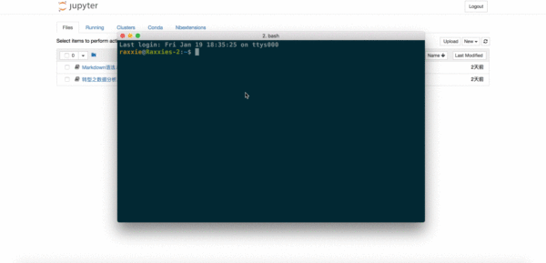


<center>加载本地Python文件</center>

<br>

## **直接运行本地Python文件**

### **① 使用场景**

不想在Jupyter Notebook的单元格中加载本地Python文件，想要直接运行。

<br>

### **② 方法**

执行命令：

```shell
%run Python文件的绝对路径
```

或

```shell
!python3 Python文件的绝对路径
```

或

```shell
!python Python文件的绝对路径
```

<br>

### **③ 注意**

1. Python文件的后缀为“.py”。
2. “%run”后跟的是Python文件的==**绝对路径**==。
3. “!python3”用于执行Python
   3.x版本的代码。
4. “!python”用于执行Python
   2.x版本的代码。
5. “!python3”和“!python”属于 `!shell命令` 语法的使用，即在Jupyter Notebook中执行shell命令的语法。
6. 输入命令后，可以按 `control return` 来执行命令，执行过程中将不显示本地Python文件的内容，直接显示运行结果。

<br>

### **④ 例**

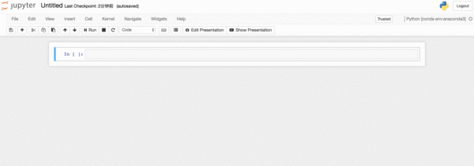

<center>运行本地Python文件</center>

<br>

## **在Jupyter Notebook中获取当前位置**

### **① 使用场景**

想要在Jupyter Notebook中获取当前所在位置的**绝对路径。**

<br>

### **② 方法**

```text
%pwd
```

或

```text
!pwd
```

<br>

### **③ 注意**

1. 获取的位置是当前Jupyter Notebook中创建的笔记本所在位置，且该位置为**绝对路径**。
2. “!pwd”属于 `!shell命令` 语法的使用，即在Jupyter
   Notebook中执行shell命令的语法。

<br>

### **④ 例**


<center>获取当前位置的绝对路径</center>

<br>

## **在Jupyter Notebook使用shell命令**

### **① 方法一——在笔记本的单元格中**

 **⑴ 语法**

```text
!shell命令
```

- 在Jupyter Notebook中的笔记本单元格中用英文==感叹号“!”后接shell命令==即可执行shell命令。

<br>

 **⑵ 例**

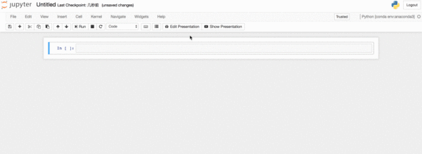


<center>Shell命令的使用</center>

<br>

### **② 方法二——在Jupyter Notebook中新建终端**

 **⑴ 启动方法**

在Jupyter Notebook主界面，即“File”界面中点击“New”；在“New”下拉框中点击“Terminal”即新建了终端。此时终端位置是在你的家目录，可以通过`pwd`命令查询当前所在位置的绝对路径。

<br>

 **⑵ 关闭方法**

在Jupyter Notebook的“Running”界面中的“Terminals”类目中可以看到正在运行的终端，点击后边的“Shutdown”即可关闭终端。

<br>

 **⑶ 例**

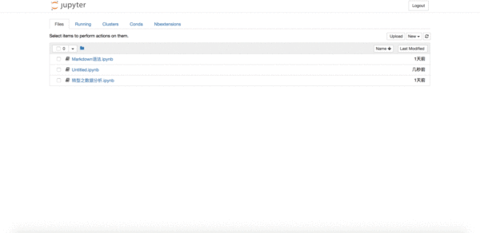

<center>笔记本中的终端使用</center>

<br>

## **隐藏笔记本输入单元格**

### **① 使用场景**

在Jupyter Notebook的笔记本中无论是编写文档还是编程，都有输入（In []）和输出（Out []）。当我们**==编写的代码或文档使用的单元格较多==**时，有时我们**只想关注输出的内容**而暂时不看输入的内容，这时就需要隐藏输入单元格而只显示输出单元格。

### **② 方法一**

 **⑴ 代码**

```shell
from IPython.display import display
from IPython.display import HTML
import IPython.core.display as di # Example: di.display_html('<h3>%s:</h3>' % str, raw=True)

# 这行代码的作用是：当文档作为HTML格式输出时，将会默认隐藏输入单元格。
di.display_html('<script>jQuery(function() {if (jQuery("body.notebook_app").length == 0) { jQuery(".input_area").toggle(); jQuery(".prompt").toggle();}});</script>', raw=True)

# 这行代码将会添加“Toggle code”按钮来切换“隐藏/显示”输入单元格。
di.display_html('''<button onclick="jQuery('.input_area').toggle(); jQuery('.prompt').toggle();">Toggle code</button>''', raw=True)
```

在笔记本第一个单元格中输入以上代码，然后执行，即可在该文档中使用**“隐藏/显示”输入单元格**功能。

- 缺陷：此方法**不能**很好的适用于Markdown单元格。

 ⑵ 例

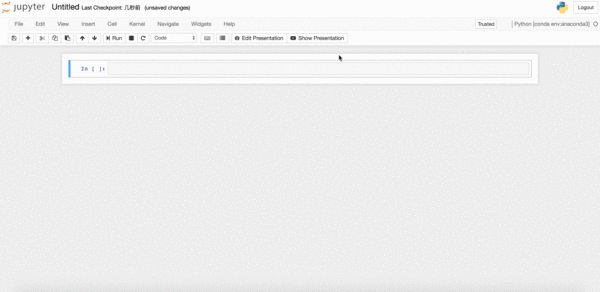

<center>方法一：隐藏/显示输入单元格</center>


### **③ 方法二**

 **⑴ 代码**

```text
from IPython.display import HTML

HTML('''<script>
code_show=true; 
function code_toggle() {
if (code_show){
$('div.input').hide();
} else {
$('div.input').show();
}
code_show = !code_show
} 
$( document ).ready(code_toggle);
</script>
<form action="javascript:code_toggle()"><input type="submit" value="Click here to toggle on/off the raw code."></form>''')
```

在笔记本第一个单元格中输入以上代码，然后执行，即可在该文档中使用“隐藏/显示”输入单元格功能。

- 缺陷：此方法不能很好的适用于Markdown单元格。

 **⑵ 例**

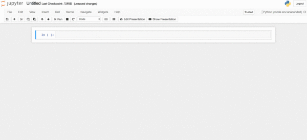

<center>方法二：隐藏/显示输入单元格</center>

<br>

## **魔术命令**

由于目前暂时用不到过多的魔术命令，因此暂时先参考[官网的文档](https://link.zhihu.com/?target=http%3A//ipython.readthedocs.io/en/stable/interactive/magics.html)。

