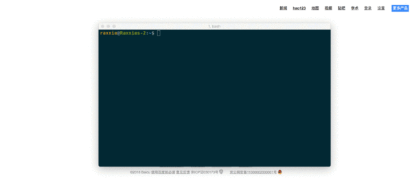
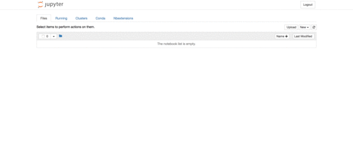
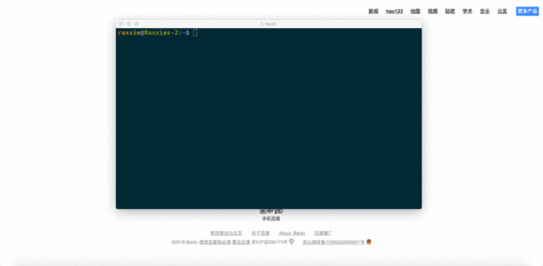

# 增加内核 ipykernel

## **使用场景**

- 场景一：同时用不同版本的Python进行工作，在Jupyter Notebook中无法切换，即“New”的下拉菜单中无法使用需要的环境。
- 场景二：创建了不同的虚拟环境（或许具有相同的Python版本但安装的包不同），在Jupyter Notebook中无法切换，即“New”的下拉菜单中无法使用需要的环境。

接下来将分别用==“命令行模式”和“图形界面模式”==来解决以上两个场景的问题。顾名思义，“命令行模式”即在终端中通过执行命令来一步步解决问题；“图形界面模式”则是通过在Jupyter Notebook的网页中通过鼠标点击的方式解决上述问题。

其中，“图形界面模式”的解决方法相对比较简单快捷，如果对于急于解决问题，不需要知道运行原理的朋友，可以直接进入“3. 解决方法之图形界面模式”来阅读。

“命令行模式”看似比较复杂，且又划分了使用场景，但通过这种方式来解决问题可以更好的了解其中的工作原理，比如，每进行一步操作对应的命令是什么，而命令的执行是为了达到什么样的目的，这些可能都被封装在图形界面上的一个点击动作来完成了。对于想更深入了解其运作过程的朋友，可以接着向下阅读。

<br>

## **解决方法之命令行模式**

### **① 同时使用不同版本的Python**

#### **⑴ 在Python 3中创建Python 2内核**

 **⒜ pip安装**

- 首先安装Python 2的ipykernel包。

```shell
python2 -m pip install ipykernel
```

- 再为**当前用户**安装Python 2的内核（ipykernel）。

```shell
python2 -m ipykernel install --user
```

- 注意：“--user”参数的意思是针对当前用户安装，而非系统范围内安装。

<br>

**⒝ conda安装**

- 首先创建Python版本为2.x且具有ipykernel的新环境，其中“<env_name>”为自定义环境名，环境名两边不加尖括号“<>”。

```shell
conda create -n <env_name> python=2 ipykernel	# 会安装很多packages， 先download
```

- 然后切换至新创建的环境。

```shell
Windows: activate <env_name>
Linux/macOS: source activate <env_name>
# To activate this environment, use:
# > source activate ttt
#
# To deactivate an active environment, use:
# > source deactivate
[14:36@cookie ~/Downloads/test_env_conda #10]$ source activate ttt
(ttt) [14:38@cookie ~/Downloads/test_env_conda #11]$ 	# 前面有ttt，表示虚拟环境
```

- 为**当前用户**安装Python 2的内核（ipykernel）。

```shell
python2 -m ipykernel install --user
```

- 注意：“--user”参数的意思是针对当前用户安装，而非系统范围内安装。

<br>

#### **⑵ 在Python 2中创建Python 3内核**

 **⒜ pip安装**

- 首先安装Python 3的ipykernel包。

```shell
python3 -m pip install ipykernel
```

- 再为**当前用户**安装Python 2的内核（ipykernel）。

```shell
python3 -m ipykernel install --user
```

- 注意：“--user”参数的意思是针对当前用户安装，而非系统范围内安装。

<br>

**⒝ conda安装**

- 首先创建Python版本为3.x且具有ipykernel的新环境，其中“<env_name>”为自定义环境名，环境名两边不加尖括号“<>”。

```shell
conda create -n <env_name> python=3 ipykernel
```

- 然后切换至新创建的环境。

```shell
Windows: activate <env_name>
Linux/macOS: source activate <env_name>
```

- 为**当前用户**安装Python 3的内核（ipykernel）。

```shell
python3 -m ipykernel install --user
```

- 注意：“--user”参数的意思是针对当前用户安装，而非系统范围内安装。

<br>

### **② 为不同环境创建内核**

#### **⑴ 切换至需安装内核的环境**

```shell
Windows: activate <env_name>
Linux/macOS: source activate <env_name>
```

- 注意：“<env_name>”是需要安装内核的环境名称，环境名两边不加尖括号“<>”。

<br>

#### **⑵ 检查该环境是否安装了ipykernel包**

```shell
conda list
```

执行上述命令查看当前环境下安装的包，若没有安装ipykernel包，则执行安装命令；否则进行下一步。

```shell
conda install ipykernel
```

<br>

#### **⑶ 为当前环境下的当前用户安装Python内核**

- 若该环境的Python版本为2.x，则执行命令：

```shell
python2 -m ipykernel install --user --name <env_name> --display-name "<notebook_name>"
```

- 若该环境的Python版本为3.x，则执行命令：

```shell
python3 -m ipykernel install --user --name <env_name> --display-name "<notebook_name>"
```

- 注意:

\1. “<env_name>”为当前环境的环境名称。环境名两边不加尖括号“<>”。

\2. “<notebook_name>”为自定义显示在Jupyter Notebook中的名称。名称两边不加尖括号“<>”，但**双引号必须加**。

\3. “--name”参数的值，即“<env_name>”是  Jupyter内部使用的，其目录的**存放路径**为`~/Library/Jupyter/kernels/`。如果定义的名称在该路径已经存在，那么将自动覆盖该名称目录的内容。

\4. “--display-name”参数的值是显示在Jupyter Notebook的菜单中的名称。

<br>

#### **⑷ 检验**

使用命令`jupyter notebook`启动Jupyter Notebook；在“Files”下的“New”下拉框中即可找到你在第⑶步中的自定义名称，此时，你便可以尽情地在Jupyter Notebook中切换环境，在不同的环境中创建笔记本进行工作和学习啦！

<br>

## **解决方法之图形界面模式**

① 你创建了一个新的环境，但却发现在Jupyter Notebook的“New”中找不到这个环境，无法在该环境中创建笔记本。



<center>问题发现</center>


② 进入Jupyter Notebook → Conda → 在“Conda environment”中点击你要添加ipykernel包的环境 → 左下方搜索框输入“ipykernel” → 勾选“ipykernel” → 点击搜索框旁的“→”箭头 → 安装完毕 → 右下方框内找到“ipykernel”说明已经安装成功



<center>解决方法</center>

③ 在终端`control c`关闭Jupyter Notebook的服务器然后重启Jupyter Notebook，在“File”的“New”的下拉列表里就可以找到你的环境啦。



<center>验证</center>


