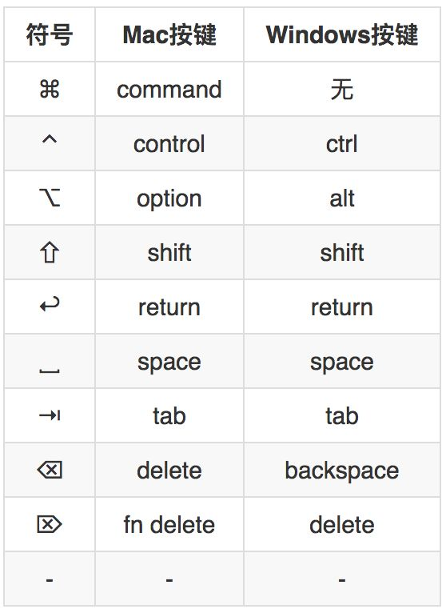
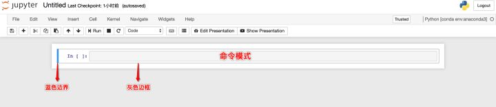
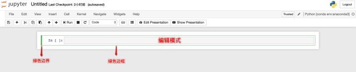
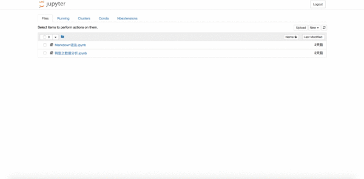

# **Jupyter Notebook快捷键**

## **Mac与Windows特殊按键对照表**

Mac和Windows特殊按键对照表

 

## **Jupyter Notebook笔记本的两种模式**

### **① 命令模式**

- 命令模式将键盘命令与Jupyter Notebook笔记本命令相结合，可以通过键盘不同键的组合运行笔记本的命令。
- ==**按`esc`键进入命令模式**==。
- 命令模式下，单元格边框为灰色，且左侧边框线为蓝色粗线条。

命令模式

 

### **② 编辑模式**

- 编辑模式使用户可以在单元格内编辑代码或文档。
- 按`enter`或`return`键进入编辑模式。
- 编辑模式下，单元格边框和左侧边框线均为绿色。

编辑模式

 

## **两种模式的快捷键**

### **① 命令模式**

命令模式快捷键

 

### **② 编辑模式**

编辑模式快捷键

## **查看和编辑快捷键**

### **① 查看快捷键**

① 进入Jupyter Notebook主界面“File”中。

② 在“New”的下拉列表中选择环境创建一个笔记本。

③ 点击“Help”。

④ 点击“Keyboard Shortcuts”。

 

### **② 编辑快捷键**

#### **⑴ 方法一**

① 进入Jupyter Notebook主界面“File”中。

② 在“New”的下拉列表中选择环境创建一个笔记本。

③ 点击“Help”。

④ 点击“Keyboard Shortcuts”。

⑤ 弹出的对话框中“Command Mode (press Esc to enable)”旁点击“Edit
Shortcuts”按钮。

 

#### **⑵ 方法二**

① 进入Jupyter Notebook主界面“File”中。

② 在“New”的下拉列表中选择环境创建一个笔记本。

③ 点击“Help”。

④ 点击“Edit Keyboard Shortcuts”。

 

### **③ 例**

查看和编辑快捷键
