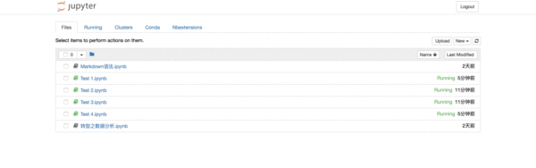

# 关闭和退出

## **关闭笔记本和终端**

当我们在Jupyter Notebook中创建了终端或笔记本时，将会弹出新的窗口来运行终端或笔记本。当我们使用完毕想要退出终端或笔记本时，仅仅**关闭页面**是无法结束程序运行的，因此我们需要通过以下步骤将其完全关闭。

### **① 方法一**

⑴ 进入“Files”页面。

⑵ 勾选想要关闭的“ipynb”笔记本。正在运行的笔记本其图标为绿色，且后边标有“Running”的字样；已经关闭的笔记本其图标为灰色。

⑶ 点击上方的黄色的“Shutdown”按钮。

⑷ 成功关闭笔记本。

- 注意：此方法只能关闭笔记本，**==无法关闭终端==**。

 

### **② 方法二**

⑴ 进入“Running”页面。

⑵ 第一栏是“Terminals”，即所有正在运行的终端均会在此显示；第二栏是“Notebooks”，即所有正在运行的“ipynb”笔记本均会在此显示。

⑶ 点击想要关闭的终端或笔记本后**==黄色“Shutdown”按钮==**。

⑷ 成功关闭终端或笔记本。

- 注意：此方法可以关闭任何正在运行的终端和笔记本。

 

### **③ 注意**

⑴ 只有**==“ipynb”笔记本==**和**==终端==**需要通过上述方法才能使其结束运行。

⑵ “txt”文档，即“New”下拉列表中的“Text File”，以及“Folder”只要**==关闭程序运行的页面==**即结束运行，无需通过上述步骤关闭。

 

### **④ 演示**

关闭笔记本或终端程序

 

## **退出Jupyter Notebook程序**

如果你想退出Jupyter Notebook程序，仅仅通过关闭网页是无法退出的，因为当你打开Jupyter Notebook时，其实是启动了它的服务器。

你可以尝试关闭页面，并打开新的浏览器页面，把之前的地址输进地址栏，然后跳转页面，你会发现再次进入了刚才“关闭”的Jupyter Notebook页面。

如果你忘记了刚才关闭的页面地址，可以在启动Jupyter Notebook的终端中找到地址，复制并粘贴至新的浏览器页面的地址栏，会发现同样能够进入刚才关闭的页面。

因此，想要**==彻底退出Jupyter Notebook==**，需要关闭它的服务器。只需要在它启动的终端上按：

- Mac用户：`control c`
- Windows用户：`ctrl c`

然后在终端上会提示：“Shutdown this notebook server (y/[n])?”输入`y`即可关闭服务器，这才是彻底退出了Jupyter Notebook程序。此时，如果你想要通过输入刚才关闭网页的网址进行访问Jupyter Notebook便会看到报错页面。

 

## **参考资料**

\1.知乎：jupyter notebook 可以做哪些事情？[猴子的回答](https://www.zhihu.com/question/46309360/answer/254638807?utm_source=wechat_session&utm_medium=social)

\2. [Jupyter Notebook官方介绍](https://link.zhihu.com/?target=https%3A//jupyter-notebook.readthedocs.io/en/stable/notebook.html)

\3. [Anaconda官方下载页面](https://link.zhihu.com/?target=https%3A//www.anaconda.com/download/%23macos)

\4. [Python·Jupyter Notebook各种使用方法记录](https://link.zhihu.com/?target=http%3A//blog.csdn.net/tina_ttl/article/details/51031113%2321-%25E6%2596%25B9%25E5%25BC%258F%25E4%25B8%2580)

\5. [Stack Overflow中有关如何隐藏/显示输入单元格的问题](https://link.zhihu.com/?target=https%3A//stackoverflow.com/questions/27934885/how-to-hide-code-from-cells-in-ipython-notebook-visualized-with-nbviewer)

\6. [魔术命令官方文档](https://link.zhihu.com/?target=http%3A//ipython.readthedocs.io/en/stable/interactive/magics.html)

\7. [Jupyter Notebook 的快捷键](https://link.zhihu.com/?target=http%3A//blog.csdn.net/lawme/article/details/51034543)

\8. [Jupyter Notebook官方文档](https://link.zhihu.com/?target=http%3A//jupyter.org/documentation)