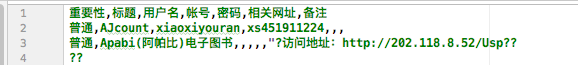

# 读写csv文件

举一个csv文件的例子：



那么就得开始解析csv文件了：

需要注意的是，每行是一个字典， 为了防止每行字典的顺序被打乱， 用有序字典：

```python
 order_dict = collections.OrderedDict()  # 有序字典， 保持标签的顺序
```

一张表的结构就是： `[{},{},....]` , 每个字典就是一行。

<br>

还有一点要注意的是， 在写文件的时候，为了防止乱码， 需要在文件句柄加入下语句：

```python
csvFile.write(codecs.BOM_UTF8)  # 防止乱码	
```

<br>

示例

```shell
#!/usr/bin/env python
# -*- coding: utf-8 -*-

'''
filename: csv_wr.py
message: 读写csv文件的
'''

__author__ = 'xi'

import csv
import collections
import codecs

class RWCsv():
    def __init__(self, in_file='', out_file='', headers=[], list = []):
        self._header = headers		
        self._list = list
        self._in_infile = in_file
        self._out_file = out_file
        self._dict_reader = None

    def getList(self):
        return self._list


    def str2unicode(self, val):
        return val.decode('utf-8')

    def unicode2str(self, val):
        return val.encode('utf-8')

    def read(self, filename='', mode='r'):
        l_filename = filename       # l 开头的都是临时文件名
        if not l_filename:
            l_filename = self._in_infile

        csvFile = open(l_filename, mode)
        self._dict_reader = csv.DictReader(csvFile)
        self._header = self._dict_reader.fieldnames #['重要性', '标题', '用户名', '账号', '密码', '相关地址', '备注']
        # print type(self.dict_reader.fieldnames[0])
        # print self._header      # 输出第一行
        self.dict_reader2general_dict()

    def dict_reader2general_dict(self):
        '''
        将dict_reader 转成普通的 dict 对象
        :return:
        '''
        self._list = []

        for item in self._dict_reader:
            # print item
            order_dict = collections.OrderedDict()  # 有序字典， 保持标签的顺序
            for key in self._header:
                order_dict[key] = item[key]
            self._list.append(order_dict)

    def write(self, filename='', header = [], list = [], mode='w'):
        l_filename = filename  # l 开头的都是临时文件名
        if not l_filename:
            l_filename = self._out_file

        l_header = header
        if not l_header:
            l_header = self._header

        l_list = list
        if not l_list:
            l_list = self._list

        # 写csv 文件，Excel打开会乱码，参考：https://www.zhihu.com/question/34201726
        csvFile = open(l_filename, mode)
        csvFile.write(codecs.BOM_UTF8)  # 防止乱码
        # 文件头以列表的形式传入函数，列表的每个元素表示每一列的标识
        fileheader = l_header
        dict_writer = csv.DictWriter(csvFile, fileheader)

        # 但是如果此时直接写入内容，会导致没有数据名，所以，应先写数据名（也就是我们上面定义的文件头）。
        # 写数据名，可以自己写如下代码完成：

        dict_writer.writerow(dict(zip(fileheader, fileheader)))
        # dict_writer.writeheader()

        # 编码转换
        # ll_list = []
        # for item in l_list:
        #     order_dict = collections.OrderedDict()  # 有序字典， 保持标签的顺序
        #     for k, v in item.items():
        #         l_k = self.str2unicode(k)
        #         l_v = self.str2unicode(v)
        #         order_dict[l_k] = l_v
        #     ll_list.append(order_dict)


        # 之后，按照（属性：数据）的形式，将字典写入CSV文档即可
        for item in l_list:
            dict_writer.writerow(item)	# 每一行写一个字典

        csvFile.close()

    def str2unicode(self, val):
        return val.decode('utf-8')

    def unicode2str(self, val):
        return val.encode('utf-8')

    def code_transfer(self, val):
        if isinstance(val, unicode):
            return self.unicode2str(val)
        else:
            return val

if __name__=='__main__':
    obj = RWCsv('src_csv/东大.csv', 'ttt.csv');
    obj.read()
    obj.write()
```

<br>

## 参考

[1] https://blog.csdn.net/waple_0820/article/details/70049953

[2] https://python3-cookbook.readthedocs.io/zh_CN/latest/c06/p01_read_write_csv_data.html

[3] https://blog.csdn.net/guoziqing506/article/details/52014506


