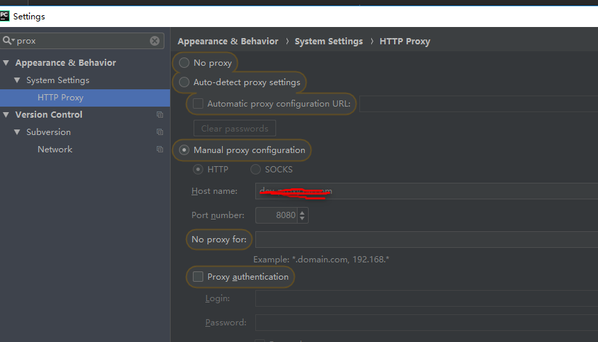

# 20180724pycharm error loading package list connect time out

pycharm 在安装新的package时出现： error loading package list:connect time out

这时候需要查看代理，很可能是被拦截了。

参考： https://intellij-support.jetbrains.com/hc/en-us/community/posts/115000450230-Error-Loading-Package-List

另一个参考： https://stackoverflow.com/questions/39498602/pycharm-error-loading-package-list

