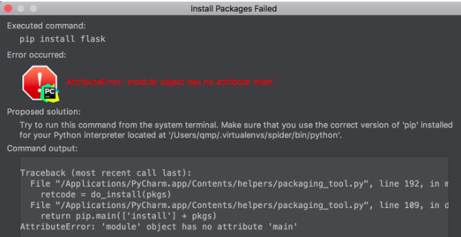

#  20180729error pycharm AttributeError module object has no attribute main

AttributeError: 'module' object has no attribute 'main’

pycharm 安装 flask 时候报错

```shell
pycharm版本：2017.2.3
python版本：2.7
pip版本：10.0.1
```

# 报错




```shell
Traceback (most recent call last):
  File "/Applications/PyCharm.app/Contents/helpers/packaging_tool.py", line 192, in main
    retcode = do_install(pkgs)
  File "/Applications/PyCharm.app/Contents/helpers/packaging_tool.py", line 109, in do_install
    return pip.main(['install'] + pkgs)
AttributeError: 'module' object has no attribute 'main'
```

# 原因

新版pip中的main函数已经发生了变化，是pycharm的原因

> 参考： 
> [PyCharm 2017.3 在pip10.0.0版本中报错（module ‘pip’ has no attribute ‘main’）](http://coffeebrother.cn/post/35/)

# 解决

方式一

```
通过 pip 命令手动安装
```

方式二 
根据报错提示中的路径

```
"/Applications/PyCharm.app/Contents/helpers/packaging_tool.py"
```

打开文件，如果在mac中找不到文件，可以使用打开

```
$ vim "/Applications/PyCharm.app/Contents/helpers/packaging_tool.py"
```

打开后找到如下代码

```python
def do_install(pkgs):
    try:
        import pip
    except ImportError:
        error_no_pip()
    return pip.main(['install'] + pkgs)


def do_uninstall(pkgs):
    try:
        import pip
    except ImportError:
        error_no_pip()
    return pip.main(['uninstall', '-y'] + pkgs)
```

先注释，添加如下代码：

```python
def do_install(pkgs):
    try:
        try:
            from pip._internal import main
        except Exception:
            from pip import main
    except ImportError:
        error_no_pip()
    return main(['install'] + pkgs)


def do_uninstall(pkgs):
    try:
        try:
            from pip._internal import main
        except Exception:
            from pip import main
    except ImportError:
        error_no_pip()
    return main(['uninstall', '-y'] + pkgs)
```

问题成功解决.

参考： https://blog.csdn.net/mouday/article/details/80075144

 


