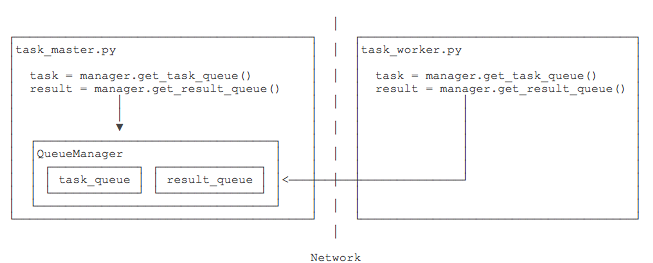

# 分布式进程

在Thread和Process中，应当==优选Process，因为Process更稳定==，而且，Process==可以分布到多台机器上==，而Thread最多只能分布到同一台机器的多个CPU上。

Python的`multiprocessing`模块不但支持多进程，其中`managers`子模块还**支持把多进程分布到多台机器上**。一个服务进程可以作为调度者，将任务分布到其他多个进程中，依靠网络通信。由于`managers`模块封装很好，不必了解网络通信的细节，就可以很容易地**编写分布式多进程程序**。

举个例子：如果我们已经有一个通过`Queue`通信的多进程程序在同一台机器上运行，现在，由于处理任务的进程任务繁重，希望把发送任务的进程和处理任务的进程分布到两台机器上。怎么用分布式进程实现？

原有的`Queue`可以继续使用，但是，通过`managers`模块把`Queue`通过网络暴露出去，就可以让其他机器的进程访问`Queue`了。

我们先看服务进程，服务进程负责启动`Queue`，把`Queue`注册到网络上，然后往`Queue`里面写入任务：

```python
#!/usr/bin/env python3
# -*- coding: utf-8 -*-

'''
filename: ch11/05.py
message: notes for liaoxuefeng in learning pyhon 3.7
'''

__author__ = 'xi'

# task_master.py

import random, time, queue
from multiprocessing.managers import BaseManager

# 发送任务的队列:
task_queue = queue.Queue()
# 接收结果的队列:
result_queue = queue.Queue()

# 从BaseManager继承的QueueManager:
class QueueManager(BaseManager):
    pass

# 把两个Queue都注册到网络上, callable参数关联了Queue对象:
QueueManager.register('get_task_queue', callable=lambda: task_queue)
QueueManager.register('get_result_queue', callable=lambda: result_queue)

# 绑定端口5000, 设置验证码'abc':
manager = QueueManager(address=('', 5000), authkey=b'abc')

# 启动Queue:
manager.start()

# 获得通过网络访问的Queue对象:
task = manager.get_task_queue()
result = manager.get_result_queue()

# 放几个任务进去:
for i in range(10):
    n = random.randint(0, 10000)
    print('Put task %d...' % n)
    task.put(n)

# 从result队列读取结果:
print('Try get results...')
for i in range(10):
    r = result.get(timeout=10)
    print('Result: %s' % r)

# 关闭:
manager.shutdown()
print('master exit.')
```

请注意，当我们在一台机器上写多进程程序时，创建的`Queue`可以直接拿来用，但是，**在分布式多进程环境下，**添加任务到`Queue`不可以直接对原始的`task_queue`进行操作，那样就绕过了`QueueManager`的封装，必须**通过`manager.get_task_queue()`获得的`Queue`接口添加。**

然后，在另一台机器上启动任务进程（本机上启动也可以）：

```python
#!/usr/bin/env python3
# -*- coding: utf-8 -*-

'''
filename: ch11/06.py
message: notes for liaoxuefeng in learning pyhon 3.7
'''

__author__ = 'xi'


# task_worker.py

import time, sys, queue
from multiprocessing.managers import BaseManager

# 创建类似的QueueManager:
class QueueManager(BaseManager):
    pass

# 由于这个QueueManager只从网络上获取Queue，所以注册时只提供名字:
QueueManager.register('get_task_queue')
QueueManager.register('get_result_queue')

# 连接到服务器，也就是运行task_master.py的机器:
server_addr = '127.0.0.1'
print('Connect to server %s...' % server_addr)

# 端口和验证码注意保持与task_master.py设置的完全一致:
m = QueueManager(address=(server_addr, 5000), authkey=b'abc')
# 从网络连接:
m.connect()

# 获取Queue的对象:
task = m.get_task_queue()
result = m.get_result_queue()
# 从task队列取任务,并把结果写入result队列:
for i in range(10):
    try:
        n = task.get(timeout=1)
        print('run task %d * %d...' % (n, n))
        r = '%d * %d = %d' % (n, n, n*n)
        time.sleep(1)
        result.put(r)
    except Queue.Empty:
        print('task queue is empty.')

# 处理结束:
print('worker exit.')
```

任务进程要通过网络连接到服务进程，所以要指定服务进程的IP。

现在，可以试试分布式进程的工作效果了。先启动`task_master.py`服务进程：

```shell
$ python3 task_master.py 
Put task 3411...
Put task 1605...
Put task 1398...
Put task 4729...
Put task 5300...
Put task 7471...
Put task 68...
Put task 4219...
Put task 339...
Put task 7866...
Try get results...
```

`task_master.py`进程发送完任务后，开始等待`result`队列的结果。现在启动`task_worker.py`进程：

```shell
$ python3 task_worker.py
Connect to server 127.0.0.1...
run task 3411 * 3411...
run task 1605 * 1605...
run task 1398 * 1398...
run task 4729 * 4729...
run task 5300 * 5300...
run task 7471 * 7471...
run task 68 * 68...
run task 4219 * 4219...
run task 339 * 339...
run task 7866 * 7866...
worker exit.
```

`task_worker.py`进程结束，在`task_master.py`进程中会继续打印出结果：

```shell
Result: 3411 * 3411 = 11634921
Result: 1605 * 1605 = 2576025
Result: 1398 * 1398 = 1954404
Result: 4729 * 4729 = 22363441
Result: 5300 * 5300 = 28090000
Result: 7471 * 7471 = 55815841
Result: 68 * 68 = 4624
Result: 4219 * 4219 = 17799961
Result: 339 * 339 = 114921
Result: 7866 * 7866 = 61873956
```

这个简单的Master/Worker模型有什么用？其实这就是一个**简单但真正的分布式计算**，把代码稍加改造，启动多个worker，就可以**把任务分布到几台甚至几十台机器上，比如把计算`n*n`的代码换成发送邮件，就实现了邮件队列的异步发送。**

Queue对象存储在哪？注意到`task_worker.py`中根本没有创建Queue的代码，所以，Queue对象存储在`task_master.py`进程中：



而`Queue`之所以能通过网络访问，就是通过`QueueManager`实现的。由于`QueueManager`管理的不止一个`Queue`，所以，==要给每个`Queue`的网络调用接口起个名字，比如`get_task_queue`。==

`authkey`有什么用？这是为了保证两台机器正常通信，不被其他机器恶意干扰。如果`task_worker.py`的`authkey`和`task_master.py`的`authkey`不一致，肯定连接不上。

<br>

## 小结

Python的分布式进程接口简单，封装良好，适合需要**把繁重任务分布到多台机器的环境下**。

注意**Queue的作用是用来传递任务和接收结果，每个任务的描述数据量要尽量小。比如发送一个处理日志文件的任务，就不要发送几百兆的日志文件本身，而是发送日志文件存放的完整路径，由Worker进程再去共享的磁盘上读取文件。**

可能出现如下问题：

1- 在win10 上，出现 OSError： WInError 87

在win10环境下，pickle模块不能序列化lambda函数，所以需要自定义task_queue和result_queue：

```python
def return_task_queue():
    global task_queue
    return task_queue
def return_result_queue():
    global result_queue
    return result_queue

# 把两个Queue都注册到网络上，callable参数关联了Queue对象：
QueueManager.register('get_task_queue',callable=return_task_queue)
QueueManager.register('get_result_queue',callable=return_result_queue)
```

<br>

2- 应该是python2 和 3的版本问题,以下是我在慕课网看到的，看样子是把模块名首字母大写了，也不知道为什么这么改动：

```
# Python2.x 
from Queue import Queue 

# Python3.x 
import queue 

# Python2.x 
q = Queue() 
# Python3.x 
q = queue.Queue() 

# 存储一个元组到Queue中 
q.put((1, 'a')) 

# q.get()每次获取一个数据，使用下面这种方式可以直接拆分元组 
int_data, str_data = q.get()

作者： 秋名山车神 
链接：https://www.imooc.com/article/16198
来源：慕课网
```

可以查看python的文档来知道答案： 下面是`queue`模块中的说明，可以看到里面有`queue.Queue`类

> The **queue** module implements multi-producer, multi-consumer queues. It is especially useful in threaded programming when information must be exchanged safely between multiple threads. The **Queue** class in this module implements all the required locking semantics. It depends on the availability of thread support in Python; see the threading module.

下面是`multiprocessing`模块中关于进程间两种通信通道（`Queues`和`Pipes`）的描述

> The **Queue** class is a near clone of **queue.Queue**.

由此，可以看到这个`Queue`类来自两个模块，只不过它俩几乎一样！而明显文中给的例子是来自前者。

<br>

3- ConnectionRefuseError:[WinError 10061]由于目标计算机积极拒绝，无法连接
有人和我一样的错误吗？？

- -我是因为先启动了worker，没有启动master，就出现了这种情况。
- 尝试了多次 终于找到原因了，task_master.py 地址要和task_worker.py 一模一样，一定要是一模一样。开始我的masker写的127.0.0.1，worker写的调度机在局域网的IP，一直调试不通。 必须将masker的127.0.0.1改成调度机在局域网内的IP（这个地址一定是要被worker可访问的，且worker也配置此IP）。
- 你是没有启动task_master.py,直接启动的task_worker.py吧,要先起master再在10秒钟内(看你设置的timeout参数是多少)起worker才能正常运行


