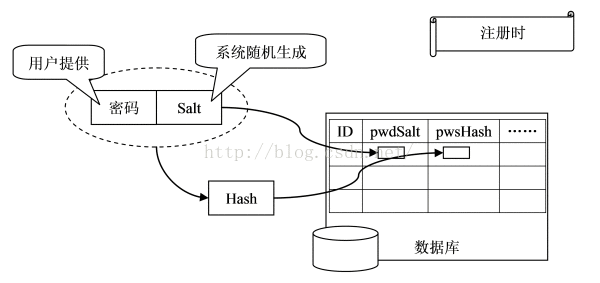
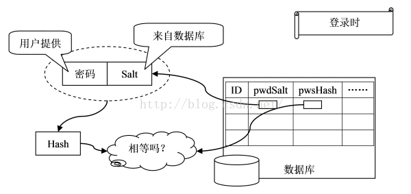

# hmac

通过哈希算法，我们可以验证一段数据是否有效，方法就是对比该数据的哈希值，例如，判断用户口令是否正确，我们用保存在数据库中的`password_md5`对比计算`md5(password)`的结果，如果一致，用户输入的口令就是正确的。

为了防止黑客通过彩虹表根据哈希值反推原始口令，在计算哈希的时候，不能仅针对原始输入计算，需要增加一个salt来使得相同的输入也能得到不同的哈希，这样，大大增加了黑客破解的难度。

如果salt是我们自己随机生成的，通常我们计算MD5时采用`md5(message + salt)`。但实际上，把salt看做一个“口令”，加salt的哈希就是**：计算一段message的哈希时，根据不通口令计算出不同的哈希。要验证哈希值，必须同时提供正确的口令。**

这实际上就是Hmac算法：Keyed-Hashing for Message Authentication。它通过一个标准算法，在计算哈希的过程中，**把key混入计算过程中**。

和我们自定义的加salt算法不同，Hmac**算法针对所有哈希算法都通用**，无论是MD5还是SHA-1。**采用Hmac替代我们自己的salt算法，可以使程序算法更标准化，也更安全。**

Python自带的hmac模块实现了标准的Hmac算法。我们来看看如何使**用hmac实现带key的哈希**。

我们首先需要准备待计算的原始消息message，随机key，哈希算法，这里采用MD5，使用hmac的代码如下：

```python
>>> import hmac
>>> message = b'Hello, world!'
>>> key = b'secret'
>>> h = hmac.new(key, message, digestmod='MD5')
>>> # 如果消息很长，可以多次调用h.update(msg)
>>> h.hexdigest()
'fa4ee7d173f2d97ee79022d1a7355bcf'
```

可见使用hmac和普通hash算法非常类似。hmac输出的**长度和原始哈希算法的长度一致**。需要注意传入**的key和message都是`bytes`类型，`str`类型需要首先编码为`bytes`。**

<br>

## 练习

将上一节的salt改为标准的hmac算法，验证用户口令：

用户的登录验证过程：

 



```python

#!/usr/bin/env python3
# -*- coding: utf-8 -*-

'''
filename: ch13/07.py
message: notes for liaoxuefeng in learning pyhon 3.7
'''

__author__ = 'xi'


import random,hashlib,hmac

#注册
user_info={}
def registration(u,p):
    if u in user_info:
        print('username existed...please choose another one...')
    else:
        user_info[u]=Users(u,p)

#hmac加密
def get_hmac(key,pw):
    return hmac.new(key.encode('utf-8'),pw.encode('utf-8'),'MD5').hexdigest()

#账号密码处理
class Users(object):
    def __init__(self,username,password):
        self._username=username
        self.key=''.join([chr(random.randint(48,122)) for i in range(25)])  # 这里是随机生成了一个key; 这是一个数组， 有25个元素，每个元素都用 chr(random.randint(48,122)) 随机生成；
        self._password=get_hmac(self.key,password)

#验证登陆
def login(user,pw):
    if user not in user_info.keys():
        return 'no such username'
    else:
        a=user_info[user]
        if a._password == get_hmac(a.key,pw):
            return 'succeeded!'
        else:
            return 'wrong password'

#测试
registration('mary','123')
registration('kirk','abc787')
registration('herby','gg567')
print(user_info)
print(login('mary','123'))
```

==上一节是盐， 这一节改成了加key;==

我一开始也以为是要保存明文密码的 看了这个图就清楚了... 不过感觉如果==salt只是一开始随机生成,之后完全不变的存在数据库里== 还是不太安全, 我觉得应该每次登录会更新一次Salt和对应的pwdHash

hmac算法并不是拼凑 hashlib的加salt只是把原始密码字符串和一个salt字符串拼凑成一个新的字符串再去获取md5

```python
a=hashlib.md5('qq'.encode('utf-8')).hexdigest() 
a 
'099b3b060154898840f0ebdfb46ec78f' 

+++++++++++++++分隔符+++++++++++++++++++++++ 
b=hmac.new('q'.encode('utf-8'),'q'.encode('utf-8'),'MD5').hexdigest() 
b 
'18fbebb00df535b536f7f8710fc6a22b'
```

贴上一段代码 说明hmac并不是拼凑字符串 显然更安全;

hash 算法本身并不加盐，
hmac 算法通过 key 来加盐。

如果想看加密，可[参考](https://www.cnblogs.com/yyds/p/7072492.html)


