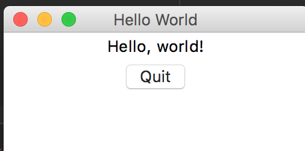
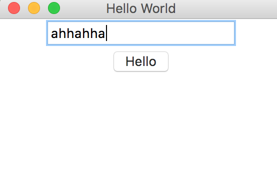

# 图形界面

Python支持多种图形界面的第三方库，包括：

- Tk
- wxWidgets
- Qt
- GTK

等等。

但是Python==自带的==库是支持Tk的Tkinter，使用Tkinter，无需安装任何包，就可以直接使用。本章简单介绍如何使用Tkinter进行GUI编程。

<br>

## Tkinter

我们来梳理一下概念：

我们编写的Python代码会调用内置的Tkinter，Tkinter==封装了访问Tk的接口==；

Tk是一个图形库，支持多个操作系统，==使用Tcl语言==开发；

Tk会调用操作系统提供的本地GUI接口，完成最终的GUI。

所以，我们的代码只需要调用Tkinter提供的接口就可以了。

<br>

## 第一个GUI程序

使用Tkinter十分简单，我们来编写一个GUI版本的“Hello, world!”。

1- 第一步是导入Tkinter包的所有内容：

```python
from tkinter import *
```

<br>

2- 第二步是==从`Frame`派生==一个`Application`类，这是所有Widget的父容器：

```python
#!/usr/bin/env python3
# -*- coding: utf-8 -*-

'''
filename: ch16/01.py
message: notes for liaoxuefeng in learning pyhon 3.7
'''

__author__ = 'xi'

from tkinter import *

class Application(Frame):
    def __init__(self, master=None):
        Frame.__init__(self, master)
        self.pack()
        self.createWidgets()

    def createWidgets(self):
        self.helloLabel = Label(self, text='Hello, world!')
        self.helloLabel.pack()
        self.quitButton = Button(self, text='Quit', command=self.quit)
        self.quitButton.pack()

```

在GUI中，每个==Button、Label、输入框等，都是一个Widget==。==Frame则是可以容纳==其他Widget的Widget，所有的Widget组合起来就是一棵树。【本身自己是一个（容器）组件， 在这个组件上能放其它组件】

`pack()`方法==把Widget加入到父容器中==，并实现布局。`pack()`是==最简单的布局，`grid()`可以实现更复杂的布局。==

在`createWidgets()`方法中，我们创建一个`Label`和一个`Button`，==当Button被点击时，触发`self.quit()`使程序退出。==

<br>

3- 第三步，==实例化`Application`，并启动消息循环==：

```python
if __name__ == '__main__':
    app = Application()
    # 设置窗口标题:
    app.master.title('Hello World')
    # 主消息循环:
    app.mainloop()
```

GUI程序的主线程负责监听来自操作系统的消息，并依次处理每一条消息。因此，如果消息处理非常耗时，就需要在新线程中处理。

运行这个GUI程序，可以看到下面的窗口：




点击“Quit”按钮或者窗口的“x”结束程序。

<br>

## 输入文本

我们再对这个GUI程序改进一下，加入一个文本框，让用户==可以输入文本，然后点按钮后，弹出消息对话框==。

```python
#!/usr/bin/env python3
# -*- coding: utf-8 -*-

'''
filename: ch16/02.py
message: notes for liaoxuefeng in learning pyhon 3.7
'''

__author__ = 'xi'

from tkinter import *

import tkinter.messagebox as messagebox

class Application(Frame):
    def __init__(self, master=None):
        Frame.__init__(self, master)
        self.pack()
        self.createWidgets()

    def createWidgets(self):
        self.nameInput = Entry(self)
        self.nameInput.pack()   	# 布局
        self.alertButton = Button(self, text='Hello', command=self.hello)	# 点击执行函数；
        self.alertButton.pack()

    def hello(self):
        name = self.nameInput.get() or 'world'
        messagebox.showinfo('Message', 'Hello, %s' % name)


if __name__ == "__main__":
    app = Application()
    # 设置窗口标题:
    app.master.title('Hello World')
    # 主消息循环:
    app.mainloop()

```

当用户点击按钮时，触发`hello()`，通过`self.nameInput.get()`获得用户输入的文本后，使用`tkMessageBox.showinfo()`可以弹出消息对话框。

程序运行结果如下：



<br>

## 小结

Python内置的Tkinter可以满足基本的GUI程序的要求，如果是非常复杂的GUI程序，建议==用操作系统原生支持的语言和库来编写==。

<br>

## 练习

1- 提出这么一个问题：怎么使1、2、3这些按钮不换行？

```python
 def createWidgets(self):
        self.nameInput = Entry(self)
        self.nameInput.pack()
        self.onebutton = Button(self,text='1',command=self.hello)
        self.onebutton.pack()
        self.twebutton = Button(self, text='2')
        self.twebutton.pack()
        self.threebutton = Button(self, text='3')
        self.threebutton.pack()
        self.alertButton = Button(self, text='Hello', command=self.hello)
        self.alertButton.pack()
```

<br>

应该和布局有关，查了一下相关文档。Tkinter控件有特定的几何状态管理方法，管理整个控件区域组织，一下是Tkinter公开的几何管理类：包、网格、位置

| 几何方法 | 描述 |
| -------- | ---- |
| pach()   | 包装 |
| grid()   | 网格 |
| place()  | 位置 |


具体想深入还得去看官方文档

<br>

2-  用place 写了一个例子：

```python
#!/usr/bin/env python3
# -*- coding: utf-8 -*-

'''
filename: ch16/03.py
message: notes for liaoxuefeng in learning pyhon 3.7
'''

__author__ = 'xi'

from tkinter import *


from tkinter import *
import tkinter as tk
import tkinter.messagebox as messagebox


win = Tk()
win.title('title')
win.geometry('100x100')

tk.Label(win, text='hello').place(x=10, y=10)
tk.Button(win, text='1', command=quit).place(x=5, y=30)
tk.Button(win, text='2', command=quit).place(x=25, y=30)
tk.Button(win, text='3', command=quit).place(x=45, y=30)

win.mainloop()

```

<br>

3- python2  和 python3 用的库不同：

```sh
python 3.x import tkinter

python 2.x import Tkinter
```


