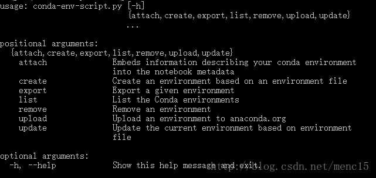
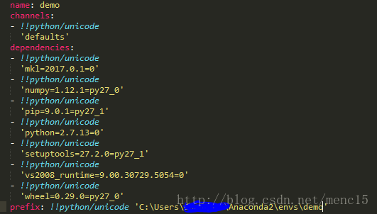

# 20180824 conda 创建python版本

主要参考Anaconda官方指南Using Conda：<https://conda.io/docs/using/index.html>

环境：Win10 64bit with conda 4.3.14 
以下命令均在windows命令行中输入。一般来讲，无论是在Linux，OS X还是在windows系统中，在命令行窗口中输入的conda命令基本是一致的，除非有特别标注。

## 0.获取版本号

```
conda --version1
```

或

```
conda -V1
```

## 1. 获取帮助

```
conda --help
conda -h12
```

查看某一命令的帮助，如update命令及remove命令

```
conda update --help
conda remove --help12
```

同理，以上命令中的`--help`也可以换成`-h`。

## 2.环境管理

查看环境管理的全部命令帮助

```
conda env -h1
```



创建环境

```
conda create --name your_env_name1
```

输入`y`确认创建。

创建制定python版本的环境

```
conda create --name your_env_name python=2.7
conda create --name your_env_name python=3
conda create --name your_env_name python=3.5123
```

创建包含某些包的环境

```
conda create --name your_env_name numpy scipy1
```

创建指定python版本下包含某些包的环境

```
conda create --name your_env_name python=3.5 numpy scipy1
```

列举当前所有环境

```
conda info --envs
conda env list12
```

进入某个环境

```
activate your_env_name1
```

退出当前环境

```
deactivate 1
```

复制某个环境

```
conda create --name new_env_name --clone old_env_name 1
```

删除某个环境

```
conda remove --name your_env_name --all1
```

## 3.分享环境

如果你想把你当前的环境配置与别人分享，这样ta可以快速建立一个与你一模一样的环境（同一个版本的python及各种包）来共同开发/进行新的实验。一个分享环境的快速方法就是给ta一个你的环境的`.yml`文件。

首先通过`activate target_env`要分享的环境`target_env`，然后输入下面的命令会在当前工作目录下生成一个`environment.yml`文件，

```
conda env export > environment.yml1
```

小伙伴拿到`environment.yml`文件后，将该文件放在工作目录下，可以通过以下命令从该文件创建环境

```
conda env create -f environment.yml1
```

`.yml`是这个样子的 



当然，你也可以手写一个`.yml`文件用来描述或记录你的python环境。

## 4.包管理

列举当前活跃环境下的所有包

```
conda list1
```

列举一个非当前活跃环境下的所有包

```
conda list -n your_env_name1
```

为指定环境安装某个包

```
conda install -n env_name package_name1
```

如果不能通过conda install来安装，文档中提到可以从Anaconda.org安装，但我觉得会更习惯用pip直接安装。pip在Anaconda中已安装好，不需要单独为每个环境安装pip。如需要用pip管理包，activate环境后直接使用即可。

参考： https://blog.csdn.net/menc15/article/details/71477949/

