# anaconda介绍安装及使用教程

本文[参考](https://zhuanlan.zhihu.com/p/32925500) 


<center>目录</center>

## **〇、序**

Python是一种面向对象的解释型计算机程序设计语言，其使用，具有跨平台的特点，可以在Linux、macOS以及Windows系统中搭建环境并使用，其编写的代码在不同平台上运行时，几乎不需要做较大的改动，使用者无不受益于它的便捷性。

此外，Python的强大之处在于它的应用领域范围之广，遍及人工智能、科学计算、Web开发、系统运维、大数据及云计算、金融、游戏开发等。实现其强大功能的前提，就是Python具有数量庞大且功能相对完善的==标准库和第三方库==。通过对库的引用，能够实现对不同领域业务的开发。然而，正是由于库的数量庞大，对于管理这些库以及对库作及时的维护成为既重要但复杂度又高的事情。

<br>

## **什么是Anaconda？**

### **简介**

Anaconda（[官方网站](https://link.zhihu.com/?target=https%3A//www.anaconda.com/download/%23macos)）就是可以便捷获取包且对包能够进行管理，同时对环境可以统一管理的发行版本。Anaconda包含了conda、Python在内的**==超过180个科学包==**及其依赖项。

<br>

### **特点**

Anaconda具有如下特点：

▪ 开源

▪ 安装过程简单

▪ 高性能使用Python和R语言

▪ 免费的社区支持

其特点的实现主要基于Anaconda拥有的：

▪ conda包

▪ 环境管理器

▪ 1,000+开源库

如果日常工作或学习**==并不必要使用1,000多个库==**，那么可以考虑安装Miniconda（[下载界面请戳](https://link.zhihu.com/?target=https%3A//conda.io/miniconda.html)），这里不过多介绍Miniconda的安装及使用。

<br>

### **Anaconda、conda、pip、virtualenv的区别**

**① Anaconda**

Anaconda是一个包含180+的科学包及其依赖项的**==发行版本==**。其包含的科学包包括：conda, numpy, scipy, ipython notebook等。

<br>

**② conda**

conda是包及其依赖项和环境的管理工具。

▪ 适用语言：==Python, R, Ruby, Lua, Scala, Java, JavaScript, C/C++, FORTRAN==。

▪ 适用平台：Windows, macOS, Linux

▪ 用途：

① 快速安装、运行和升级包及其依赖项。

② 在计算机中便捷地创建、保存、加载和切换环境。

> 如果你需要的包要求不同版本的Python，你无需切换到不同的环境，因为conda同样是一个环境管理器。仅需要几条命令，你可以创建一个完全独立的环境来运行不同的Python版本，同时继续在你常规的环境中使用你常用的Python版本。——[Conda官方网站](https://link.zhihu.com/?target=https%3A//conda.io/docs/)

▪ conda==为Python项目而创造==，但可适用于上述的多种语言。

▪ conda包和环境管理器包含于Anaconda的所有版本当中。

<br>

**③ pip**

pip是用于安装和管理软件包的包管理器。

▪ pip编写语言：Python。

▪ Python中默认安装的版本：

① Python 2.7.9及后续版本：默认安装，命令为 **pip**

② Python 3.4及后续版本：默认安装，命令为 **pip3**

▪ pip名称的由来：pip采用的是**递归缩写**进行命名的。其名字被普遍认为来源于2处：

① “Pip installs Packages”（“pip安装包”）

② “Pip installs Python”（“pip安装Python”）

<br>

**④ virtualenv**

virtualenv是用于创建一个**独立的**Python环境的工具。

▪ 解决问题：

1. 当一个程序需要使用Python 2.7版本，而另一个程序需要使用Python 3.6版本，如何同时使用这两个程序？如果将所有程序都安装在系统下的默认路径，如：**/usr/lib/python2.7/site-packages**，当不小心升级了本不该升级的程序时，将会对其他的程序造成影响。
2. 如果想要安装程序并在程序运行时对其库或库的版本进行修改，都会导致程序的中断。
3. 在共享主机时，无法在全局 **site-packages** 目录中安装包。

▪ virtualenv将会为它自己的 ==**安装目录创建一个环境，这并不与其他virtualenv环境共享库；同时也可以选择性地不连接已安装的全局库**==。

<br>

**⑤ pip 与 conda 比较**

**依赖项检查**

▪ pip：

① ==**不一定**==会展示所需其他依赖包。

② 安装包时**或许**会直接忽略依赖项而安装，仅在结果中提示错误。

▪ conda：

① **列出所需其他依赖包**。

② 安装包时==自动安装其依赖项==。

③ 可以便捷地在包的不同版本中自由切换。

<br>

**环境管理**

▪ pip：维护多个环境难度较大。

▪ conda：**==比较方便地在不同环境之间进行切换==**，环境管理较为简单。

<br>

**对系统自带Python的影响**

▪ pip：在系统自带Python中包的更新/回退版本/卸载将影响其他程序。

▪ conda：**==不会影响系统自带Python==**。

<br>

**适用语言**

▪ pip：仅适用于Python。

▪ conda：适用于Python, R, Ruby, Lua, Scala, Java, JavaScript, C/C++, FORTRAN。

<br>

**⑥ conda与pip、virtualenv的关系**

▪ conda**结合**了pip和virtualenv的功能。

<br>

## **Anaconda的适用平台及安装条件**

**1. 适用平台**

Anaconda可以在以下系统平台中安装和使用：

▪ Windows

▪ macOS

▪ Linux（x86 / Power8）

<br>

**2. 安装条件**

▪ 系统要求：32位或64位系统均可

▪ 下载文件大小：约500MB

▪ 所需空间大小：==3GB空间大==小（Miniconda仅需400MB空间即可）

<br>

## **Anaconda的安装步骤**

### **macOS系统安装Anaconda**

**① 图形界面安装**

\1. 前往[官方下载页面](https://link.zhihu.com/?target=https%3A//www.anaconda.com/downloads%23macos)下载。有两个版本可供选择：Python 3.6 和 Python 2.7，我下载的是前者。选择版之后点击“64-Bit Graphical Installer”进行下载。

\2. 完成下载之后，双击下载文件，在对话框中“Introduction”、“Read Me”、“License”部分可直接点击下一步

\3. “Destination Select”部分选择“Install for me only”并点击下一步。

- 注意：若有错误提示信息“You cannot install Anaconda in this location”则重新选择“Install for me only”并点击下一步。

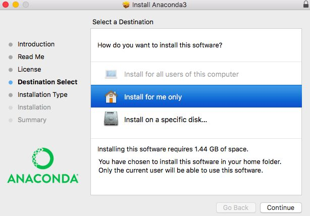

\4. “Installation Type”部分，可以点击“Change Install Location”来改变安装位置。标准的安装路径是在用户的家目录下。在这一步我没有改变安装位置。若选择默认安装路径，则直接点击“Install”进行安装。

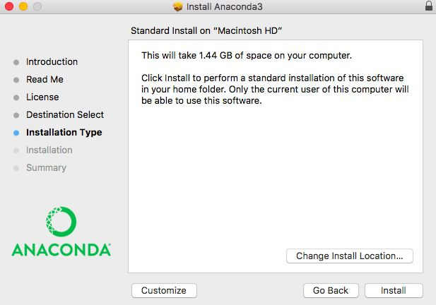

\5. 等待“Installation”部分结束，在“Summary”部分若看到“The installation was completed successfully.”则安装成功，直接点击“Close”关闭对话框。

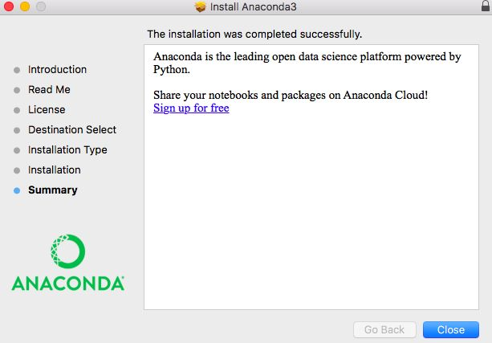

\6. 在mac的Launchpad中可以找到名为“Anaconda-Navigator”的图标，点击打开。


\7. 若“Anaconda-Navigator”成功启动，则说明真正成功地安装了Anaconda；如果未成功，请务必仔细检查以上安装步骤。

- 提示：“Anaconda-Navigator”中已经包含“Jupyter Notebook”、“Jupyterlab”、“Qtconsole”和“Spyder”。（图中的“**Rstudio**”是我后来安装的，但它默认出现在“Anaconda-Navigator”的启动界面，只需要**==点击“Install”==**便可安装。）
- Jupyter Notebook有助于我们编写代码、运行代码以及获取代码的运行结果，特点是可以令我们便捷地为代码及其运行结果添加文档的描述、解释和说明。无论是学习还是工作，Jupyter Notebook都是提高效率和学习、工作质量的利器。具体的使用，可以参见我的另一篇[文章](https://zhuanlan.zhihu.com/p/33105153)

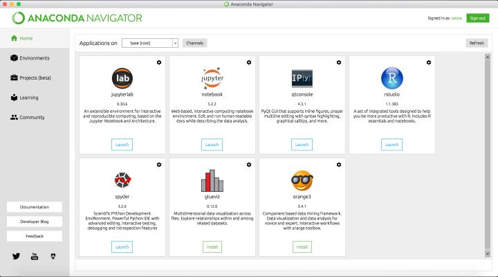

\8. 完成安装。

<br>

**② 命令行安装**

\1. 前往[官方下载页面](https://link.zhihu.com/?target=https%3A//www.anaconda.com/downloads%23macos)下载。有两个版本可供选择：Python 3.6 和 Python 2.7，我下载的是前者。选择版之后点击“64-Bit Command-Line Installer”进行下载。

\2. 完成下载之后，在mac的Launchpad中找到“其他”并打开“终端”。

▫ 安装Python 3.6： **bash ~/Downloads/Anaconda3-5.0.1-MacOSX-x86_64.sh**

▫ 安装Python 2.7： **bash ~/Downloads/Anaconda2-5.0.1-MacOSX-x86_64.sh**

- 注意：

1. 首词bash也需要输入，无论是否用的Bash shell。
2. 如果你的下载路径是自定义的，那么把该步骤路径中的 **~/Downloads** 替换成你自己的下载路径。
3. 如果你将第1步下载的 **.sh** 文件重命名了，那么把该步骤路径中的 **Anaconda3-5.0.1-MacOSX-x86_64.sh** 或 **Anaconda2-5.0.1-MacOSX-x86_64.sh** 替换成你重命名后的文件名。

▫ 强烈建议：**不要**修改文件名。如果重命名，使用**英文**进行命名。

\3. 安装过程中，看到提示“In order to continue the installation process, please review the license agreement.”（“请浏览许可证协议以便继续安装。”），点击“Enter”查看“许可证协议”。

\4. 在“许可证协议”界面将屏幕滚动至底，输入“yes”表示同意许可证协议内容。然后进行下一步。

\5. 安装过程中，提示“Press Enter to confirm the location, Press CTRL-C to cancel the installation or specify an alternate installation directory.”（“按回车键确认安装路径，按'CTRL-C'取消安装或者指定安装目录。”）如果接受默认安装路径，则会显示**PREFIX=/home/<user>/anaconda<2 or 3>** 并且继续安装。安装过程大约需要几分钟的时间。

- 建议：直接接受默认安装路径。

\6. 安装器若提示“Do you wish the installer to prepend the Anaconda install location to PATH in your /home/<user>/.bash_profile ?”（“你希望安装器添加Anaconda安装路径在**/home/<user>/.bash_profile** 文件中吗？”），建议输入“yes”。

- 注意：

① 路径 **/home/<user>/.bash_profile** 中 **<user>** 即进入到家目录后你的目录名。

② 如果输入“no”，则需要手动添加路径。添加 **export PATH="/<path to anaconda>/bin:$PATH"** 在 **.bashrc** 或者 **.bash_profile** 中。其中， **<path to anaconda>** 替换为你真实的Anaconda安装路径。

\7. 当看到“Thank you for installing Anaconda!”则说明已经成功完成安装。

\8. 关闭终端，然后再打开终端以使安装后的Anaconda启动。

\9. 验证安装结果。可选用以下任意一种方法：

① 在终端中输入命令 **conda list** ，如果Anaconda被成功安装，则会显示已经安装的包名和版本号。

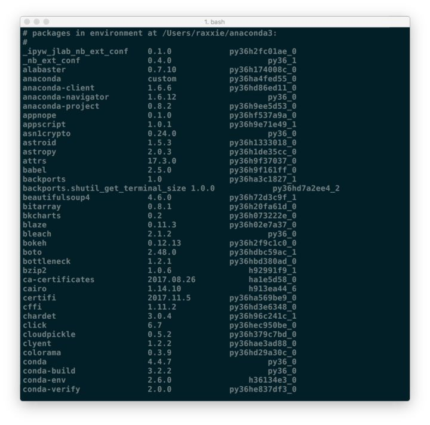

② 在终端中输入 **python** 。这条命令将会启动Python交互界面，如果Anaconda被成功安装并且可以运行，则将会在Python版本号的右边显示“Anaconda custom (64-bit)”。退出Python交互界面则输入 **exit()** 或 **quit()** 即可。

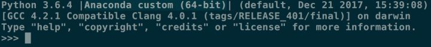

③ 在终端中输入 **anaconda-navigator** 。如果Anaconda被成功安装，则Anaconda Navigator的图形界面将会被启动。

<br>

### **Windows系统安装Anaconda**

\1. 前往[官方下载页面](https://link.zhihu.com/?target=https%3A//docs.anaconda.com/anaconda/install/windows)下载。有两个版本可供选择：Python 3.6 和 Python 2.7，选择版之后根据自己操作系统的情况点击“64-Bit Graphical Installer”或“32-Bit Graphical Installer”进行下载。

\2. 完成下载之后，双击下载文件，启动安装程序。

- 注意：

① 如果在安装过程中遇到任何问题，那么暂时地关闭杀毒软件，并在安装程序完成之后再打开。

② 如果在安装时选择了“为所有用户安装”，则卸载Anaconda然后重新安装，只为“我这个用户”安装。

\3. 选择“Next”。

\4. 阅读许可证协议条款，然后勾选“I Agree”并进行下一步。

\5. 除非是以管理员身份为所有用户安装，否则仅勾选“Just Me”并点击“Next”。

\6. 在“Choose Install Location”界面中选择安装Anaconda的目标路径，然后点击“Next”。

- 注意：

① 目标路径中**不能**含有**空格**，同时不能是**“unicode”**编码。

② 除非被要求以管理员权限安装，否则不要以管理员身份安装。

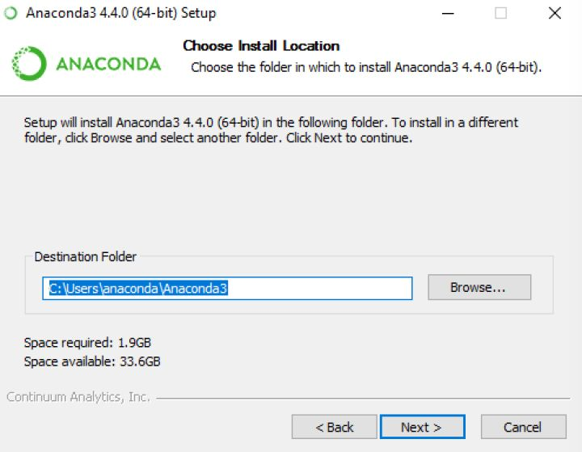

\7. 在“Advanced Installation Options”中**不要**勾选“Add Anaconda to my PATH environment variable.”（“添加Anaconda至我的环境变量。”）。因为如果勾选，则将会影响其他程序的使用。如果使用Anaconda，则通过打开Anaconda Navigator或者在开始菜单中的“Anaconda Prompt”（类似macOS中的“终端”）中进行使用。

除非你打算使用多个版本的Anaconda或者多个版本的Python，否则便勾选“Register Anaconda as my default Python 3.6”。

然后点击“Install”开始安装。如果想要查看安装细节，则可以点击“Show Details”。

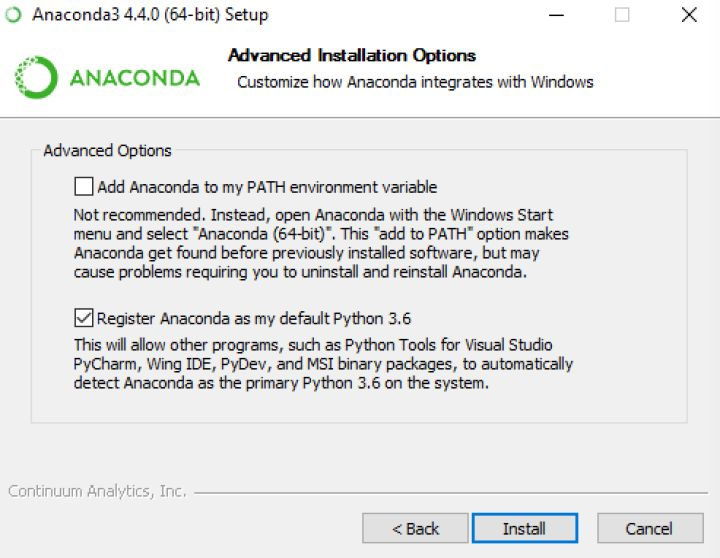

\8. 点击“Next”。

\9. 进入“Thanks for installing Anaconda!”界面则意味着安装成功，点击“Finish”完成安装。

- 注意：如果你不想了解“Anaconda云”和“Anaconda支持”，则可以**不勾选**“Learn more about Anaconda Cloud”和“Learn more about Anaconda Support”。

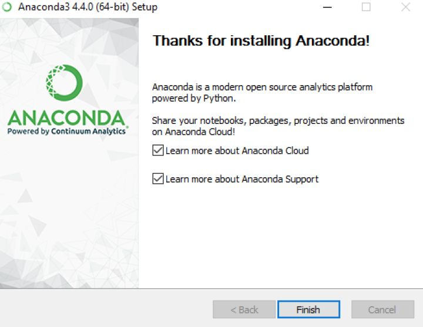

\10. 验证安装结果。可选以下任意方法：

① “开始 → Anaconda3（64-bit）→ Anaconda Navigator”，若可以成功启动Anaconda Navigator则说明安装成功。

② “开始 → Anaconda3（64-bit）→ 右键点击Anaconda Prompt → 以管理员身份运行”，在Anaconda Prompt中输入 **conda list** ，可以查看已经安装的包名和版本号。若结果可以正常显示，则说明安装成功。

<br>

### **Linux系统安装Anaconda**

\1. 前往[官方下载页面](https://link.zhihu.com/?target=https%3A//www.anaconda.com/download/%23linux)下载。有两个版本可供选择：Python 3.6 和 Python 2.7。

\2. 启动终端，在终端中输入命令 **\*md5sum /path/filename*** 或 **\*sha256sum /path/filename***

- 注意：将该步骤命令中的 **\*/path/filename*** 替换为文件的实际下载路径和文件名。其中，path是路径，filename为文件名。
- 强烈建议：

① 路径和文件名中不要出现空格或其他特殊字符。

② 路径和文件名最好以英文命名，不要以中文或其他特殊字符命名。

\3. 根据Python版本的不同有选择性地在终端输入命令：

▫ Python 3.6： **bash ~/Downloads/Anaconda3-5.0.1-Linux-x86_64.sh**

▫ Python 2.7： **bash ~/Downloads/Anaconda2-5.0.1-Linux-x86_64.sh**

- 注意：

① 首词bash也需要输入，无论是否用的Bash shell。

② 如果你的下载路径是自定义的，那么把该步骤路径中的 **\*~/Downloads*** 替换成你自己的下载路径。

③ 除非被要求使用root权限，否则均选择“Install Anaconda as a user”。

\4. 安装过程中，看到提示“In order to continue the installation process, please review the license agreement.”（“请浏览许可证协议以便继续安装。”），点击“Enter”查看“许可证协议”。

\5. 在“许可证协议”界面将屏幕滚动至底，输入“yes”表示同意许可证协议内容。然后进行下一步。

\6. 安装过程中，提示“Press Enter to accept the default install location, CTRL-C to cancel the installation or specify an alternate installation directory.”（“按回车键确认安装路径，按'CTRL-C'取消安装或者指定安装目录。”）如果接受默认安装路径，则会显示**PREFIX=/home/<user>/anaconda<2 or 3>** 并且继续安装。安装过程大约需要几分钟的时间。

- 建议：直接接受默认安装路径。

\7. 安装器若提示“Do you wish the installer to prepend the Anaconda<2 or 3> install location to PATH in your /home/<user>/.bashrc ?”（“你希望安装器添加Anaconda安装路径在**/home/<user>/.bashrc** 文件中吗？”），建议输入“yes”。

- 注意：

① 路径 **/home/<user>/.bash_rc** 中 **“<user>”** 即进入到家目录后你的目录名。

② 如果输入“no”，则需要手动添加路径，否则conda将无法正常运行。

\8. 当看到“Thank you for installing Anaconda<2 or 3>!”则说明已经成功完成安装。

\9. 关闭终端，然后再打开终端以使安装后的Anaconda启动。或者直接在终端中输入 **\*source ~/.bashrc*** 也可完成启动。

\10. 验证安装结果。可选用以下任意一种方法：

① 在终端中输入命令 **condal list** ，如果Anaconda被成功安装，则会显示已经安装的包名和版本号。

② 在终端中输入 **\*python*** 。这条命令将会启动Python交互界面，如果Anaconda被成功安装并且可以运行，则将会在Python版本号的右边显示“Anaconda custom (64-bit)”。退出Python交互界面则输入 **\*exit()*** 或 **\*quit()*** 即可。

③ 在终端中输入 **anaconda-navigator** 。如果Anaconda被成功安装，则Anaconda Navigator将会被启动。

<br>

## **管理conda**

### **写在前面**

接下来均是以命令行模式进行介绍，Windows用户请打开“Anaconda Prompt”；macOS和Linux用户请打开“Terminal”（“终端”）进行操作。

<br>

### **验证conda已被安装**

```shell
conda --version
```

终端上将会以 ==**conda 版本号**== 的形式显示当前安装conda的版本号。如： **conda 3.11.0**

- 注意：如果出现错误信息，则需核实是否出现以下情况：

① 使用的用户是否是安装Anaconda时的账户。

② 是否在安装Anaconda之后重启了终端。

<br>

### **更新conda至最新版本**

```shell
conda update conda
```

执行命令后，conda将会对版本进行比较并列出可以升级的版本。同时，也会告知用户其他相关包也会升级到相应版本。

当较新的版本可以用于升级时，终端会显示 **Proceed ([y]/n)?** ，此时输入 **y** 即可进行升级。

<br>

### **查看conda帮助信息**

```shell
conda --help
```

或

```shell
conda -h
```

<br>

**卸载conda**

**① Linux 或 macOS**

```shell
rm -rf ~/anaconda2
```

或

```shell
rm -rf ~/anaconda3
```

即删除Anaconda的安装目录。根据安装的Anaconda版本选择相应的卸载命令。

<br>

**② Windows**

```text
控制面板 → 添加或删除程序 → 选择“Python X.X (Anaconda)” → 点击“删除程序”
```

- 注意：

① Python X.X：即Python的版本，如：Python 3.6。

② Windows 10的删除有所不同。

<br>

## **管理环境**

**0. 写在前面**

接下来均是以命令行模式进行介绍，Windows用户请打开“Anaconda Prompt”；macOS和Linux用户请打开“Terminal”（“终端”）进行操作。

<br>

**1. 创建新环境**

```text
conda create --name <env_name> <package_names>
```

- 注意：

▫ **<env_name>**即创建的环境名。建议以英文命名，且不加空格，名称两边不加尖括号“<>”。

▫ **<package_names>** 即安装在环境中的包名。名称两边不加尖括号“<>”。

① 如果要安装指定的版本号，则只需要在包名后面以 **\*=*** 和版本号的形式执行。如： **conda create --name python2 python=2.7** ，即创建一个名为“python2”的环境，环境中安装版本为2.7的python。

② 如果要在新创建的环境中创建多个包，则直接在 **<package_names>** 后以**空格**隔开，添加多个包名即可。如： **conda create -n python3 python=3.5 numpy pandas** ，即创建一个名为“python3”的环境，环境中安装版本为3.5的python，同时也安装了numpy和pandas。

▫ **--name** 同样可以替换为 **-n** 。

- 提示：默认情况下，新创建的环境将会被保存在 **/Users/<user_name>/anaconda3/env** 目录下，其中， **\*<user_name>*** 为当前用户的用户名。

<br>

**2. 切换环境**

**① Linux 或 macOS**

```text
source activate <env_name>
```

<br>

**② Windows**

```text
activate <env_name>
```

<br>

**③ 提示**

1. 如果创建环境后安装Python时**==没有指定Python==**的版本，那么将会安装**==与Anaconda版本相同的Python版本==**，即如果安装Anaconda第2版，则会自动安装Python 2.x；如果安装Anaconda第3版，则会自动安装Python 3.x。
2. 当成功切换环境之后，在该行行首将以“(env_name)”或“[env_name]”开头。其中，“env_name”为切换到的环境名。如：在macOS系统中执行 **source active python2** ，即切换至名为“python2”的环境，则行首将会以(python2)开头。

<br>

**3. 退出环境至root**

**① Linux 或 macOS**

```text
source deactivate
```

<br>

**② Windows**

```text
deactivate
```

<br>

**③ 提示**

当执行退出当前环境，回到root环境命令后，原本行首以“(env_name)”或“[env_name]”开头的字符将不再显示。

<br>

**4. 显示已创建环境**

```shell
conda info --envs
```

或

```shell
conda info -e
```

或

```shell
conda env list
```

- 例如：

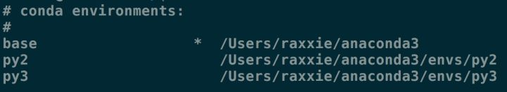

结果中星号“*”所在行即为**==当前==**所在环境。macOS系统中默认创建的环境名为“base”。

<br>

**5. 复制环境**

```shell
conda create --name <new_env_name> --clone <copied_env_name>
```

- 注意：

① **<copied_env_name>**即为被复制/克隆环境名。环境名两边不加尖括号“<>”。

② **<new_env_name>** 即为复制之后新环境的名称。环境名两边不加尖括号“<>”。

③ **conda create --name py2 --clone python2** ，即为克隆名为“python2”的环境，克隆后的新环境名为“py2”。此时，环境中将同时存在“python2”和“py2”环境，且两个环境的配置相同。

<br>

**6. 删除环境**

```text
conda remove --name <env_name> --all
```

- 注意： **<env_name>** 为被删除环境的名称。环境名两边不加尖括号“<>”。

<br>

## **管理包**

**1. 查找可供安装的包版本**

**① 精确查找**

```text
conda search --full-name <package_full_name>
```

- 注意：

① **--full-name** 为精确查找的参数。

② **<package_full_name>** 是被查找包的**全名**。包名两边不加尖括号“<>”。

- 例如： **conda search --full-name python** 即查找全名为“python”的包有哪些版本可供安装。

<br>

**② 模糊查找**

```shell
conda search <text>
```

- 注意： **<text>** 是查找含有**此字段**的包名。此字段两边不加尖括号“<>”。
- 例如： **conda search py** 即查找含有“py”字段的包，有哪些版本可供安装。

<br>

**2. 获取当前环境中已安装的包信息**

```shell
conda list
```

执行上述命令后将在终端显示当前环境已安装包的包名及其版本号。

<br>

**3. 安装包**

**① 在指定环境中安装包**

```text
conda install --name <env_name> <package_name>
```

- 注意：

**① <env_name>** 即将包安装的指定环境名。环境名两边不加尖括号“<>”。

**② <package_name>** 即要安装的包名。包名两边不加尖括号“<>”。

- 例如： **conda install --name python2 pandas** 即在名为“python2”的环境中安装pandas包。

<br>

**② 在当前环境中安装包**

```text
conda install <package_name>
```

- 注意：

① **<package_name>** 即要安装的包名。包名两边不加尖括号“<>”。

② 执行命令后在当前环境中安装包。

- 例如： **conda install pandas** 即在当前环境中安装pandas包。

<br>

**③ 使用pip安装包**

**使用场景**

当使用 **conda install**无法进行安装时，可以使用pip进行安装。例如：see包。

<br>

**命令**

```text
pip install <package_name>
```

- 注意： **<package_name>** 为指定安装包的名称。包名两边不加尖括号“<>”。
- 如： **pip install see** 即安装see包。

<br>

**注意**

1. pip只是包管理器，无法对环境进行管理。因此如果想在指定环境中使用pip进行安装包，则需要先切换到指定环境中，再使用pip命令安装包。
2. pip无法更新python，因为pip并不将python视为包。
3. pip可以安装一些conda无法安装的包；conda也可以安装一些pip无法安装的包。因此当使用一种命令无法安装包时，可以尝试用另一种命令。

<br>

**④ 从http://Anaconda.org安装包**

**使用场景**

当使用 **conda install** 无法进行安装时，可以考虑从[http://Anaconda.org](https://link.zhihu.com/?target=http%3A//Anaconda.org)中获取安装包的命令，并进行安装。

<br>

**→ 注意**

\1. 从[http://Anaconda.org](https://link.zhihu.com/?target=http%3A//Anaconda.org)安装包时，无需注册。

\2. 在**当前环境**中安装来自于[http://Anaconda.org](https://link.zhihu.com/?target=http%3A//Anaconda.org)的包时，需要通过输入要安装的包在[http://Anaconda.org](https://link.zhihu.com/?target=http%3A//Anaconda.org)中的路径作为获取途径（channel）。查询路径的方式如下：

① 在浏览器中输入：[http://anaconda.org](https://link.zhihu.com/?target=http%3A//anaconda.org/)，或直接点击[Anaconda Cloud](https://link.zhihu.com/?target=http%3A//anaconda.org/)

② 在新页面“Anaconda Cloud”的上方搜索框中输入要安装的包名，然后点击右边“放大镜”标志。


\3. 搜索结果中有数以千计的包可供选择，此时点击“Downloads”可根据下载量进行排序，最上面的为下载最多的包。（图中以搜索bottleneck包为例）

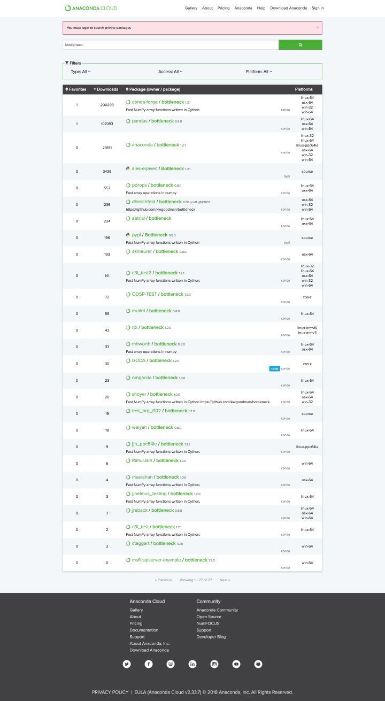

\4. 选择满足需求的包或下载量最多的包，点击包名。

\5. 复制“To install this package with conda run:”下方的命令，并粘贴在终端中执行。

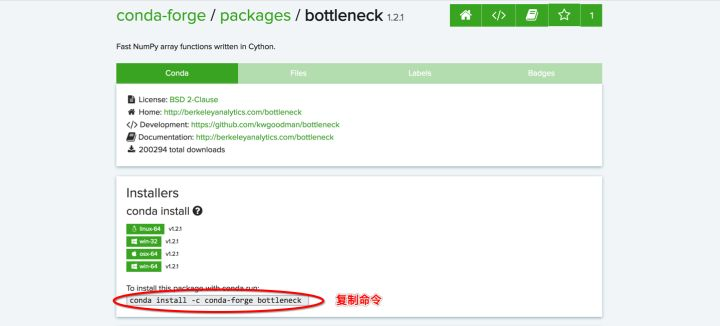

\6. 完成安装。

<>br

**4. 卸载包**

**① 卸载指定环境中的包**

```text
conda remove --name <env_name> <package_name>
```

- 注意：

① **<env_name>** 即卸载包所在指定环境的名称。环境名两边不加尖括号“<>”。

② **<package_name>** 即要卸载包的名称。包名两边不加尖括号“<>”。

- 例如： **conda remove --name python2 pandas** 即卸载名为“python2”中的pandas包。

<br>

**② 卸载当前环境中的包**

```shell
conda remove <package_name>
```

- 注意：

① **<package_name>** 即要卸载包的名称。包名两边不加尖括号“<>”。

② 执行命令后即在当前环境中卸载指定包。

- 例如： **conda remove pandas** 即在当前环境中卸载pandas包。

<br>

**5. 更新包**

**① 更新所有包**

```shell
conda update --all
```

或

```shell
conda upgrade --all
```

- 建议：在安装Anaconda之后执行上述命令更新Anaconda中的所有包至最新版本，便于使用。

<br>

**② 更新指定包**

```shell
conda update <package_name>
```

或

```shell
conda upgrade <package_name>
```

- 注意：

① **<package_name>** 为指定更新的包名。包名两边不加尖括号“<>”。

② 更新多个指定包，则包名以**空格**隔开，向后排列。如： **conda update pandas numpy matplotlib** 即更新pandas、numpy、matplotlib包。

<br>

## **参考资料**

1. 知乎“初学python者自学anaconda的正确姿势是什么？？”[猴子的回答](https://www.zhihu.com/question/58033789/answer/254673663?utm_source=wechat_session&utm_medium=social)
2. [Anaconda Cheat Sheet](https://link.zhihu.com/?target=https%3A//docs.anaconda.com/_downloads/Anaconda-Starter-Guide-Cheat-Sheet.pdf)
3. [Anaconda官方网站](https://link.zhihu.com/?target=https%3A//www.anaconda.com/download/%23macos)
4. [conda官方网站](https://link.zhihu.com/?target=https%3A//conda.io/docs/)
5. [pip维基百科](https://link.zhihu.com/?target=https%3A//en.wikipedia.org/wiki/Pip_%28package_manager%29%23External_links)
6. [pip官方网站](https://link.zhihu.com/?target=https%3A//pip.pypa.io/en/stable/)
7. YouTube视频：[Pip vs Conda: Differences and Comparisons](https://link.zhihu.com/?target=https%3A//www.youtube.com/watch%3Fv%3DRXLRIHaabaI)
8. [virtualenv官方网站](https://link.zhihu.com/?target=https%3A//virtualenv.pypa.io/en/stable/)
9. [macOS系统安装Anaconda的官方教程](https://link.zhihu.com/?target=https%3A//docs.anaconda.com/anaconda/install/mac-os%23macos-graphical-install)
10. [Windows系统安装Anaconda的官方教程](https://link.zhihu.com/?target=https%3A//docs.anaconda.com/anaconda/install/windows)
11. [Linux系统安装Anaconda的官方教程](https://link.zhihu.com/?target=https%3A//docs.anaconda.com/anaconda/install/linux)
12. [conda官方使用指南](https://link.zhihu.com/?target=https%3A//conda.io/docs/user-guide/getting-started.html%23managing-conda)