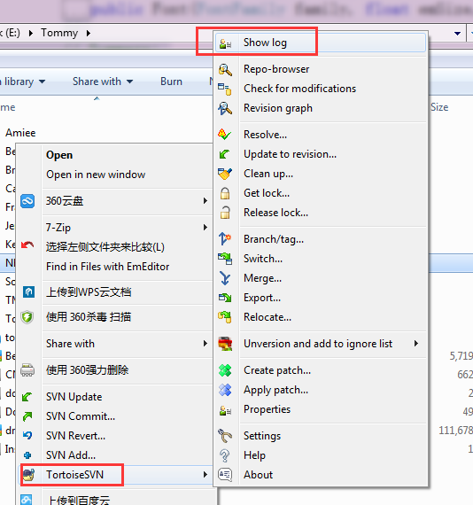
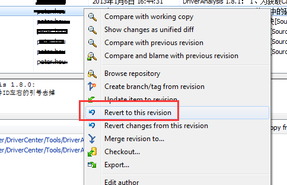
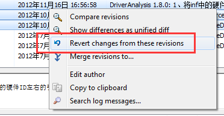

# 20180713win 下 svn 回滚到旧版本

参考： https://www.cnblogs.com/tommy-huang/p/4729634.html

当发现新提交的代码有问题，然后想将某个旧的版本作为最新的版本时，可以使用回滚，

操作步骤如下：

## 1. 签出(CheckOut)最新版本的代码到电脑中(不能做任何修改)

## 2. 执行TortoiseSVN的Show log操作，

​    在新签出的文件夹上右键，**TortoiseSVN** -> **Show log**, 如下图: 

​        

##  3. 回滚，这里有2种类型的回滚

###      3.1. 直接回滚到某个旧的版本，这个版本后的变更都会被删除，

​            操作如下：选中某个旧的版本，执行“Revert to this revision”操作：

###             **

###          3.2. 删除中间的几个版本，执行"Revert chages from these revisions"   

​                (假如提交错误了，也可以使用这个方法删掉)

​                

## 4. 确认提交，这是最后一步，也是最重要的一步

​      前面的操作，都只是在本地电脑上进行的操作，必须要**commit**后才能真正提交到SVN服务器

