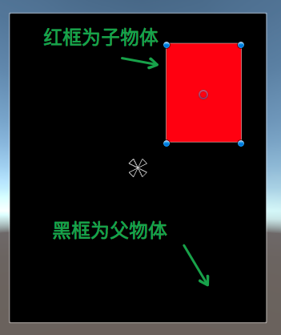
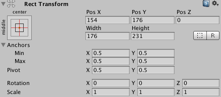
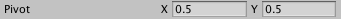
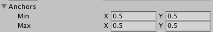
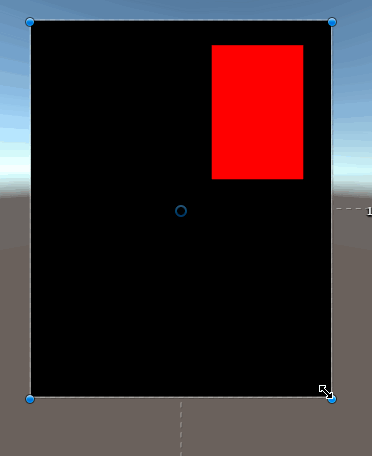
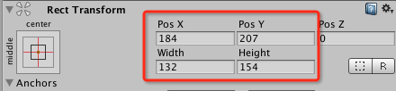
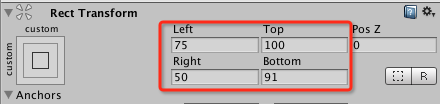
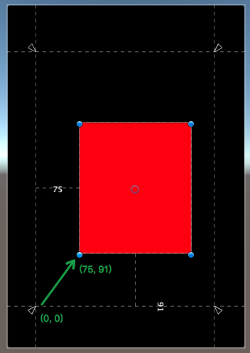
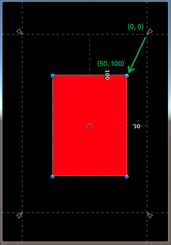
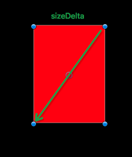

# 20180713unity中的pivot 和 Anchor 锚点

参考： https://www.cnblogs.com/w-wfy/p/7800757.html

  

RectTransform属性一览

# 前言

最近要做UI，有时候需要在代码中调整改变UI控件的属性，比如位置、大小等，然而在NGUI里面，控制UI控件的位置等属性的是RectTransform这个组件，这个组件继承自Transform组件，却增加许多自己的特性，在不了解这些特性的情况下鲁莽的去使用它，会导致出现很多匪夷所思的问题，而且使用起来也不够得心应手，于是决定研究一下RectTransform到底是如何工作的

# 你将学得到什么？

- 什么是Pivot
- 什么是Anchor
- 如何结合使用Pivot和Anchor来调整UI
- 了解RectTransform其他属性的作用

# 一、Pivot属性详解

首先为了让大家更好的理解内容，我在Unity中创建了两个UI控件，一个Plane控件，作为父对象，一个Image控件，最为子对象，如下图：

  

两个演示用的UI空间

然后我们选中红框，来看看它的RectTransform组件的属性，如下图：

  

红框的RectTransform组件

你会看到有一堆的数据，那么这些数据是如何最终决定UI在屏幕中的位置和大小的呢？我们首先来看第一个重要的属性Pivot，因为它理解RectTransform这套UI布局方案的第一个关键

  

Pivot属性

Pivot我们可以暂且称它为中心轴（这个翻译不太准确，但为了便于理解，先这么叫着），它是一个X,Y值范围是0到1的点，这个点的会在Anchor（锚点）计算位置的时候会使用到，下面用一张图来解释Pivot点的位置

  

Pivot图解

设置Pivot的坐标系如上图，(0,0)表示红框物体的左下角的点，(1,1)表示红框物体的右上角的点

# 二、Anchor属性详解

关于Anchor锚点可能接触过UI的朋友都了解一些，但是Unity中Anchor应该称它为锚框更为合理，因为它是由两个锚点(Min，Max)组成的一个矩形，当然也可以组成一个点（两个点重合）

  

锚框

而Unity为了方便我们调整锚框，在编辑视图给出了锚框的标示，如下图：

  

锚框标示(重合情况)

当然上图是两个锚点重合的情况，所以看上去是一个点，下面我们利用两个锚点不重合的情况来说明一下：

  

锚框标示

# 三、Pivot和Anchor的结合

在了解了Pivot和Anchor分别是什么后，我们就来看看Unity是如何使用这个两个东西来控制UI的布局

## 第1种情况：两个锚点重合时

我们先来看看两个锚点重合时的情况，这种情况是我们最常用也是最容易理解的方式

  

第1种情况

我们将Anchor锚点放在黑框的正中间，然后将Pivot中心轴放在红框的正中间，然后我们改变黑框的大小和位置，看看红框会有什么变化，如下图：

  

变化图示

我们从上图可以看出，不管我们怎么拖动黑框，改变他大小和位置，红框的Pivot点到Anchor点的距离是始终不变的，也就是说红框物体会参照锚点来实时调整自己的位置，使自己的Pivot点到锚点的距离始终保持一致，而且值得一提的是，在这种情况下，红框物体的RectTransform组件中的属性是Width和Height，这个属性在后面的情况中会发生变化，大家需要注意下

  

Paste_Image.png

总结下第1种情况的特点就是：子物体的大小不会随着父物体的大小变化而变化，但是位置会根据Pivot点到Anchor点的距离一致的原则发生对应的变化

## 第2种情况：两个锚点不重合时，即锚框的情况

当两个锚点（AnchorMin和AnchorMax）不重合时，两点就会确定一个矩形，这个矩形就是我们的锚框，如下图中的绿框就是我们的锚框区域

  

锚框区域

此时我们再观察一下红框物体的RectTransform属性，发现属性分别变成了Left、Top、Right、Bottom

  

Left、Top、Right、Bottom

那么这4个属性分别表示什么呢？我们看看下面的这个图

  

Left和Bottom图解

从上图我们看出，Unity以锚框的左下角为坐标系的原地(0, 0)，然后红框的Left和Bottom两个数确定红框左下角的点在坐标系中的位置，原点和红框左下角的点确定一段距离（即上图的绿色箭头），不管黑框如何变化，这段距离都保持不变

  

Right和Top图解

同理，如上图所示，Unity以锚框的右上角为原点(0,0)，然后红框的Right和Top两个数确定红框的右上角的在坐标系中的位置，原地和红框的右上角的点确定一段距离（即上图的绿色箭头），不管黑框如何边框，这段距离都保持不变

在黑框大小和位置变化的时候，Unity会保证红框的左下角到锚框的左下角距离不变，同时红框的右上角到锚框的右上角距离不变，来确定红框的相对位置和大小，看下图来感受一下变化：

  

变化图示

注意上图中红框左下角到黑框左下角的距离，以及红框右上角到黑框右上角的距离，他们都是不变的

# 三、anchoredPosition属性详解

anchoredPosition根据名字的含义，我们大概可以猜出他是根据anchor锚点得出来个一个位置属性，他本身是一个点，如果在AnchorMin和AnchorMax是重合的情况下，anchoredPosition就是表示锚点到Pivot的位置，如下图所示：

  

anchoredPosition图解一

但是如果AnchorMin和AnchorMax不重合的时候，anchoredPosition就比较复杂了，在这种情况下，Unity会根据Pivot、AnchorMin和AnchorMax计算出一个锚点，然后在通过Pivot和锚点来得出anchoredPosition的位置，关于如何计算规则，有兴趣的朋友可以自己逆推一下

# 四、offsetMin和offsetMax详解

offsetMin和offsetMax这两个属性比较好理解，其中offsetMin表示物体（本文中的红框）左下角相对AnchorMin的偏移，offsetMax表示物体右上角相对AnchorMax的偏移

  

anchor(0, 0)

  

anchorMin(0,0) anchorMax(1,1)

# 五、sizeDelta详解

sizeDelta就是offsetMax - offsetMin的值，即物体左下角到右上角的变量，如下图所示：

  

sizeDelta图解