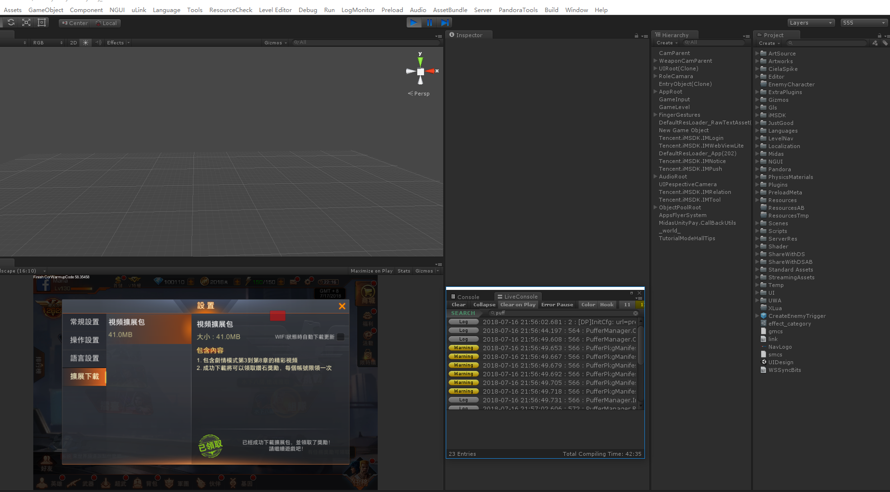

# 20180716 unity 布局

Windows中，unity4存储的路径。

C:\Users\xixie\AppData\Roaming\Unity\Editor-4.x\Preferences\Layouts

参考如下： 

or unity 4 you have the layout stored at this path: (Windows) C:\Users\Username\AppData\Roaming\Unity\Editor-4.x\Preferences\Layouts (%appdata%\Unity\Editor-4.x\Preferences\Layouts)  MonoDevelop seems to save the settings at this path: (Windows) 

C:\Users\Username\AppData\Roaming\MonoDevelop-Unity-2.8 (%appdata%\MonoDevelop-Unity-2.8\Config) 

布局参考： 

