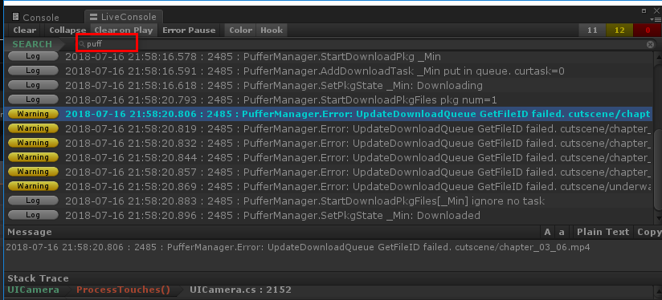
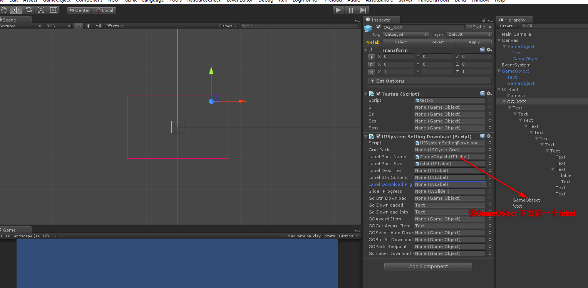
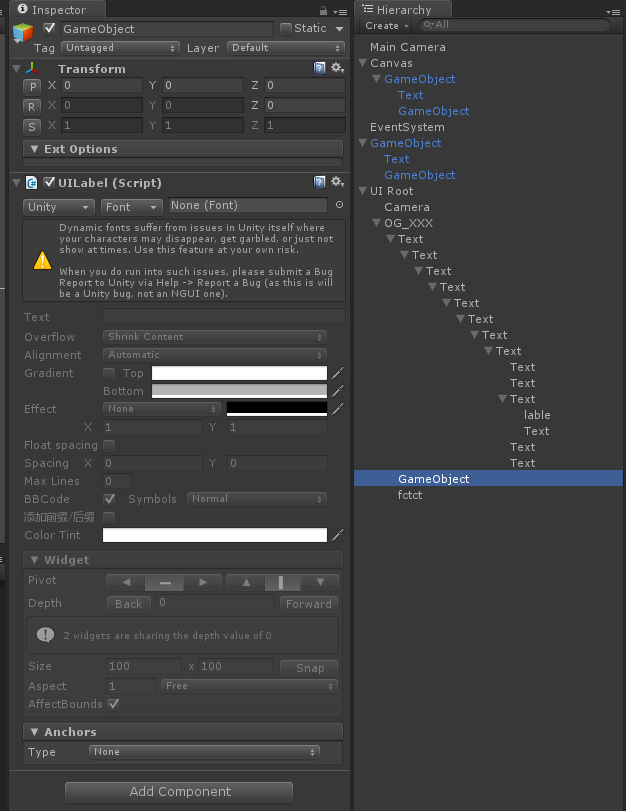
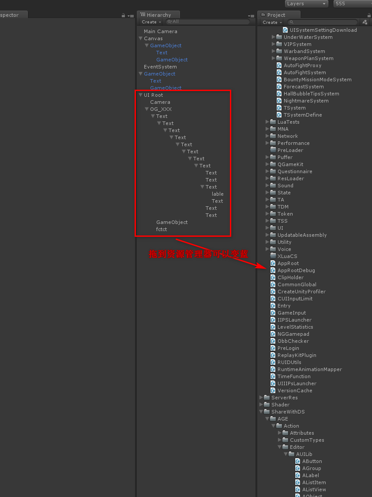

# 20180716 unity调试技巧

1- console框一般是在菜单 Windows/Live Console 调出来的。

调试定位到某个文件后，

在文件中一般会写如下这样的日志信息：

```csharp
LogError(string.Format("UpdateDownloadQueue GetPkgFileList {0} failed", pkgTask.resType));
Log("StartDownloadPkgFiles pkg num=" + m_lstTaskDownPkg.Count);
Log(string.Format("StartDownloadPkgFiles[{0}] ignore no task", pkgTask.resType));

static void LogError(string text)
{
    Logger.LogWarning(string.Format("PufferManager.Error: {0}", text));
}

static void Log(string text)
{
    Logger.Log(string.Format("PufferManager.{0}", text));
};
```

在日志信息里输出关键词，可以快速定位。




如果在代码中时一个 GameObject，可以在debug的时候，获得它的base的name， 这个name 就是预制体的名称。

如果是Label，就需要搜相关的名字`public UILabel m_LabelDownloadPrg;`, 如`LabelDownloadPrg`, 或者看它挂在哪个下面，就在哪个下面找。

<br>

一般讲组件挂在另一个下面，方便管理。

如果脚本中，变量声明为GameObject，则可以挂除GameObject之外（类型不匹配）的任何组件。

如果声明为Label，则可以挂Label外，假设一个物体下面有Label对象，也可以。这将直接引用到该物体下面的Label。



如下图， GameObject下面挂了一个Label，就可以赋值给上面的那个Label标签（那个变量会直接引用到该标签）。




在场景中是白色的组件，代表还没有保存，这个是在资源加载的时候是不能被加载的。需要将它拖到资源管理器中，它会保存，同时字体变蓝。




