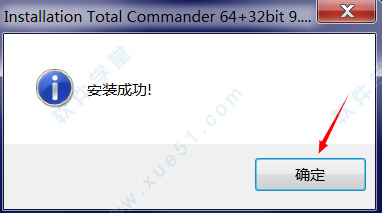

# 20180711 win 必备软件之Total Commander

## 安装

1、在本站下载好压缩包，将文件解压，双击运行“tcmd900ax32_64.exe”程序，弹出语言选择框，选择“简体中文”，点击“下一步”开始安装；

  

2、自定义软件安装目录，默认安装路径为“c:\totalcmd”，安装路径不要选择带有中文符号的路径，点击“下一步”进行安装；

  

3、选择用户使用权限，默认允许当前用户使用；  

4、当出现下图时表示软件安装成功，点击“确定”完成安装； 

##  破解

1、安装完成后先不要运行软件，回到之前下载好的安装包目录，将目录下的“wincmd.key”复制到软件的安装目录下，默认路径为“c:\totalcmd”；  

2、运行软件，点击软件主界面右上角的“帮助”按钮，在下拉框中选择“关于”查看软件注册信息，出现下图表示软件注册激活成功；

 

 参考： http://www.xue51.com/soft/2959.html

常用的几种功能参考： https://www.jianshu.com/p/82ccb65e2bd1

将TC设置为默认的文件浏览器： https://blog.csdn.net/lord_is_layuping/article/details/6919835

 