# 20180814 在cloudflare 添加证书

## 添加站点

首先[注册](https://www.cloudflare.com/a/sign-up) Cloudflare 账号，注册成功之后，点击 [add site](https://www.cloudflare.com/a/add-site)，添加一个网站，在下图输入框中输入自己的域名，点击 Begin Scan 按钮开始扫描。

 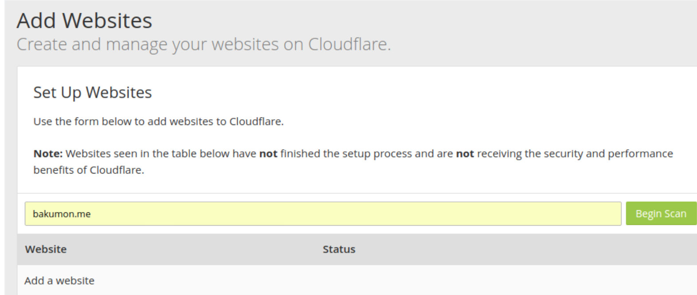

 

## DNS 设置为cloudflare

输入网址后，自动检测我现在的域名解析IP

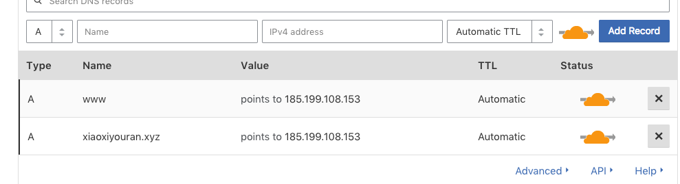

点击下一步，需要修改购买的域名服务器上的DNS 为 cloudflare:

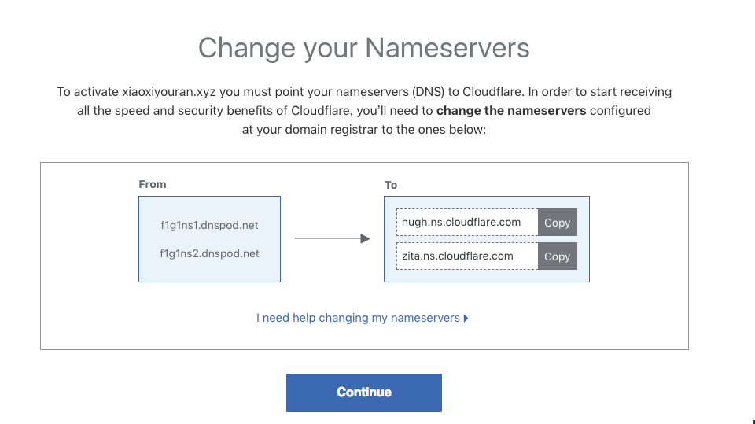

在腾讯云下点击 **管理**

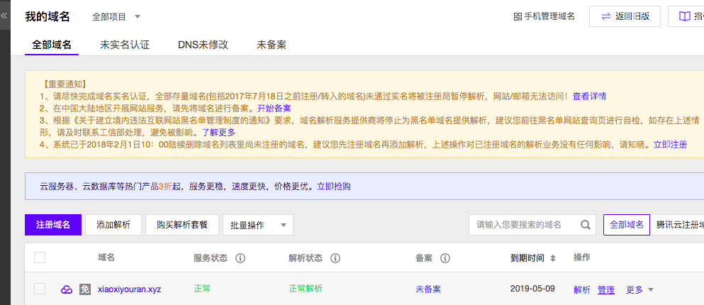

可以神奇的看到 cloudflare 检测到了我们的dns

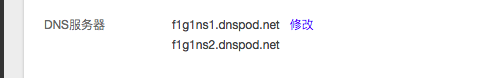

修改成 cloudflare 提供的dns即可，修改完后：

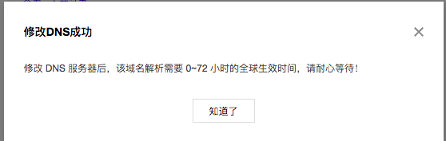

过了4-5分钟，cloudflare 会邮件通知，或看左上角 OVerview，发现状态变为 Active， 可以用了。

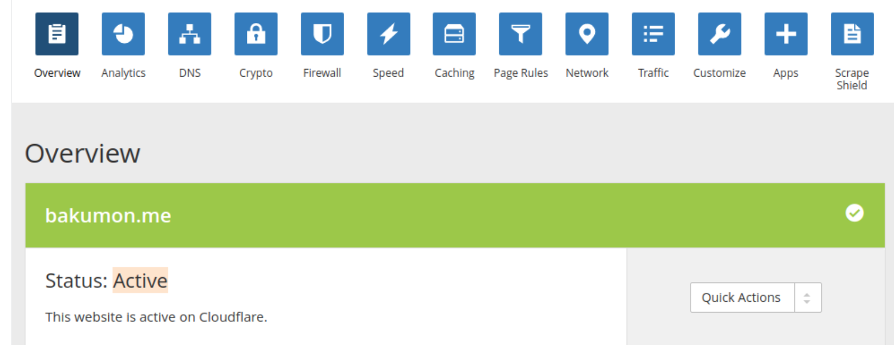

 

## 设置SSL

[参考](https://bakumon.me/blog/p/github-pages-https-ssl.html)

选择 Crypto，修改状态为 full。

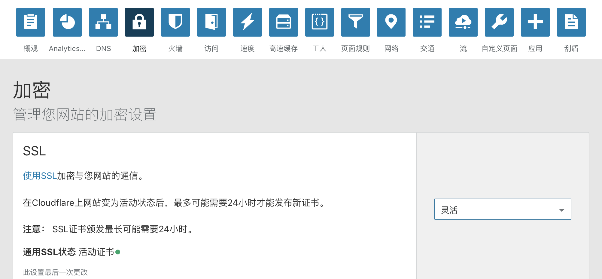

强制 https，选择 Page Rules，添加一条规则。让 [http://www.xiaoxiyouran.xyz](http://www.xiaoxiyouran.xyz) 的所有网页都跳转到 https。

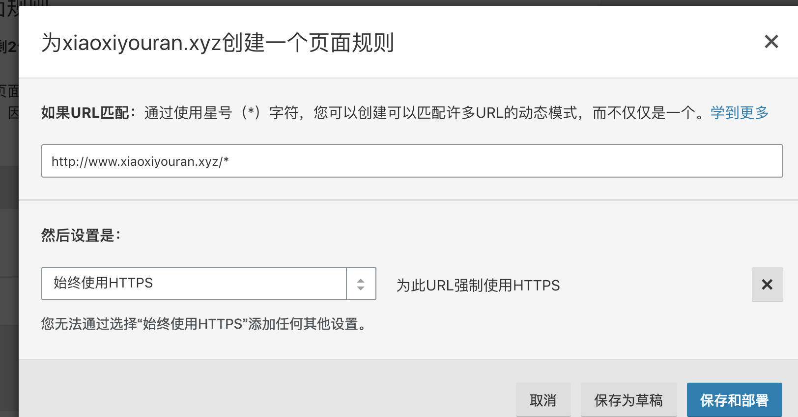

到这里访问  [http://www.xiaoxiyouran.xyz](http://www.xiaoxiyouran.xyz) 就可以成功看到小绿锁了。

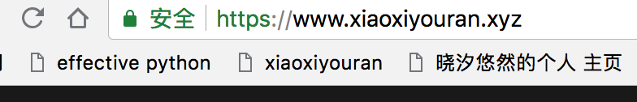

 

### 参考方法

下面这种方式[参考](https://blog.csdn.net/jave_f/article/details/80056501), 但是这种方式只是添加一个网址，如果下面的子网地址都想将 http 转成 https 呢？所以只1是一种参考。

点击 `crypto`菜单 , 然后设置`Flexible SSL` ，如下图

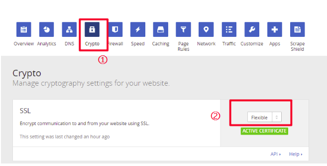

添加www重定向到[https://xiaoxiyouran.xyz](https://xiaoxiyouran.xyz/)

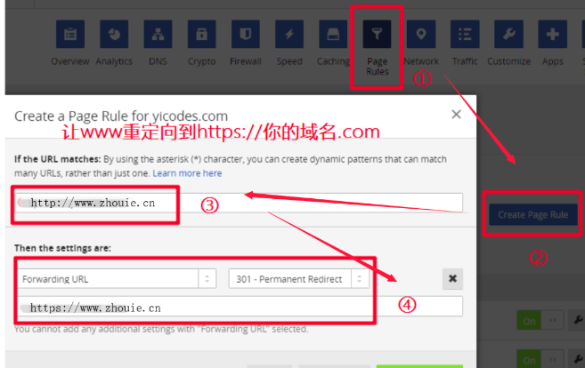

改完后的结果如下： 

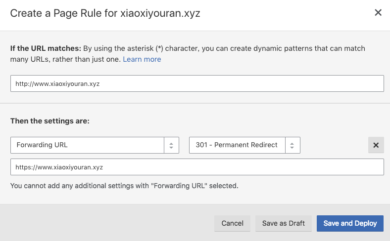

save 后的结果如下： 

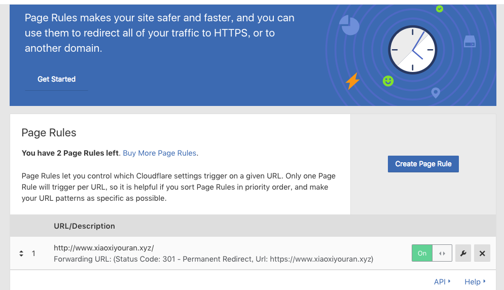

添加SSL的教程就此完成，一般需要5~30分钟生效！！！ 

