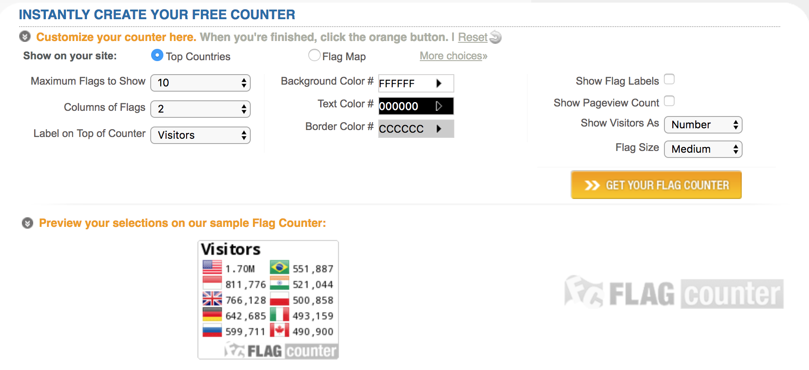
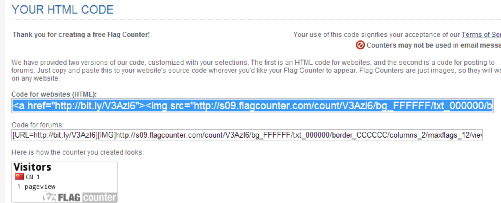
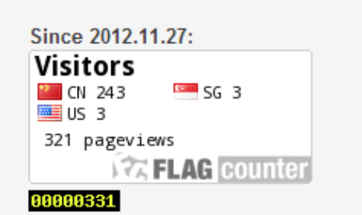
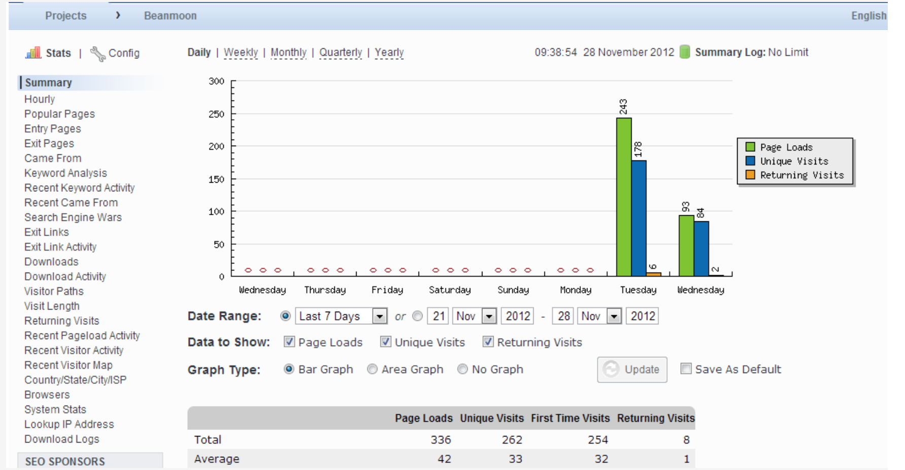
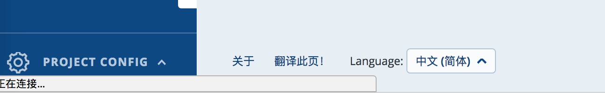

# 20180814 统计个人站点流量

## flagcounter 统计

网址： https://s01.flagcounter.com/index.html

这个很简单，不需要注册，设置好想显示的格式，它会生成一段代码，放在网页里即可。我猜终端会生成一个相应的id，然后记录。 这个记录的挺准的。

　1）[flagcounter.com](http://www.flagcounter.com/)：进入这个网站，然后根据首页的自定义界面选择你想要的显示模式，如下图所示：

设置完成后，点击“get your flag counter"按钮，会生成两组代码：

这里我们选择html格式的代码，复制后粘贴到**博客园后台管理**的公告栏 / 这里是**个人网址想显示的地址**即可：

　此时刷新你的博客主页就可以在公告栏看到你的统计信息了。以下是我的统计页面（黑底黄字的统计框来源于下面要介绍的statcounter）：

 

## statcounter

　　2）[statcounter.com](http://www.statcounter.com/)：这个网站的统计器功能比较强大，除了简单的访问计数外，它可以为你提供各种各样的信息（如访客停留时间，最受欢迎页面，用户从何处登录你的网页，又从你的网页转向何处，是否是“回头客”，访客所使用的浏览器，访客搜索所使用关键字等等），所以需要注册（免费的） 　　

 注册以后，你需要==创建一个project==，用于表示你需要统计的网站节点（如你的博客首页），同样的，创建完成后会生成一段html代码，以同样方法copy到你的公告栏里即可，下图为我使用的project：

在最下面可以将语言切换成 “中文”

在设置想检测的 “https://www.xiaoxiyouran.xyz” 之后， 会生成相应的代码，将代码拷贝在网页下面。

需要注意的是，有时候那个计数不动，不知道是有延迟还是怎么回事，得==重新生成一下代码==。

最后看一下我的效果：

 

## 参考

http://www.cnblogs.com/beanmoon/archive/2012/11/27/2791438.html

