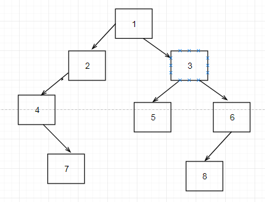
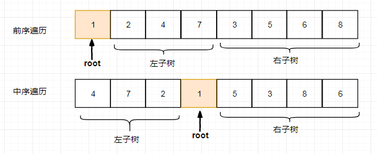
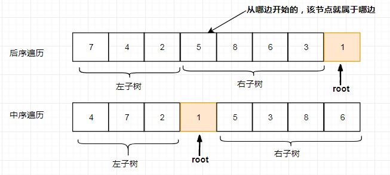

# 剑指offer6 编程之美3_9_重建二叉树

原文：https://blog.csdn.net/u010119170/article/details/24599193

## 1- 题目描述

输入某二叉树的前序遍历和中序遍历的结果，请重建出该二叉树。假设输入的前序遍历和中序遍历的结果中都不含重复的数字。例如输入前序遍历序列{1,2,4,7,3,5,6,8}和中序遍历序列{4,7,2,1,5,3,8,6}，则重建二叉树并返回。

## 2- 思路

对于前序遍历，它的第一个元素就是根节点； 
对于中序遍历，根节点左面是左子树，右面是右子树； 
通过递归不断地分割，对每一个节点赋值；

易知前序序列中的第一个结点即为二叉树的根结点，而此结点在中序序列中将二叉树的结点分为两部分，其左边部分即为左子树中的各个结点，其有边部分即为右子树中的各个结点，根据这些我们可以得到**左右子树中分别有多少个结点**，

假设左子树中有left个结点，右子树中有right个结点，进而又可以将先序序列分为两部分

根结点后面的left个结点即为左子树中的结点，最后面的right个结点即为右子树中的结点。

利用递归可以重复求解，最终得到我们期望的二叉树结果。

## 3- 重写收获

1. 一个清晰的思路对代码的好处是不可说的，我性子就是上来就是写写写，最后是通过不断调试成功，最后看代码，再优化，这样真的浪费时间；可能时间的题少，心里没底，总想着先写点，但是这种思路是不对的；另外就是对递归的理解，这么久还是没理解递归的结构，真是太愚蠢了；


还有一个问题：

问：假如遍历序列中**含有相同的结点值**时，如和求解？




## 3.1- 前序+中序 -> 二叉树




```cpp
//根据二叉树前序和中序遍历构造二叉树  
BinaryTreeNode* constructBT(int* preorder, int* inorder, int length) {  
    if (NULL == preorder || NULL == inorder || 0 >= length) {  
        return NULL;  
    }  
  
    return constructBTByPreInOrder(preorder, preorder + length - 1, inorder,  
        inorder + length - 1);  
}  
  
//根据二叉树前序和中序遍历构造二叉树，传入先序的头 和 先序的尾， 中序的头 和 中序的尾  [preOreder,PreOrder + len -1], [inOrder, inOrder + len - 1]
BinaryTreeNode* constructBTByPreInOrder(int* startPreorder, int* endPreorder,  
        int* startInorder, int* endInorder) {  
    if (NULL == startPreorder || NULL == endPreorder || NULL == startInorder  
            || NULL == endInorder) {  
        return NULL;  
    }  
  
    //创建根结点  
    int rootValue = startPreorder[0];  
    BinaryTreeNode* root = new BinaryTreeNode();  
    root->m_nValue = rootValue;  
    root->m_pLeftChild = NULL;  
    root->m_pRightChild = NULL;  
  
    //在中序序列中找到根结点  
    int* rootInorder = startInorder;  
    for (; rootInorder <= endInorder; ++rootInorder) {  
        if (rootValue == *rootInorder) {  
            break;  
        }  
    }  
  
    //分别求得左右子树的结点数  
    int leftChildLength = rootInorder - startInorder;  
    int rightChildLength = endInorder - rootInorder;  
  
    //构建左子树  
    if (0 < leftChildLength) {  
        root->m_pLeftChild = constructBTByPreInOrder(startPreorder + 1,  
                startPreorder + leftChildLength, startInorder, rootInorder - 1);  ///  [preOreder_start + 1,PreOrder + leftChildLength], [inOrder, inOrder_root - 1]
    }  
  
    //构建右子树  
    if (0 < rightChildLength) {  
        root->m_pRightChild = constructBTByPreInOrder(  
                startPreorder + leftChildLength + 1, endPreorder,  
                rootInorder + 1, endInorder);   /// ///  [preOreder_start + leftChildLength+ 1,endPreorder], [inOrder_root + 1, endInorder]
    }  
  
    return root;  
}  
```


## 3.2 中序+后序-> 二叉树

根据二叉树的中序和后序遍历序列，构造二叉树。思路：利用前面的思路，很容易得到下面这个结果。




```cpp
//根据二叉树中序和后序遍历构造二叉树  
BinaryTreeNode* constructBT(int* inorder, int* postorder, int length) {  
    if (NULL == inorder || NULL == postorder || 0 >= length) {  
        return NULL;  
    }  
  
    return constructBTByInPostOrder(inorder, inorder + length - 1, postorder,  
            postorder + length - 1);  
}  
  
BinaryTreeNode* constructBTByInPostOrder(int* startInorder, int* endInorder,  
        int* startPostOrder, int* endPostOrder) {  
    if (NULL == startInorder || NULL == endInorder || NULL == startPostOrder  
            || NULL == endPostOrder) {  
        return NULL;  
    }  
  
    //根据后序遍历得到根结点  
    int rootValue = endPostOrder[0];  
    BinaryTreeNode* root = new BinaryTreeNode();  
    root->m_nValue = rootValue;  
    root->m_pLeftChild = NULL;  
    root->m_pRightChild = NULL;  
  
    //在中序序列中找根结点  
    int* rootInorder = startInorder;  
    for (; rootInorder <= endInorder; ++rootInorder) {  
        if (rootValue == *rootInorder) {  
            break;  
        }  
    }  
  
    //分别计算左右子树中的结点数目  
    int leftChildCount = rootInorder - startInorder;  
    int rightChildCount = endInorder - rootInorder;  
  
    //构建左右子树  
    if (0 < leftChildCount) {  
        root->m_pLeftChild = constructBTByInPostOrder(startInorder,  
                rootInorder - 1, startPostOrder,  
                startPostOrder + leftChildCount - 1);   /// 后序遍历是从后开始的。
    }  
  
    //构建右孩子  
    if (0 < rightChildCount) {  
        root->m_pRightChild = constructBTByInPostOrder(rootInorder + 1,  
                endInorder, startPostOrder + leftChildCount, endPostOrder - 1);  
    }  
  
    return root;  
}  
```


## 3.3 测试


```cpp
#include <stddef.h>  
#include <iostream>  
  
using namespace std;  
  
int main() {  
    int n = 0;  
    cout << "输入测试数据的组数：" << endl;  
    cin >> n;  
    while (n > 0) {  
        cout << "输入序列长度：" << endl;  
        int len = 0;  
        cin >> len;  
  
        int *x = new int[len];  
        int *y = new int[len];  
  
        cout << "输入先(中)序序列：" << endl;  
        for (int i = 0; i < len; ++i) {  
            cin >> x[i];  
        }  
  
        cout << "输入中(后)序序列：" << endl;  
        for (int i = 0; i < len; ++i) {  
            cin >> y[i];  
        }  
  
        BinaryTreeNode* binaryTreeNode = constructBT(x, y, len);  
  
        cout << "二叉树前序遍历(递归):" << endl;  
        preorderTravesal(binaryTreeNode);  
        cout << endl;  
  
        cout << "二叉树的后序遍历(递归):" << endl;  
        postorderTravesal(binaryTreeNode);  
        cout << endl;  
  
        delete x;  
        delete y;  
  
        --n;  
    }  
  
    return 0;  
}  
```


