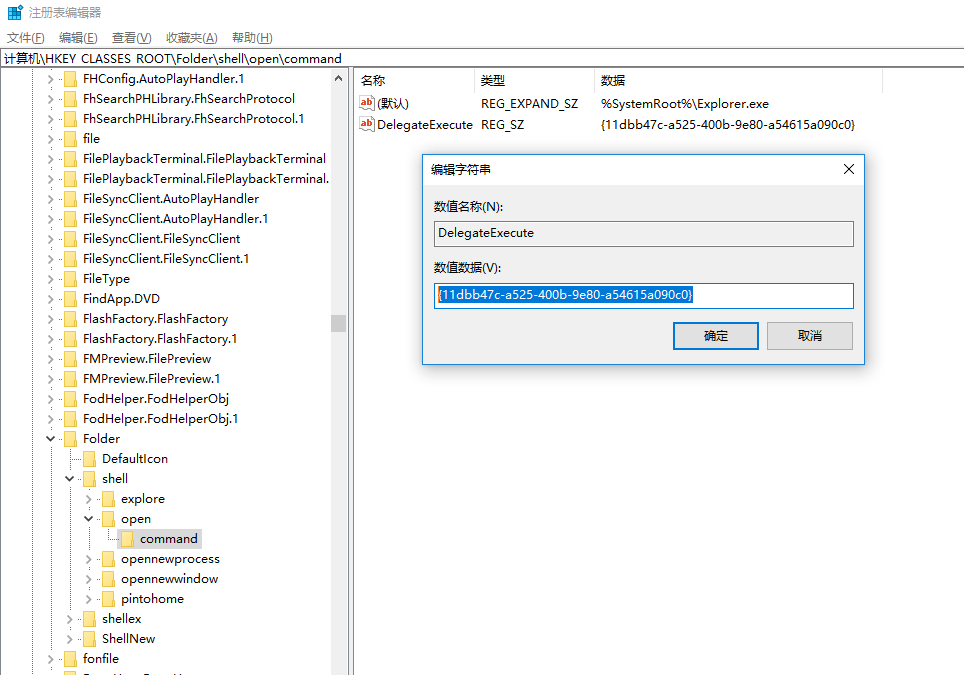
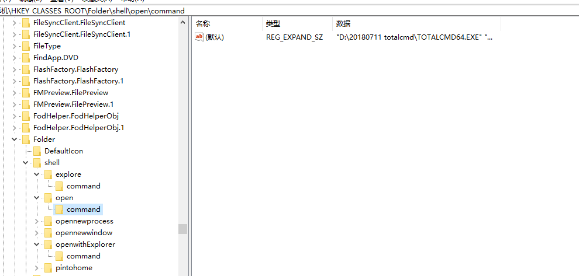
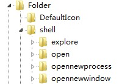
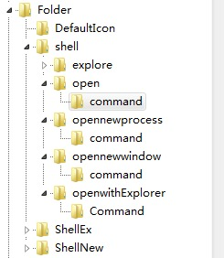
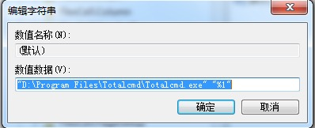

# 20180711 将TC 设置成默认的文件管理器

参考： https://blog.csdn.net/lord_is_layuping/article/details/7435989

原来的是`{11dbb47c-a525-400b-9e80-a54615a090c0}`, 需要把DelegateExecute 整行删除，然后修改上面的默认值`%SystemRoot%\Explorer.exe `改成`"D:\20180711 totalcmd\TOTALCMD64.EXE" "%1"`

open改完后，如下:

其他设置参考上面的网址。

-----------------

## windows 7终极大法

1- 使用`win+R` 和 `regedit` 命令即可。

2-

打开注册表，HKEY_CLASSES_ROOT\Folder\shell通过观察shell下的这几个项，发现都是右键点击文件夹时的菜单内容。既然这个注册表项跟文件夹弹出的右键菜单有关，那么修改里面的东西肯定能实现我要的功能。

 

点开open，opennewprocess，opennewwindow，里面的command键值都是一样的，那么我按照上述内容，将open下面的command键值修改为TC目录，删掉后面的DelegateExecute  {11dbb47c-a525-400b-9e80-a54615a090c0}内容不就行了吗？立马试验，成功！修改后如下：

再发散：这样我就以后就只能用TC了吗？（当然只用TC没什么不好。）我如果要再用回资源管理器怎么办呢？聪明的你已经想到了吧。解决如下：

[HKEY_LOCAL_MACHINE\SOFTWARE\Classes\Folder\shell\下先建项，名称为openwithExplorer，键值为“资源管理器打开”，

再在openwithExplorer建项command，增添Execute，值为：{11dbb47c-a525-400b-9e80-a54615a090c0}，

在TC中调用右键（如果右键选择NC模式时按徽标键与Ctrl之间的键）选择“资源管理器打开”即可继续使用资源管理器。

 

参考：

现在 Win7 X64 下有设置 TC 为默认资源管理器的方法吗？ - 知乎
http://www.zhihu.com/question/20320155/answer/17539351