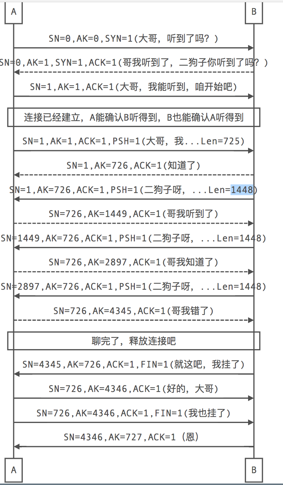

# TCP IP  等网络协议补充

物理层与数据链路层为上面的协议族提供服务我们一般很少接触。IP(ip v4/ ip v6)在网络层，TCP/UDP在传输层，应用层一般是我们经常接触的东西.


```
- TCP协议工作在OSI的传输层，是一种可靠的面向连接的数据流协议。

- 每个数据包都包含序列号和确认号，发送数据包的同时确认已接收到的数据包
    确认号 = 接收到的数据包的序列号 + 该包有效数据长度
    序列号 = 接收到的数据包里的确认号
    也就是始终让对方来设置我的序列号应该是多少，即我应该发送那个包

- TCP发送一个数据包时会把其放入重发队列，同时启动计时，超时时间内收到确认包则删除该包，否则重传

- 接收方使用序列号来对分组传输的数据进行重组，保证传输的完整性
```


## TCP连接的建立

```
TCP使用我们熟悉的三次握手方式建立连接。这里以A向B发起连接来说明。
```

1. A向B发送一个同步请求数据包，该包中初始序列号*ISN_a1*是A随机生成的，确认号是0, SYC=1 (A问B听到了吗？）
2. B接收到A发送过来的请求数据包之后，会向A发送一个同步确认数据包，该包的初始序列号*ISN_b1*由B随机生成，确认号为*ISN_a1*+1, SYC=1, ARC=1（B说听到了，你听到了吗？）–此时A知道B能听到
3. A收到B的同步确认数据包之后，再向B发送一个确认包，该包的序列号=B包里的确认号，该包的确认号=*ISN_b1*+1, ARC=1（A说我也听到了）–此时B知道A也能听到


## TCP数据的传输

```
TCP工作在全双工模式下。
三次握手时A、B各发送了一个请求包，占用一个包序号，所以传输数据时A、B的序列号都从初始序列号+1开始。
```

- A向B发送数据的情况（PacketB初始为建立连接时，第二次握手时B发的确认包）
  1. A发送数据包：A向B发送数据包packetA（序列号=packetB.确认号，确认号=packetB.序列号）
  2. B发送确认包：B收到数据包packetA，向A发送确认包packetB（序列号=packetA.确认号，确认号=packetA.序列号+packetA.有效载荷）
  3. A接收确认包：A收到确认包packetB，从重发队列删除packetA，并继续发送
- B向A发送数据的情况（PacketA初始为建立连接时，第三次握手时A发的确认包）
  1. B发送数据包：B向A发送数据包packetB（序列号=packetA.确认号，确认号=packetA.序列号）
  2. A发送确认包：A收到数据包packetB，向B发送确认包packetA（序列号=packetB.确认号，确认号=packetB.序列号+packetB.有效载荷）
  3. B接收确认包：B收到确认包packetA，从重发队列删除packetB，并继续发送

数据发送过程同时进行，即上述两个过程并行。 
使用滑动窗口，使的发送方在没有接收到确认包之前可以发送多个数据包。

## TCP连接的关闭

```
著名的四次挥手，我挥一挥手，各回各家吧！

 1. A向B发送关闭连接的请求，FIN标志位置1（我要挂电话咯）
 2. B发送确认包，A到B的连接可以关闭（好的）
 3. B再向A发送关闭连接的请求，FIN标志位置1（我也挂了）
 4. A发送确认包，B到A的连接也可以关闭咯（恩）
```

## 举个例子

（sequence number(SN)序列号，acknowledgement number(AK)确认号,实际中初始SN为随机生成数，这里为了方便设为0）




