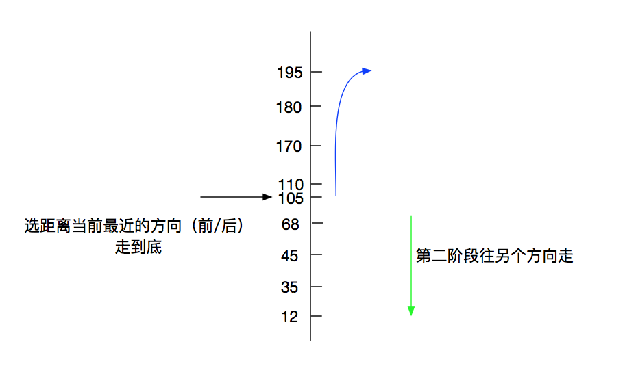

# Scan 调度算法

链接：<https://www.nowcoder.com/questionTerminal/1db691a07ee14465b1545c2d6a907be8>
来源：牛客网

   SCAN调度(电梯调度)算法:电梯调度算法基于日常生活中的电梯工作模式：电梯保持按一个方向移动，直到在那个方向上没有请求为止，然后改变方向。反映在磁盘调度上，总是==沿着移动臂的移动方向选择距离磁头当前位置最近的I/O请求作为下一次调度的对象。如果该方向上已无I/O请求，则改变方向再做选择==。假设磁头当前位于第105道，正在向磁道序号增加的方向移动。现在一个磁道访问请求序列为35，45，12，68，110，180，170，195，采用SCAN调度（电梯调度）算法得到的磁道访问序列是：110,170,180,195,68,45,35,12。

一张图说明：

