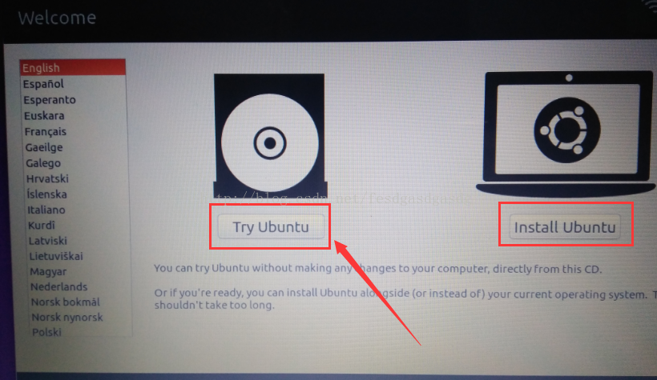
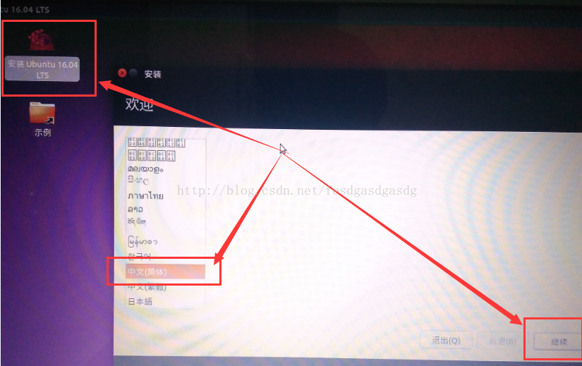
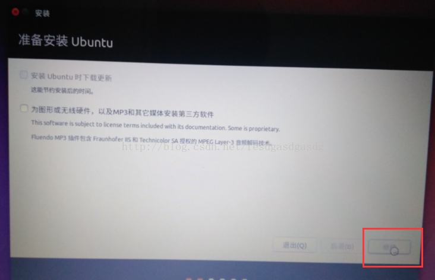
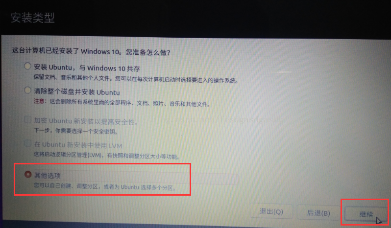
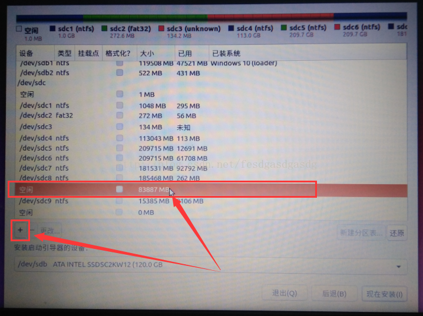

进入BIOS 启动项是按F9
# 刻录系统盘  
我用的是UniversalUSBInstaller 工具，其它的各种刻盘工具好像试过了都不行。

# 安装
进入启动界面，选择try ubuntu试用，不要选择立即安装。
因为试用时，可以操作ubuntu，打开里面的浏览器查阅资料等。立即安装后面的流程，是操作不了ubuntu系统的。图：  

进入系统后，你可以先玩玩，点击桌面右上角联网，点击左侧启动器里面的火狐浏览器上网。
点击桌面左上角的“安装 Ubuntu 16.04 LTS”启动安装程序，选择界面语言，继续： 

“为图形或无线硬件...”不勾选，直接继续：
这一步我得提醒你：断网。如果没断网，安装过程可能需要下载什么，而这国外服务器的网速慢，为啥。。。你懂得，否则浪费的是你的时间。

这一步很关键，选择错了位置，会毁掉你windows系统上所有的数据。
选择“其他选项”，使用之前预留的独立区域来安装ubuntu系统，继续：

选中“空闲”区域，核对一下大小对不对，点击左下角的加号创建分区，若创建错了就点减号删除。  
若之前在windows系统里面，你没有按照我说的删除预留分区，则在此处就难以辨认是哪一个了。此处选择错了分区后果你懂得。

# 分区

【/】：20GB  前面分出来的SSD的容量

【Swap】：8G 我笔记本的内存是（4G） 一般是你物理内存的两倍

【/boot 】：200MB 之前固态分出来的

【/home】：剩下的都给了home

sudo update-grub 

sudo reboot now 重启完美解决

这一次居然没有在grub启动项多做纠缠就弄好了。

写文档用的参考链接：
http://blog.csdn.net/fesdgasdgasdg/article/details/54183577 
http://blog.csdn.net/ysy950803/article/details/52643737 
http://www.afox.cc/archives/38 
https://mathsyouth.github.io/2017/07/23/win7-ubuntu
http://blog.csdn.net/zf_c_cqupt/article/details/71075884
http://blog.csdn.net/cafuc46wingw/article/details/40785305
http://blog.csdn.net/qq_29726359/article/details/75269161
http://blog.csdn.net/dyx810601/article/details/51282733