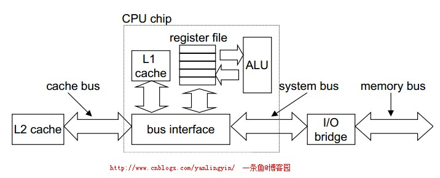

# 20180428_对缓存的思考 提高命中率

------

原文：http://www.cnblogs.com/yanlingyin/archive/2012/02/14/2348980.html

**开篇**

编写高效的程序并不只在于算法的精巧，还应该考虑到计算机内部的组织结构，cpu微指令的执行，缓存的组织和工作原理等。

好的算法在实际中不见得有高效率，如果**完全没有考虑缓存、微指令**实现的话。

前两篇博文

[局部性原理浅析](http://www.cnblogs.com/yanlingyin/archive/2012/02/11/2347116.html) 介绍了程序的局部性原理，如何写出局部性良好代码。

[提高程序性能、何为缓存](http://www.cnblogs.com/yanlingyin/archive/2012/02/12/2347757.html) 讨论了存储器层次结构，计算机内部的存储结构、缓存的概念，简单的介绍了缓存的工作机制。

建议先阅读前两篇博文，虽然他们之间联系不大，在前面也有一些对本文的铺垫。而且，这是一个系列的文章。旨在优化程序性能。

这篇博文主要介绍的是缓存的组织、工作原理。拨开迷雾，让你更加清晰的认识缓存。

**通用缓存结构**

**回顾**

在[提高程序性能、何为缓存](http://www.cnblogs.com/yanlingyin/archive/2012/02/12/2347757.html)中提到:早起的cpu存储层次只有三层，即**cup的寄存器，DRAM主存和磁盘存储**。因为寄存器和主存之间的访问时间开销差距很大，于是设计者在寄存器（一个时钟周期）和主存之间加入了L1缓存（2——4个时钟周期），后来由于L1缓存和主存之间的差距，又在主存和L1之间加入了L2缓存，当然后面还有L3缓存，，，等等。

在这里为了简单起见，假设CPU寄存器和主存之间只有一个L1缓存。

下图是高速缓存存储器的典型总线结构:

**缓存结构**

下图清晰的说明了通用缓存的组织结构:

可以看到，缓存内部是以组的形式组织的。图中的每一块代表一组，每组由一到多行组成（当然图中的是每组有多行）。

**每一行包括**

1 位标记位（valid bit）标明这行的信息是否有可用

t 位的标记，标明它是属于这一组的哪一行

剩下的空间是存储数据的数据的空间

可以看出在下面的图中把数据地址分为了三部分，左边 t 位是标记行号的，中间的 s 位标明组号，最后的 b 位则是数据块在行内的偏移量。

通常来说，缓存器可描述为(S; E; B; m)其中S为缓存中的组数，E为每组的行数，B为每行存储的字节数，m为缓存的地址位数。

所以缓存的容量为C=S*E*B。

**从缓存中取数据**

（这个过程在上一篇博文中就有简单的介绍）当cpu需要从主存中取出地址为A的数据时，先把地址A发送给缓存，如果缓存中存有地址为A的数据，就从缓存中取出该数据传给cpu。

那么，缓存是如何知道自己是否存有地址为A的数据呢？这就和缓存的组织有关系了，上文中缓存把地址组分为了三部分，t 、s 、b。

所以，只要简单的检查地址中的数据位，就能判断该地址是否在缓存中，如果在的话，还能确定该数据的位置。

参数 s 、b 、m 把m个地址位分为三个字段。如下图:

下面的详细的寻址过程

地址A中的中间S 位标记了该地址在缓存中属于哪一组，先通过s 确定这个地址在缓存中的哪一组。

通过上面一步确定了属于的组后，地址A中的左边 t 位标记了该地址在该组的哪一行。

最后由右边的 b 指出地址A中的元素在该行的偏移位。也就是确定在这行的哪一个位置。

**CPU从主存中读数据的详细过程**

和上文中说的一样，这里假设计算机的存储结构只有：cpu寄存器，L1缓存，主存。

当cpu执行一条读存储器地址为A的指令，它向高速缓存请求该地址，如果缓存命中，缓存很快返回数据。如果缓存不命中，L1缓存向主存请求该数据，在这期间cpu必须等待。当被请求块从主存到达缓存L1时，L1缓存将数据放在他的一个高速缓存行里，然后将数据从行中提取返回给cpu。也就是说，如果缓存不命中，先要把数据存入缓存，再返回给cpu。

概括的说，高速缓存确定一个请求是否命中有三个过程： 

1、组选择

2、行匹配

3、字抽取

下面将会结合具体情况说明这一过程。

**直接映射高速缓存**

现在已经知道，我们用(S; E; B; m) 来描述缓存，这里就根据其中的E，也就是一组的行数， 把缓存分为不同的类别。

当E=1 时，也就是说每组只有一行的缓存组织形式，我们称为直接映射高速缓存。因为容易理解，先对它进行介绍。

（图片来源 《computer systems》）

正如上图所示，直接映射高速缓存中每组只有一行。

**直接映射高速缓存中取数据**

下面将以直接映射高速缓存为例，一步步说明cup从高速缓存中取数据的过程。

**1、组选择**

如上图所示，缓存从地址A中抽取出中间的s 位，这 s 为的数值就标记了该地址所在的组。这里可以把缓存当作是一维数组，其中每个元素是一个组，而地址中的 s 位则是这些组的索引。如图中的组标记为 0001 对应组 set1。这要把地址中间的 s 为提取，就能得到该地址在缓存中对应的组。

**2、 行选择**

选好组 i 之后，就是确定地址A在组 i 的哪一行。因为直接映射缓存的每一组只有一个行。所以只要看A地址中的行标记是否和缓存中的行标记位匹配。匹配则地址A中的数据在缓存中。

**3、字抽取**

既然已知道了地址A中的数据在缓存中的位置，最后一步只要更具地址A中表示偏移量的位，从缓存中取出数据即可。

如下图所示：

**直接映射高速缓存不命中**

当缓存不命中的时候，就要从下一层存储中取出数据，放入缓存的某个位置中，放入的位置就由请求地址A中的组索引确定所在缓存的组，行所以确定应该放置的行。如果组中的行都是有效缓存行了，就必须要驱逐现有的一个行。对于直接映射高速缓存，每组包含一个行，替换策略就变的很简单，用新来的行替换当前行。

**直接映射缓存寻址示例**

通过上面的介绍，已经基本了解了缓存的组织形式以及如何从缓存中取出数据，但是上面都只是理论上的阐述。

为了能更好的了解，这里会有一个具体的示例。诚然，学习一种只是最好的方式就是应用它。 如果你已经对上面的知识有所了解，那么请继续吧。下面的内容会让你更清楚的了解到缓存工作的机制。

假设我们有一个直接映射的高速缓存，描述如下

(S; E; B; m)=(4;1;2;4)

也就是说:该缓存有4个组（s=4），每组有一行（E=1），每一块有两个字节（B=2）存储器的地址是4位的（m=4）

该状态有图描述如下:

其中最左边的一列是地址，中间的三列是地址的二进制表示形式。最右边的一列是虚拟存储器的块的标号。

和上文中说的一样，缓存寻址时，把地址分为了三个部分。分别表示该地址在缓存中所在的组、行、以及偏移。和上图所对应是四位的地址，

**行：**其中最高的一位标记所在的行，因为是直接映射高速缓存，每组只有一行，所以一位就能表示。

**组**：中间的两位表示地址所在的组。从图中可以看出，拥有相同组的地址有四个，比如组号为00 的地址有四个，为0、2、8、9

**偏移**：偏移位由最右边的一位表示。每行中有两个数据块，所以偏移位用一位也就能表示。

看这个表的时候有一点提示：中间的三列其实是第一列地址的二进制表示形式。

**下面是对这个特定缓存的一点分析：**

(S; E; B; m)=(4;1;2;4)

该缓存有四个组，每组一行。有图中可知，要放入缓存的地址为16个。所以每组对应四个地址。在图中的表现就是：四个相同的地址有相同的组索引。

每行有两个数据块，用地址最低位表示（0表示第一个，1为第二个）。

看组索引为00的地址，为0 、1 和 8 、9。0和1有相同的行标记0，8和9有相同的行标记1.所以地址为0、1的数据要么都在组00中，要么多不在。地址为8、9的也一样。说明了0、1是一个整体，8、9也一样。如果在，都在；不在，都不在。这两个整体通过最高位（标记为）来标明。

**下面是寻址实例**

刚开始时，缓存是空的，也就是还没有预热，如下图所示

**1）读地址0的字**

地址0的为 0 00 0 对应缓存中第0组，行标记位为0的，偏移为0的位置。显然，现在缓存还是空的（标志位 valid 都为0）。缓存不命中，所以缓存先从下一级的存储中取出改行对应的所有地址的元素，放入缓存中。（也就是地址为0 和1 的元素）。然后再从缓存中取出数据m[0]，传递给cpu。

进过对地址0的读操作后，缓存的组织情况如下所示

这也验证了上文的说法，地址0 和1 是一体的，他们要么都在，要么都不在。因为他们有相同的组索引、行索引。

**2）读取地址1的字**

地址1为0 00 1 对应缓存中的第0组，行标记为0，偏移为1。这次缓存命中，从缓存返回m[1]

**3)读地址13的字**

地址13为1 10 1 对应缓存中的第2组 行标记为1 偏移为1。同1）一样，缓存不命中，从低一级存储中取出 组索引为10 行为1 的数据放入缓存，然后返回m[13]

对地址13进行操作后的缓存情况为

**4）读地址为8的字**

地址8为 1 00 0 组索引为00 行标记为1 偏移为0 在看上图的缓存组织情况，可判读发生缓存不命中。于是从低一级存储中取出组索引为00 行标记为1 的数据，也就是m[8]、m[9]放入第一行中，然后返回m[8]

操作后的缓存组织为

通过上面的示例，应该对缓存的工作原理有一定了解了把。

其实就是吧地址分为不同的部分，划分为表示组、行 和偏移。然后根据这些去判断所需地址是否在缓存中。如果在，则返回数据，不在则从低一级的存储中取出数据放入缓存中（放入的位置由地址确定）。然后返回地址。

**组相联高速缓存**

 刚才讨论的直接映射高速缓存可以看作是缓存中的一个特例，因为每组只有一行。这里介绍一下更普遍的缓存结构：组相连高速缓存。

其实就是每一组有多行。如下图是E =2 的缓存

同样的，当要从缓存中取地址为A的数据时，

**1）先确定地址A所在的组，**如下图所示

2）确定行

3）抽取字（偏移）

**全联高速缓存**

 全联高速缓存中的S =1 ，也就是说，全联高速缓存只有一个组。

全联高速缓存中对数据的操作和之前讨论过的两种情况大同小异，主要就是三部。这里就不说了。

**小结**

这篇博文先介绍了缓存内部的组织形式，并介绍了从缓存中读取数据的方式，主要包括1)组选择2）行匹配 3）字抽取

缓存可以用形如(S; E; B; m)的形式表述。其中S代表缓存中的组数，E为每组的行数，B为每个缓存块的大小。

更具E的不同可将缓存分类。

这篇文章主要介绍的是缓存的工作机制。在以后的文章中会介绍如何写出缓存友好的代码

 

全文完。