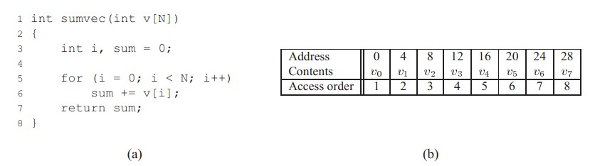
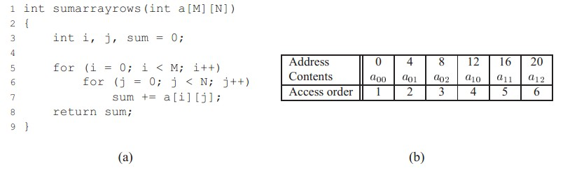
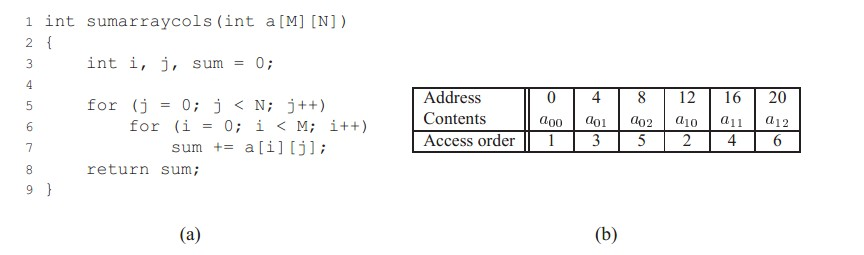

# 20180428 局部性原理浅析__良好代码的基本素质

**开篇**

 一个优秀的程序、优美的代码，一般都具有良好的局部性。简洁、高效是每个程序员的追求。了解程序的局部性，能编写出更高效的代码。

因为有良好局部性的程序能更好的利用缓存。不过这方面的只是将在以后的文章中介绍。

**这篇文章就简单的介绍以下程序的局部性原理。**

**什么是局部性**

局部性通常有两种形式：

**时间局部性(temporal locality)**

时间局部性指的是：被引用过一次的存储器位置在未来会被多次引用（通常在循环中）。

**空间局部性(spatial locality)**

如果一个存储器的位置被引用，那么将来他附近的位置也会被引用。

（这样说过于理论了些，在下面的论述中会有例子说明）

**数据引用局部性**

例子是最好说明问题的途径~

看图a）中的 for 循环，可以判断：循环中的 sum 有良好的时间局部性。因为在for循环结束之前，每次执行循环体都有对 sum 的访问。

而 sum 没有空间局部性。因为sum 是标量（也就是说通过 sum 这个地址（可认为是基址，只能得到一个值）

对于循环体中的 v 则有良好的空间局部性。可以看到 图 b） 中，向量 v 是按顺序存储的（在实际中多数情况也按顺序存储）。

每次访问 v[i]总是在 v[i-1] 的下一个位置。而 v 没有时间局部性。因为每个元素只被访问一次。

**步长**

向上面例子中按顺序、连续的对 v 的引用，我们称为**步长为1的引用模式。**同理，在一个连续的向量中，每隔k个元素对向量进行访问，称为步长为k的引用。一般来说，随着步长的增加，空间局部性会下降。

对于多维数组而言，步长对空间局部性的影响显得尤为重要。

考虑上面的例子，是对一个二维数组的求和。

可以看到，for循环体中，是以行序为主序对元素进行遍历。也就是说内层循环先访问第一行的元素，然后第二行。。。

图 b）中是二维数组存储情况。可以看出，在存储器中也是按照行序为主序来进行存储的。也就是说先存储第一行，然后第二行。。。

现在我们已经知道了，本例中存储顺序和访问顺序一致。所以可以该程序对a[][]的引用有良好的空间局部性。

对a[][]实行的是步长为1 的引用。

继续看下面的例子：

可以看出，相对于上面的例子，该例的for 循环中交换了 索引 i j 的位置。

也就是说在对a[][]进行遍历的时候，以列序为主序。即先访问第一列，在访问第二列。。。

而b）中，对a[][]的存储仍是行序为主序。这意味着没访问一个元素，就要跳过k个存储器才能访问下一个。于是得到一个简单的结论：该例中对a[][]的访问是以步长为k 的模式（k 为每行的元素个数）没有良好的时间局部性。

通过上面的例子我们知道:在对向量的访问中，如果访问数序和存储顺序一致，并且是连续访问，那么这种访问具有良好的空间局部性。

**取指令的局部性**

 指令存在于存储器中，cpu 要读指令就必须取出指令。所以也能评价对于取指令的局部性。

在for 循环中，循环体内的指令多次被执行，所以有良好的时间局部性。

循环体中的指令是桉顺序执行的，有良好的空间局部性(指令在存储器中是顺序存放的)。

**局部性小结**

 评价局部性的简单原则：

1、重复引用同一个变量有良好的时间局部性

2、对于步长为k 的引用的程序，步长越小，空间局部性越小。步长为1 的引用具有良好的空间局部性。k越大，空间局部性越差。

3、对于取指令来说、循环有较好的时间和空间局部性。

**后记**

这篇文章只是简单的介绍了什么是局部性，局部性原理的应有，即为什么有良好局部性的程序有更好的性能，局部性和告诉缓存的关系是如何的，将在后面的文章中介绍。这篇文章且当作后文的铺垫吧。

本人认知有限，如上述文章有不足之处欢迎指正交流。